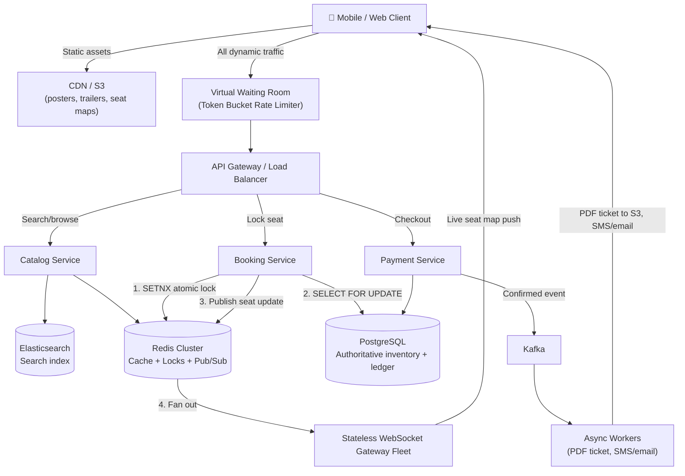

# System Design: Ticket Booking Platform (BookMyShow / Ticketmaster / IRCTC)

**Level:** SDE Internship / Junior SDE Interview
**Style:** Read-heavy catalog + write-critical checkout, under extreme flash-sale spikes
**Contrast with your other builds:** unlike the payment ledger (hard CP everywhere), this system runs **AP for browsing** and **CP only for the seat-locking moment** — it switches consistency models depending on which part of the request you're in. That's the signal to lead with in an interview.

---

## 1. Requirements

### Functional
- **Search & discovery:** browse/filter movies, events, showtimes by keyword, city, date
- **Interactive seat map:** real-time view distinguishing `AVAILABLE`, `LOCKED` (someone's mid-checkout), `BOOKED`
- **Booking & payment:** select seats → pay → receive a confirmed digital ticket

### Proactive Engineering Features
- **10-minute temporary seat lock:** selecting a seat atomically freezes it for 600 seconds so no one else can grab it while you enter payment details
- **Virtual waiting room:** an edge-level queue that absorbs flash-sale traffic before it ever reaches the booking backend

### Non-Functional Requirements
| Requirement | Target | Justification |
|---|---|---|
| **Search/browse latency** | < 100 ms | Below this, the UI *feels* instant to a human brain |
| **Seat selection/checkout latency** | < 2 sec | Users tolerate a short pause for "security processing," but past ~3 sec, cart abandonment rises sharply |
| **Consistency during checkout** | Strong (CP) | Rejecting a booking attempt is fine. Selling the same seat to two people is not — there's no way to "eventually" fix that |
| **Availability for browsing** | 99.99% | Read-only catalog data is non-transactional — no reason to sacrifice uptime here |
| **Flash-scale tolerance** | 50–100× traffic spike within seconds | Ticket-release windows create a traffic shape none of your other systems have — a genuine step-function surge, not a gradual ramp |

> **Why CP only during checkout, and not everywhere?** Browsing "how many seats are left" can be slightly stale — worst case, someone sees a seat as available for a second longer than it should be, and gets a graceful rejection at lock time. But the *lock itself* must be strongly consistent, because that's the one moment where a stale read directly causes a double-sale.

---

## 2. Scale Estimation

**Assume:** 10M DAU, 5 page views/user/day (browsing), 1% checkout conversion rate

| Metric | Calculation | Result |
|---|---|---|
| Daily reads (browsing) | 10M × 5 | 50M/day |
| Average read QPS | 50M ÷ 86,400s | ~580 QPS |
| Peak read QPS (2×) | 580 × 2 | ~1,160 QPS |
| **Flash-sale read spike (50–100×)** | 580 × ~100 | **50,000+ QPS** |
| Daily bookings (writes) | 10M × 1% | 100,000/day |
| Average write QPS | 100,000 ÷ 86,400s | ~1.2 QPS |
| **Flash-sale write spike** | — | **100–500 QPS** of simultaneous seat-lock attempts |
| Read : write ratio | 50M : 100K | ~500:1 |

**Storage:**
| Data | Size | Notes |
|---|---|---|
| Booking record (~1 KB) | 100K/day × 1 KB | ~100 MB/day → ~36.5 GB/year — trivially small |
| Static media (posters, trailers, seat-map SVGs) | ~1,000 shows × 5 MB | ~5 GB total — belongs in S3, never in a DB |

**Key insight:** unlike your other four systems, storage volume here is a non-issue. The entire engineering challenge is **write concurrency during a 10-second window**, not data growth over years. That reframes everything downstream — this is a locking problem, not a sharding problem.

---

## 3. Storage: Why Four Different Systems

| Layer | Choice | Stores | Why |
|---|---|---|---|
| **Authoritative inventory & bookings** | PostgreSQL | Confirmed bookings, financial ledger, seat inventory truth | Needs real ACID + row-level locking (`SELECT ... FOR UPDATE`) — the one place where "probably correct" isn't good enough |
| **Locks, sessions, cache** | Redis Cluster | 10-min seat locks (`SETNX`), user sessions, catalog cache, Pub/Sub channels | Single-threaded execution = atomic lock acquisition with zero race conditions, sub-millisecond — acts as a shield in front of Postgres |
| **Search & catalog** | Elasticsearch | Movie metadata, cast, venues, showtimes, autocomplete | Inverted indices make fuzzy/multi-field search fast at high read volume — Postgres would choke doing full-text search across millions of rows |
| **Static media** | S3 + CDN | Posters, trailers, seat-map SVGs, generated PDF tickets | Cheap, infinite, and served from the edge — keeping large blobs out of any database that also needs to stay fast for transactional reads |

> **Why split search into its own database at all?** Because catalog browsing is ~500× the traffic of bookings. If search queries hit the same Postgres instance as checkout, a viral movie's search traffic would slow down someone else's payment transaction — completely unrelated concerns competing for the same resource.

---

## 4. High-Level Architecture



**Flow summary:**
1. Static assets (posters, seat-map images) load straight from CDN — never touch app servers
2. Every dynamic request passes through the **virtual waiting room** first — this is what makes a 100× spike survivable
3. Browsing hits Elasticsearch + Redis cache — Postgres never sees search traffic
4. Seat selection is a **two-layer lock**: Redis `SETNX` first (fast, in-memory), then a Postgres row lock as a backstop (Section 6, Bottleneck 1)
5. A successful lock publishes to Redis Pub/Sub, which a stateless WebSocket fleet fans out to every client watching that seat map
6. Payment commits to Postgres, then hands off to Kafka so ticket generation and notifications happen **asynchronously** — the checkout response doesn't wait on PDF rendering or SMS delivery

---

## 5. API Contracts

**Search events** (REST)
```
GET /api/v1/events?city=Jodhpur&keyword=Interstellar
```
```json
{
  "status": "success",
  "data": [
    { "event_id": "evt_101", "title": "Interstellar (IMAX Re-release)",
      "venue": "PVR Cinemas", "showtimes": ["14:00", "18:30", "21:45"] }
  ]
}
```

**Get seat layout** (REST) → `GET /api/v1/shows/{show_id}/seats` — returns the full seat matrix with current statuses

**Lock seats for checkout** (REST, transactional write)
```
POST /api/v1/bookings/lock
```
```json
{ "show_id": "sh_889", "seat_ids": ["J12", "J13"], "user_id": "usr_505" }
```
```json
{ "booking_id": "blk_9901", "status": "LOCKED", "expires_in_seconds": 600, "total_price": 750.00 }
```

**Real-time seat status broadcast** (WebSocket push, `WSS /ws/v1/shows/{show_id}`)
```json
{ "event_type": "SEATS_LOCKED", "seat_ids": ["J12", "J13"], "timestamp": "2026-07-15T18:30:00Z" }
```

### Why REST for booking, WebSocket for seat status?
- **REST:** the lock/checkout/search actions are one-shot request-response — stateless, cacheable at the gateway
- **WebSocket:** when 5,000 people are staring at the same seat map, polling every one of them via REST to ask "any changes?" would itself DDoS the servers. A push model means the server only sends data when something actually changes

---

## 6. Deep Dive: Production Bottlenecks & Fixes

### A. The Double-Booking Race Condition
**The problem:** at 10:00:00 AM sharp, 10,000 users tap Seat J12 simultaneously. A naive "read status, then write" pattern lets multiple threads all read `AVAILABLE` before any of them commits — resulting in multiple confirmed bookings for one physical seat.

**The fix — two-layer atomic locking:**
1. **Redis shield:** `SET seat:sh_889:J12 usr_505 NX PX 600000` — because Redis is single-threaded, exactly one of the 10,000 requests gets `SUCCESS`; the other 9,999 fail in microseconds and get a `409 Conflict` **without ever touching Postgres**
2. **Postgres backstop:** the one winning user's payment flow still runs `SELECT * FROM seats WHERE show_id = 'sh_889' AND seat_id = 'J12' FOR UPDATE` — a genuine row lock, in case any edge case ever let a race slip past the cache

> **Plain English:** Redis is the bouncer at the door turning away 9,999 people in a fraction of a second; Postgres is the second lock on the door for the one person who got past the bouncer, just in case.

### B. Thundering Herd on a Hot Key
**The problem:** a blockbuster's showtime page gets refreshed by 3 million people in 5 seconds. All that catalog data sits under one Redis key — concentrating 3 million reads onto a single core. That shard maxes out and crashes, and all 3 million requests then stampede directly into Postgres, exhausting the connection pool.

**The fix — virtual waiting room + token bucket:**
- At the CDN edge (Cloudflare Workers, CloudFront), incoming traffic for a high-demand event is intercepted *before* it reaches the origin
- Users get a sequential token and sit in an async waiting room
- The room drains at a fixed, safe rate (e.g., exactly 500 users/sec) calibrated to what Redis and Postgres can actually absorb

> This is the piece none of your earlier systems needed — it's not about scaling storage or fan-out, it's about **admission control**: deliberately slowing down how fast legitimate traffic is allowed to hit the backend.

### C. WebSocket Server Memory Exhaustion
**The problem:** 100,000+ users hold open sockets watching the seat map. If a stateful server holding 50,000 connections runs out of memory and crashes, all 50,000 clients reconnect at once — a self-inflicted DDoS on the surviving servers (same failure mode as WhatsApp's thundering herd).

**The fix — stateless gateway + Redis Pub/Sub fan-out:**
- A dedicated, lightweight WebSocket gateway tier only holds sockets — it carries zero business logic and zero state
- The Booking Service publishes seat updates to a Redis channel (`PUBLISH show:sh_889:updates {...}`); gateways subscribe and fan the message out to their connected clients
- If a gateway dies, clients simply reconnect to another one — nothing is lost because no state lived on the gateway in the first place

---

## 7. Anti-Abuse: Stopping Seat-Locking Without Booking

The 10-minute TTL only solves *accidental* abandonment — a dropped connection, a distracted user. It does nothing to stop someone **deliberately** locking seats with no intent to buy: a scalper bot hoarding the best seats, or a griefer just denying inventory to real customers. Since locking currently costs nothing, it needs a separate layer of defense:

1. **Require authentication to lock, not just to pay.** Only verified accounts (phone/email confirmed) can call the lock endpoint. This alone kills the cheapest version of the attack — throwaway, unverified sessions.

2. **Rate-limit and cap locks per user.** Cap concurrent locked seats per user (e.g., max 6), and rate-limit lock attempts per user/IP (e.g., 5 attempts/minute). This stops one account or IP from grabbing large blocks of inventory across many attempts.

3. **Track abandonment rate per user, and penalize repeat offenders.** Log every lock's outcome (converted to a booking vs. expired unpaid). If a user's lock-to-purchase ratio drops below a threshold (e.g., 3+ abandoned locks in a day), apply an escalating penalty: shorter TTL, a cooldown before their next lock attempt, or a CAPTCHA gate.
   > **Plain English:** the system isn't just checking "is this a valid seat request" — it's building a trust score per user based on whether they actually follow through, and making repeat no-shows earn less trust each time.

4. **Put a real cost behind the lock.** The strongest structural fix, borrowed from how hotels and airlines handle this: run a **$0/$1 payment authorization hold** (not a charge) against the user's card at lock time, before the seat freezes. This does two things — it filters out bots that don't have a real, chargeable payment method at all, and it means abusing the system repeatedly isn't free even if no purchase completes (repeated authorization attempts get flagged and rate-limited by payment processors too).

5. **Gate waiting-room entry with a CAPTCHA or proof-of-work.** If bots are being used to mass-acquire waiting-room tokens (so a scalper can enter the lock phase many times in parallel), add friction at the *token issuance* step, not just the lock step — cheaper to stop the behavior before it ever reaches the booking service.

The realistic answer in an interview isn't "one clever trick" — it's this layered combination: authentication raises the cost of creating an attacker identity, rate limits + quotas cap what one identity can do, abandonment tracking catches repeat behavior *after the fact*, and a payment pre-authorization makes squatting have a real (if small) cost per attempt.

---

## 8. Reusable Patterns Worth Naming Explicitly

- **CQRS (Command Query Responsibility Segregation):** route 100% of read/browse traffic to Elasticsearch/Redis, reserve Postgres exclusively for transactional writes — never let search traffic and financial writes compete for the same engine
- **Async post-checkout processing:** the moment Postgres commits the booking, return `200 OK` immediately and let Kafka + background workers handle PDF generation and SMS/email — never make a checkout response wait on a third-party notification API
- **Mandatory TTLs on every distributed lock:** no lock should ever be set without an expiry — otherwise one crashed browser tab permanently freezes a seat
- **Idempotent payment calls:** every payment request carries a client-generated `idempotency_key`, checked against Redis/Postgres before charging — a network retry must never double-charge a card (this system calls into the payment ledger as a subroutine, rather than re-implementing idempotency and ACID logic from scratch)