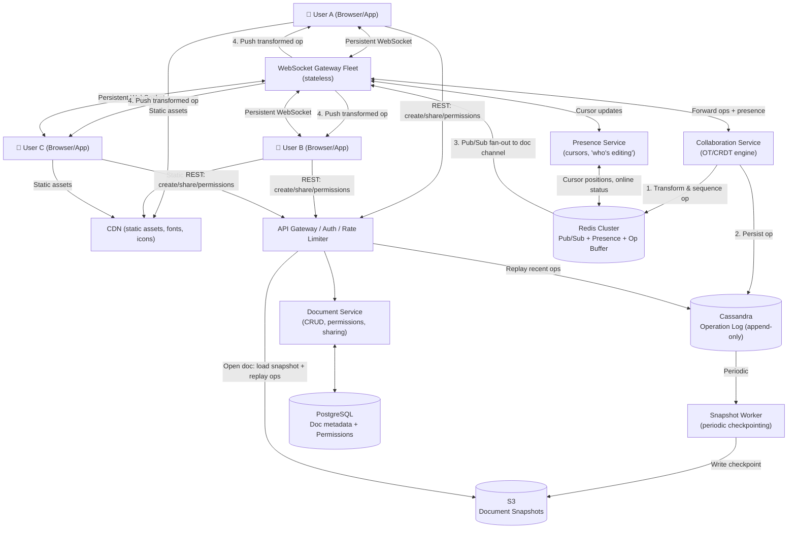

# System Design: Real-Time Collaborative Editor (Google Docs / Notion / Figma)

**Level:** SDE Internship / Junior SDE Interview
**Style:** Real-time state synchronization + conflict resolution + presence awareness
**Contrast with your other builds:** WhatsApp sends discrete messages — order matters, but each message is independent. Google Docs is fundamentally harder: **every keystroke from every user mutates the same shared document simultaneously**, and the final state must converge identically on all screens, even when users are typing in the same sentence at the same millisecond. This is a distributed consensus problem over a mutable data structure, not a message queue.

---

## 1. Requirements

### Functional
- **Real-time collaborative editing:** multiple users edit the same document concurrently with changes appearing on all screens within milliseconds
- **Rich text support:** bold, italic, headings, lists, tables, images, comments
- **Presence awareness:** see who else is viewing/editing — live cursors, name labels, colored selections
- **Version history:** view and restore any previous version of the document
- **Offline editing:** make changes without internet; reconcile when back online
- **Permissions:** owner, editor, commenter, viewer — with link-sharing controls

### Proactive Engineering Features
- **Conflict-free convergence:** when two users type at the exact same position at the exact same millisecond, the system must deterministically resolve this without data loss — no "last write wins" that silently drops someone's work
- **Operational log:** every edit is an append-only operation (insert char at position 5, delete chars 10–15, apply bold to range 20–30) — the document is a materialized view of this log

### Non-Functional Requirements
| Requirement | Target | Justification |
|---|---|---|
| **Edit propagation latency** | < 100 ms (same region), < 300 ms (cross-region) | Below 100 ms, humans perceive co-editing as "instant" — it feels like the other person is right there. Past 500 ms, collaboration feels like taking turns, not working together. |
| **Consistency** | **Strong eventual consistency** | Every client must converge to the *identical* document state, but they don't have to be in sync at every millisecond. This is stricter than AP (which allows divergence) but weaker than CP (which blocks writes during partitions). |
| **Availability** | 99.99% | Docs is a productivity tool — downtime during a work meeting means people can't collaborate, and they switch to a competitor. |
| **Offline support** | Buffer operations locally, sync on reconnect | Mobile users lose connectivity constantly. Losing their edits is unacceptable. |
| **Zero data loss** | Full operation history preserved | Unlike a chat message, a document edit can't be "resent" — the user won't remember exactly what they typed. Every keystroke must be durably captured. |

> **Why "strong eventual consistency" instead of just "eventual consistency"?** Regular eventual consistency (Instagram's choice) allows replicas to temporarily show *different* data — that's fine for a feed. But in a document, if User A sees "Hello World" and User B sees "World Hello" at the same time, they'll make conflicting decisions about what to edit next. **Strong eventual consistency** guarantees: if two replicas have received the same set of operations (in any order), they *must* show the identical document. The order of receiving operations doesn't matter — the result is always the same.

---

## 2. Scale Estimation

**Assume:** 50M DAU, average document has 3 concurrent editors, ~1 keystroke/sec per active editor

| Metric | Calculation | Result |
|---|---|---|
| Concurrent active documents | 50M DAU ÷ 3 users/doc ÷ 10 (not all editing at once) | ~1.7M concurrent docs |
| Operations/sec (global) | 50M × 0.3 (30% actively typing) × 1 keystroke/sec | ~15M ops/sec |
| Peak ops/sec (2×) | 15M × 2 | ~30M ops/sec |
| Average document size | ~50 KB (text + formatting metadata) | — |
| Daily new documents | ~5M | — |
| Daily operations stored | 15M ops/sec × 86,400s × avg 50 bytes/op | ~65 TB/day of raw operation log |
| Document snapshots/day | 5M docs × 20 KB avg snapshot | ~100 GB/day |

**Key insight:** the challenge is NOT raw throughput (30M ops/sec is high but shardable per-document). The challenge is **real-time fan-out within a document session** — every operation from User A must reach Users B, C, D within 100 ms, AND the conflict resolution algorithm must guarantee convergence even when operations arrive in different orders at different clients.

**Storage:**
| Data | Size | Notes |
|---|---|---|
| Operation log (hot — last 30 days) | ~65 TB/day × 30 days = ~2 PB | Append-only, immutable. Needs fast sequential reads for version history replay |
| Document snapshots (periodic) | ~100 GB/day | Periodic checkpoints so you don't replay the entire op log from the beginning |
| Document metadata (title, permissions, sharing) | 500M docs × 1 KB = ~500 GB | Trivially small — fits in Postgres |
| User metadata | 500M users × 1 KB = ~500 GB | Trivially small |

---

## 3. Storage: Why Four Different Systems

| Layer | Choice | Stores | Why |
|---|---|---|---|
| **Operation log** | Cassandra / ScyllaDB | Every edit operation, append-only, immutable | This is the heaviest write path (~15M ops/sec). Partition by `doc_id`, cluster by `sequence_number`. Cassandra's LSM-tree handles append-only writes beautifully. Replaying "show me version history" = sequential range read on one partition. |
| **Document snapshots** | S3 | Periodic full snapshots of document state (every N operations or every 5 minutes) | Cheap, durable blob storage. When opening a doc, load the latest snapshot + replay only operations *after* that snapshot — avoids replaying millions of ops from creation. |
| **Document & user metadata** | PostgreSQL | Titles, permissions, sharing links, user profiles, team/org structure | Needs ACID — permission changes must be atomic (revoking access must take effect immediately, not eventually). Sharing link generation needs strong consistency. |
| **Session state & presence** | Redis Cluster | Active editing sessions, cursor positions, "who's online" per document, operation buffer | Fully in-memory. Cursor positions change every 50 ms — no reason to persist this to disk. Pub/Sub channels for per-document real-time fan-out. |

> **Why not just store operations in Postgres?** At 15M ops/sec globally (and growing), the append-only operation log would bloat Postgres indexes and degrade performance on the relational queries (permissions, sharing) that also live there. Cassandra's LSM-tree is purpose-built for this append pattern — it never rewrites data in place, just stacks new data on top.

---

## 4. High-Level Architecture



**Flow summary:**
1. **Opening a document:** client sends REST request → Document Service checks permissions in Postgres → loads latest snapshot from S3 → replays operations after that snapshot from Cassandra → sends the materialized document to the client → establishes a WebSocket connection
2. **Editing (the hot path):**
   - User A types a character → client generates an operation (`INSERT "k" at position 42`)
   - Operation is sent over WebSocket → Collaboration Service receives it
   - Collaboration Service **transforms** the operation against any concurrent operations (OT) or merges it (CRDT), assigns a global sequence number
   - Transformed operation is written to Cassandra (durable) and published to the document's Redis Pub/Sub channel
   - Redis fans the operation out to all WebSocket Gateway servers holding connections for this document → pushed to Users B and C
   - Users B and C's clients apply the transformed operation to their local copy
3. **Presence:** cursor moves and selection changes flow through the Presence Service via Redis Pub/Sub — lightweight, high-frequency, no persistence needed
4. **Snapshots:** a background worker periodically reads the operation log from Cassandra, materializes a full document snapshot, and writes it to S3 — so future document opens don't need to replay millions of operations

---

## 5. API Contracts

**Create document** (REST)
```
POST /v1/documents
```
```json
{ "title": "System Design Notes", "folder_id": "folder_001" }
```
```json
{ "doc_id": "doc_88901", "title": "System Design Notes", "created_at": "2026-07-15T18:30:00Z" }
```

**Open document** (REST — returns snapshot + establishes WebSocket)
```
GET /v1/documents/{doc_id}
```
```json
{
  "doc_id": "doc_88901",
  "snapshot_version": 14520,
  "content": "... (serialized document state) ...",
  "active_users": [
    { "user_id": "usr_101", "name": "Saharsh", "color": "#FF6B6B", "cursor_position": 342 }
  ],
  "ws_url": "wss://collab.docs.com/v1/ws?doc_id=doc_88901&from_version=14520"
}
```

**Send operation** (WebSocket, client → server)
```json
{
  "type": "OPERATION",
  "client_version": 14523,
  "ops": [
    { "type": "INSERT", "position": 42, "content": "k" },
    { "type": "FORMAT", "range": [40, 45], "attribute": "bold", "value": true }
  ]
}
```

**Receive transformed operation** (WebSocket, server → client)
```json
{
  "type": "OPERATION",
  "server_version": 14524,
  "author": "usr_102",
  "ops": [
    { "type": "INSERT", "position": 44, "content": "Hello" }
  ]
}
```

**Presence update** (WebSocket, bidirectional)
```json
{
  "type": "PRESENCE",
  "user_id": "usr_101",
  "cursor_position": 345,
  "selection_range": [340, 350],
  "color": "#FF6B6B"
}
```

---

## 6. Deep Dive: Production Bottlenecks & Fixes

### A. The Core Problem: Concurrent Edit Conflicts

**The problem:** User A and User B are both editing position 10 of a document. At the same millisecond:
- User A inserts "X" at position 10
- User B inserts "Y" at position 10

If both operations are applied naively, User A sees "XY" but User B sees "YX" — the documents have diverged. This is the fundamental problem that makes collaborative editing harder than chat.

**The fix — two competing approaches:**

#### Approach 1: Operational Transformation (OT) — Google Docs' choice
- Every operation is **transformed** against concurrent operations before being applied
- Example: User A inserts "X" at position 10. User B inserts "Y" at position 10. The server receives both, picks an order (say A first), and **transforms** B's operation: "since A inserted a character before position 10, B's position shifts to 11." B's operation becomes `INSERT "Y" at position 11`. Result: "XY" on both screens.
- **Requires a central server** to decide the canonical operation order (the "sequencer")
- **Google Docs uses this** — their custom engine is called Jupiter

> **OT in plain English:** when two people type at the same spot, the server doesn't just apply both edits blindly. It adjusts the second person's edit to account for what the first person changed — like a traffic controller making sure two cars don't merge into the same lane.

#### Approach 2: CRDTs (Conflict-free Replicated Data Types) — Figma's choice
- Each character in the document gets a **unique, globally-ordered ID** (e.g., a fractional index between its neighbors)
- Operations never conflict because they reference unique IDs, not integer positions
- **No central server needed** — every client can apply operations in any order and still converge to the same state
- **Trade-off:** more complex data structures, higher memory overhead per character (~5–10× more metadata than OT)

> **CRDTs in plain English:** instead of saying "insert at position 10" (which changes meaning if someone else also inserted at position 10), every character gets a permanent address that never changes — like a house address vs a position in a queue. Two insertions at the "same place" just get neighboring addresses.

| Dimension | OT (Google Docs) | CRDTs (Figma, Yjs) |
|---|---|---|
| **Central server** | Required (single sequencer) | Not required (peer-to-peer possible) |
| **Offline support** | Hard — server must validate order | Easy — operations commute naturally |
| **Memory overhead** | Low — integer positions | High — unique IDs per character |
| **Correctness proofs** | Notoriously hard (many published OT algorithms have bugs) | Mathematically proven to converge |
| **Latency** | Extra round-trip to server for sequencing | Can apply locally first, sync later |

> **Interview recommendation:** say "I'd use OT with a central sequencing server for a server-authoritative system like Google Docs, but mention CRDTs as the alternative if the interviewer pushes on offline support or peer-to-peer scenarios."

### B. The WebSocket Fan-Out Problem (Hot Document)

**The problem:** a company-wide document (like a shared meeting notes page) has 500 concurrent editors. Every keystroke from any one of them must be pushed to the other 499 within 100 ms. That's potentially 500 keystrokes/sec × 499 recipients = ~250,000 WebSocket pushes/sec for a single document. If all 500 users are connected to different WebSocket servers, the fan-out is expensive.

**The fix — Redis Pub/Sub per-document channel:**
1. Each active document gets a Redis Pub/Sub channel: `doc:doc_88901:ops`
2. Every WebSocket server holding connections for that document subscribes to its channel
3. When an operation arrives, the Collaboration Service publishes it once to the channel → Redis fans it out to all subscribed WebSocket servers → each server pushes to its local clients
4. If 500 users are spread across 50 WebSocket servers, Redis does 50 publishes (not 500) — each server handles its local 10 clients

> This is the same pattern as BookMyShow's seat-map fan-out and WhatsApp's message routing — Redis Pub/Sub as a lightweight internal message bus between stateless WebSocket gateways.

### C. Version History Without Replaying Millions of Operations

**The problem:** a document edited daily for 2 years might have 10 million operations in its log. If a user clicks "Version History" and wants to see what the document looked like 6 months ago, replaying 8 million operations to materialize that state would take minutes.

**The fix — periodic snapshots + operation log segments:**
1. Every 1,000 operations (or every 5 minutes of active editing, whichever comes first), a background worker materializes the current document state and saves it as a snapshot to S3
2. Snapshots are indexed by version number in Postgres: `{doc_id, version: 14000, snapshot_url: "s3://..."}`
3. To reconstruct any historical version: load the nearest snapshot *before* that version → replay only the operations between the snapshot and the target version (at most 1,000 operations instead of millions)
4. The version history UI shows snapshot milestones (like Git commits) with the ability to drill into individual operations between snapshots

> **Plain English:** instead of keeping only a tape recording of every keystroke since day one, we also take periodic "photos" of the document. To see the document from 6 months ago, load the nearest photo and replay only the keystrokes since that photo — seconds instead of minutes.

### D. Offline Editing & Reconciliation

**The problem:** a user edits a document on an airplane (no internet). When they land and reconnect, their local operations might conflict with changes other users made during the same period.

**The fix — operation buffering + server reconciliation:**
1. While offline, the client stores all operations in a local buffer (IndexedDB / SQLite)
2. On reconnect, the client sends its buffered operations to the server along with the last server version it saw
3. The server transforms the buffered operations against all operations that happened since that version (standard OT/CRDT merge)
4. The server sends back any operations the client missed, already transformed to account for the client's offline edits
5. Both sides converge

> This is where CRDTs shine — their commutativity means offline operations can be applied in any order and still converge. OT requires the server to carefully re-sequence everything, which is more complex but still feasible.

---

## 7. Real-World Engineering Facts (Interview Color)

- **Google Docs — Jupiter OT:** Google's internal OT engine is called Jupiter (evolved from the original Google Wave OT system). It uses a central "sequencing server" per document that assigns a canonical order to all incoming operations. This is the single point of serialization — if it dies, a new server takes over using the persisted operation log. Mention this as: *"Google Docs uses a server-authoritative OT model with a central sequencer per document — the trade-off is a single point of ordering, but it simplifies the transformation logic significantly."*

- **Figma — CRDTs over OT:** Figma explicitly chose CRDTs because their canvas-based editor (not text) has complex spatial operations (move, resize, group) that are extremely hard to write correct OT transformations for. CRDTs' mathematical convergence guarantees saved them from the "OT correctness bug" problem that has plagued academic OT research for decades. Mention this as: *"Figma chose CRDTs because OT transformation functions for spatial canvas operations are notoriously hard to prove correct — CRDTs converge by mathematical construction."*

- **Yjs:** the most popular open-source CRDT framework for collaborative editing. Used by Notion, Jupyter, and many others. If an interviewer asks "how would you implement this in practice," saying "I'd use a CRDT library like Yjs" is a valid and practical answer.

- **Notion — Hybrid approach:** Notion uses a block-based document model where each block (paragraph, heading, image) is an independent CRDT. This limits the blast radius of conflicts — two users editing different blocks never conflict at all, even without transformation.

---

## 8. Quick-Reference Glossary

| Term | One-Line Plain-English Meaning |
|---|---|
| **Operational Transformation (OT)** | An algorithm that adjusts concurrent edits so they produce the same result regardless of arrival order — requires a central server to sequence operations |
| **CRDT (Conflict-free Replicated Data Type)** | A data structure where concurrent operations can be applied in any order and always converge to the same state — no central server needed |
| **Operation log** | An append-only record of every edit ever made to a document — the document is a materialized view of this log |
| **Snapshot** | A periodic full "photo" of the document state, so you don't have to replay the entire operation log from the beginning |
| **Presence** | Real-time awareness of who else is in the document — live cursors, colored selections, "User X is editing" labels |
| **Strong eventual consistency** | A guarantee that all replicas that have received the same set of operations will show the *identical* state — regardless of the order they received them |
| **Sequencer** | The central server component (in OT) that assigns a canonical order to concurrent operations |
| **Fractional indexing** | Assigning positions between existing items (e.g., position 1.5 between 1 and 2) so insertions never shift existing positions — used in CRDTs |
| **Commutativity** | A mathematical property where operations can be applied in any order and produce the same result — the key property that makes CRDTs work |

---

## 9. Talking Points Checklist (for the actual interview)

- [ ] Open with "this is a distributed state synchronization problem, not a messaging problem — every keystroke mutates a shared document, and all clients must converge"
- [ ] Explain OT vs CRDTs at a high level — mention Google uses OT (Jupiter), Figma uses CRDTs, and explain the trade-off (central server vs mathematical convergence)
- [ ] Walk through the editing flow: client generates operation → WebSocket → Collaboration Service transforms it → persists to Cassandra → Redis Pub/Sub fans out to all clients
- [ ] Raise the "hot document" fan-out problem yourself and explain the Redis Pub/Sub per-document channel solution
- [ ] Explain snapshots + operation log for version history — "periodic photos so you don't replay the whole tape"
- [ ] If asked about offline support, explain operation buffering + server reconciliation and mention that CRDTs handle this more naturally than OT
