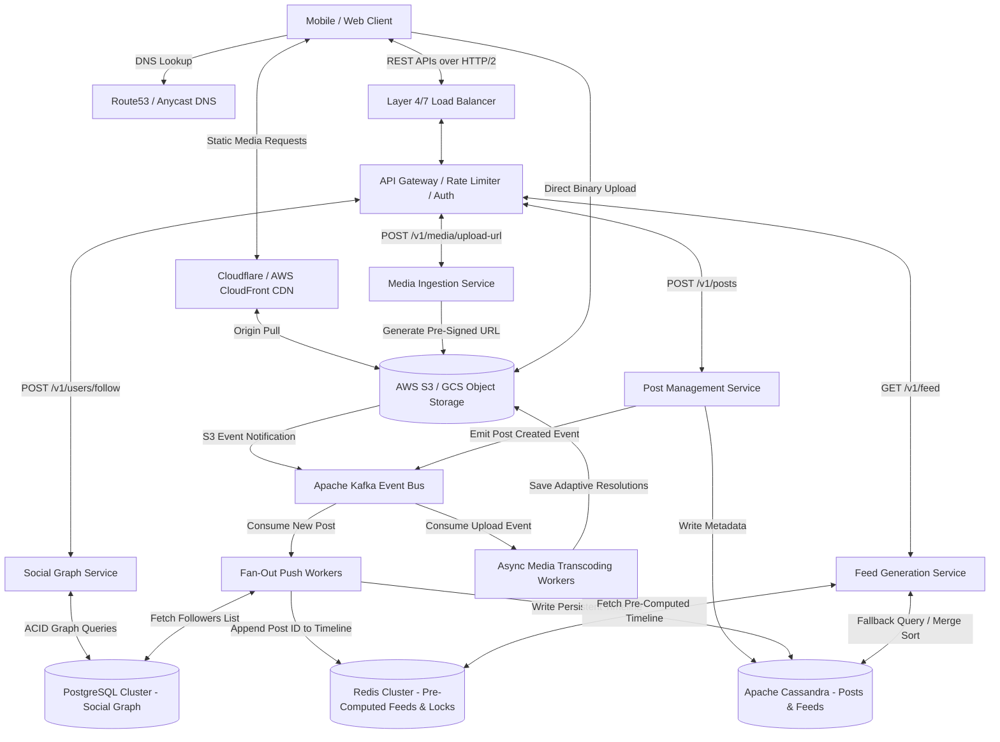

# Instagram System Design
---

## 1. Scope & System Requirements

### Core Functional Requirements
* **Media Ingestion:** Users can upload photos and videos with captions and location metadata.
* **Social Graph:** Unidirectional relationships (User A follows User B without requiring User B to follow User A).
* **Timeline Generation:** A personalized, reverse-chronological or ranked news feed merging content from followed accounts.
* **Proactive Engineering Additions:**
  * **Asynchronous Media Transcoding:** Background processing to generate multiple adaptive bitrate streaming (ABR) formats and image thumbnails without blocking client UI.
    > **ABR in plain English:** one uploaded video gets converted into several quality versions (1080p, 720p, 480p). A phone on weak wifi automatically gets a lower-quality stream instead of buffering.
  * **Cursor-Based Pagination:** Stable feed scrolling using an indexed pointer (`WHERE post_id < last_seen_id LIMIT 20`) that prevents O(N) database performance degradation caused by standard SQL `OFFSET`.
    > **Plain English:** instead of saying "skip the first 500 rows, give me the next 20" (which gets slower as the number grows), you say "give me 20 rows *after* this specific ID." It's a direct pointer jump instead of counting through everything — hence constant-time O(1) instead of O(N).

### Non-Functional Requirements (NFRs) & Architectural Justifications
* **High Availability over Consistency (AP in CAP Theorem):**
  > **CAP Theorem in plain English:** in a distributed system, if part of the network gets cut off, you must choose between two things — keep serving users possibly-stale data (**Availability**) or refuse to answer until everything is guaranteed correct (**Consistency**). Instagram chooses Availability.
  * *Justification:* Serving slightly stale data (e.g., a friend's post appearing 2 seconds late) does not impact user experience. However, a database partition causing a full outage directly destroys engagement. We optimize for availability using **Eventual Consistency** — data becomes correct everywhere *eventually* (usually within seconds), just not at the exact millisecond it was written.
* **Feed Read Latency < 200ms (P99):**
  * *Justification:* Human visual perception perceives responses under 100ms as instantaneous; delays exceeding 300ms break scrolling flow. To maintain sub-200ms latency at P99 across distributed networks, we must aggressively cache pre-computed timelines in RAM.
* **Read-to-Write Ratio (~100:1):**
  * *Justification:* Users consume significantly more media than they produce. Infrastructure must favor read throughput via replication, caching layers, and read-optimized database partitioning.
* **Zero Media Data Loss (High Durability):**
  * *Justification:* Uploaded media files represent irreplaceable user data. Object storage must guarantee 99.999999999% (11 nines) of durability via multi-region replication.

---

## 2. Scale Estimation & Hardware Boundaries

### Traffic & Volumetric Parameters
* **Daily Active Users (DAU):** 500,000,000
* **Average Read Actions:** 20 requests/user/day
* **Average Write Actions:** 0.2 posts/user/day (1 upload per user every 5 days)

### Queries Per Second (QPS) Math
We use 86,400 seconds/day and apply a **2x Peak Traffic Multiplier** to account for regional evening spikes and viral events.
* **Average Read QPS:** `(500,000,000 * 20) / 86,400` ≈ **115,740 QPS**
* **Peak Read QPS:** `115,740 * 2` ≈ **231,480 QPS**
* **Average Write QPS:** `(500,000,000 * 0.2) / 86,400` ≈ **1,157 QPS**
* **Peak Write QPS:** `1,157 * 2` ≈ **2,314 QPS**

### Storage Footprint & Replication Needs
* **Daily New Media Uploads:** `500,000,000 * 0.2` = **100,000,000 files/day**
* **Raw Media Storage (Assuming 2 MB average bundle size):**
  * Daily Raw Storage: `100,000,000 * 2 MB` = **200 TB/day**
* **Transcoding Multiplier (3x):** Storing 1080p, 720p, 480p, and thumbnails increases daily media growth to **600 TB/day** (~219 PB/year).
* **Replication Multiplier (3x Across AZs):** Total physical storage required ≈ **657 PB/year**.
  > **AZ = Availability Zone** — basically a physically separate data center within a region. Storing 3 copies across different AZs means if one building loses power, your data still survives.
* **Structured Metadata (Post ID, User ID, Timestamp, Caption ≈ 1 KB):**
  * Daily Metadata Storage: `100,000,000 * 1 KB` = **100 GB/day** (~36.5 TB/year).
* **Infrastructure Boundary Conclusion:** Media must reside in horizontally scalable Blob/Object Storage served via Content Delivery Networks (CDNs). Metadata must be partitioned across distributed NoSQL clusters; a single relational database instance cannot handle the IOPS for 231,480 Peak Read QPS.

---

## 3. High-Level Design (HLD) & Architecture Flow

### API Contracts (REST over HTTP/2)
*Why REST over WebSockets?* Feed scrolling is a unidirectional **client-pull** pattern (the client asks, the server answers — no need for the server to constantly push updates). Persistent, bi-directional WebSockets add unnecessary memory overhead to stateful gateway servers without providing architectural benefits for static feed loading. Synchronous REST over HTTPS with HTTP/2 multiplexing is optimal.

> **HTTP/2 Multiplexing in plain English:** old HTTP (1.1) needed a brand-new connection for every single image on a page — like one lane of traffic per car. HTTP/2 lets dozens of images download at the same time over a *single* connection — a multi-lane highway instead of a single lane. This is why scrolling through image-heavy feeds feels fast.

* **`POST /v1/media/upload-url`**
  * *Request:* `{ "file_size": 2048576, "file_type": "video/mp4" }`
  * *Response:* `{ "upload_url": "https://s3-accelerate.amazonaws.com/...", "media_id": "med_987654" }`
  * *Purpose:* Generates a **pre-signed URL** allowing clients to upload binary payloads directly to Object Storage, bypassing backend API servers entirely.
    > **Pre-signed URL in plain English:** a temporary, one-time-use "permission slip" your backend generates so the client can upload the file straight to S3 without ever routing through your API servers. This is why a 100MB video doesn't clog up your main servers.
* **`POST /v1/posts`**
  * *Request:* `{ "media_id": "med_987654", "caption": "Sunset #nature", "location_id": "loc_123" }`
  * *Response:* `{ "post_id": "post_555111", "status": "PROCESSING" }`
  * *Purpose:* Commits post metadata to the database and emits an asynchronous event to trigger feed distribution.
* **`GET /v1/feed?cursor=0987654321&limit=20`**
  * *Response:* `{ "data": [ { "post_id": "...", "media_url": "...", "author": "..." } ], "next_cursor": "0987654300" }`
  * *Purpose:* Fetches timeline using an indexed, constant-time O(1) cursor instead of an O(N) SQL `OFFSET`.

### System Architecture Diagram

**What each box actually does, in one line:**

| Term | Plain-English Meaning |
|---|---|
| **Anycast DNS** | The *same* IP address is broadcast from data centers worldwide. A user in Tokyo typing instagram.com gets automatically routed to the nearest copy — like calling one pizza chain phone number that always rings the closest branch. |
| **L4 Load Balancer** | Routes traffic using only IP/port info — never looks inside the request. Doesn't waste CPU reading content, so it's extremely fast and absorbs massive traffic (including DDoS attacks). The outer shield. |
| **L7 Load Balancer** | Actually reads the HTTP path (`/upload` vs `/feed`) and routes *smartly* — uploads go to heavy media servers, feed reads go to lightweight servers. Also handles SSL/TLS decryption so backend services don't have to. |
| **API Gateway** | The single front door for every client request — handles authentication and rate limiting before a request reaches any real service. |
| **CDN + Origin Pull** | A CDN caches your photos/videos on servers close to users worldwide. "Origin pull" = if the CDN's local cache is empty, it fetches the file once from your real storage (S3, the "origin"), caches it, and every future nearby user gets the fast cached copy. |
| **Kafka (Event Bus)** | A message queue that lets services notify each other asynchronously ("a post was created," "a video finished uploading") without directly calling each other — decouples services so one being slow doesn't block another. |
| **VPC (internal cloud network)** | Your own private, isolated network inside AWS/GCP. Data moving over the VPC (e.g., workers pulling videos from S3) never touches the public internet — fast, free, and secure, like an internal hallway instead of walking outside. |

---

## 4. The Polyglot Persistence Data Tier

We strictly decouple storage architectures based on access patterns, transactional requirements, and data structures.

| Storage Technology | Selected Engine | Target Use Case | Access Pattern & Engineering Justification |
| :--- | :--- | :--- | :--- |
| **Object Storage** | AWS S3 / GCS | Raw images, videos, thumbnails, and transcoded ABR video chunks. | **Why:** Databases degrade rapidly when storing binary large objects (BLOBs) due to buffer pool eviction and massive I/O bloat. Object storage provides horizontal scaling, byte-range requests, and native integration with edge CDNs. |
| **Relational SQL** | PostgreSQL (Sharded) | User accounts, authentication credentials, and core **Social Graph** (Follower/Following tables). | **Why:** The social graph requires **strict ACID transactions** and relational integrity. If User A follows User B, the state must update atomically (all-or-nothing). SQL excels at structured joins and referential integrity. |
| **Wide-Column NoSQL** | Apache Cassandra | Post metadata, user profile timelines, and persistent pre-computed home feed timelines. | **Why:** Designed for massive write throughput (2,314 Peak Write QPS) and high-speed sequential reads. By defining the partition key as `user_id` and clustering key as `timestamp DESC`, all posts for a user's feed are stored contiguously on disk, converting queries into constant-time O(1) range scans. |
| **In-Memory Cache** | Redis Cluster | Pre-computed home feed timelines for active users, session data, and distributed mutex locks. | **Why:** Bypasses disk I/O entirely to guarantee the <200ms latency NFR. Uses Redis Sorted Sets (`ZSET`) where the score is the timestamp and the value is the `post_id`, enabling sub-millisecond timeline retrieval and pagination. |

> **ACID in plain English:** a guarantee that a database operation either fully happens or doesn't happen at all — no half-finished states. Important for things like "follow" actions where partial updates would corrupt data.
>
> **ZSET (Redis Sorted Set) in plain English:** every item (a `post_id`) is tied to a number (the timestamp). Redis automatically keeps everything sorted by that number in RAM, so "give me the newest 20 posts" is a near-instant lookup, not a search.

### Deep-Dive Justification: When to Use Cassandra (And Why Not Everywhere)
* **Why it works for fast writes (e.g., activity logs, swipe history):** Cassandra uses a **Log-Structured Merge (LSM) tree**. Writing data is sequentially appending to an immutable commit log in memory/disk without B-tree locking overhead.
  > **LSM Tree in plain English:** relational databases (B-Trees) sometimes need to jump around the disk to update a record in place — slow. LSM Trees just append new writes to the *end* of a log, sequentially, like writing to the last page of a notebook instead of flipping back to edit an old page. That's why Cassandra handles thousands of writes per second so easily.
* **Why it works for Instagram Feeds (Fast Reads):** Because we define our partition key as `user_id`, Cassandra stores all feed posts for a single user physically clustered together on the exact same disk. Reading `LIMIT 20` is a localized, sequential read from one node.
* **Why NOT use Cassandra everywhere:** Cassandra **does not support JOINs, ad-hoc queries, or multi-row ACID transactions.** If you query Cassandra without knowing the exact partition key (e.g., *"Find users who live in NY"*), it executes a "scatter-gather" query across thousands of nodes, causing performance to collapse. Use PostgreSQL whenever relational integrity and complex JOINs are mandatory.

---

## 5. Architectural Clarification: Direct-to-S3 Uploads vs. Background Transcoding

### The Potential Misconception
If a mobile client uploads directly to Object Storage (bypassing backend servers), how do background workers transcode the media without causing extra network hops and bandwidth bloat?

### The Engineering Reality (Event-Driven Architecture)
1. **Direct-to-S3 Saves Public Internet & API Server CPU:** The mobile client requests a pre-signed URL from our API Gateway, then uploads the 100MB video directly to AWS S3. **Our public API servers handle 0% of this heavy media payload.** Thousands of simultaneous uploads won't exhaust API server TCP connections or RAM.
2. **Internal Event Notifications:** The instant S3 finishes saving the file, S3 natively fires an event notification into Apache Kafka (`video_uploaded_event`).
3. **Internal VPC Cloud Routing:** Background workers consume the Kafka message and download the raw file from S3 **over the internal AWS cloud network (VPC)**. Internal VPC data transfer operates at multi-gigabit speeds, costs $0 in public data transfer, and keeps API servers 100% free to serve lightweight JSON read requests. Workers transcode the file into multiple adaptive resolutions, upload them back to S3, and update the Cassandra post metadata status to `ACTIVE`.

---

## 6. Deep-Dive: Production Bottlenecks & Architectural Solutions

### Bottleneck 1: The Celebrity Fan-Out (Thundering Herd on Write)
**The Problem:** In a pure **Push Model (Fan-out-on-Write)**, when a user posts, the system appends that `post_id` to the timeline caches of all followers. If a celebrity with 600M followers posts, a single HTTP write triggers **600 million database/cache writes**. This causes severe write amplification, clogs message queues, spikes Redis CPU to 100%, and creates a Thundering Herd outage.

> **Plain English:** one action (a celebrity hitting "post") triggers millions of hidden downstream actions — like one doorbell wired to 600 million houses ringing at once.

**The Solution: Hybrid Push-Pull Architecture with Follower Thresholds**
We categorize users based on their follower count using a dynamic threshold (`Threshold = 25,000 followers`).

1. **Normal Users (< 25,000 followers) -> Pure Push:** When a normal user posts, asynchronous workers push the `post_id` directly into the Redis `ZSET` feed caches of their followers. Write amplification is negligible.
2. **Celebrities (>= 25,000 followers) -> Pure Pull:** When a celebrity posts, **zero fan-out occurs**. The post metadata is written exactly once to the celebrity's personal timeline table in Cassandra.
3. **Read-Time Merge Sort:** When an active user opens their app:
   * The Feed Service pulls their pre-computed home timeline from Redis (containing posts from normal friends).
   * It queries the Social Graph Service for a list of celebrities the user follows.
   * It executes a concurrent read to Cassandra to fetch the latest N posts from those specific celebrity timelines.
   * The service performs an in-memory merge-sort based on timestamps, caches the top results, and returns the unified timeline to the client.

> #### Word-for-Word Interview Script: Celebrity Fan-Out
> *"If we use a pure Push model, a celebrity posting to 600 million followers creates massive write amplification. Attempting 600 million cache writes instantly will clog our message brokers and cause a Thundering Herd outage. Instead, I would implement a Hybrid Push-Pull architecture. We set a threshold—say, 25,000 followers. Normal users fan-out on write because their follower count is small. Celebrities fan-out on read; we write their post once to their personal timeline. When an active user loads their feed, our Feed Service fetches their pre-computed timeline of normal friends and merges it in real-time with the latest posts from the specific celebrities they follow."*

---

### Bottleneck 2: Cache Stampede (Thundering Herd on Read)
**The Problem:** Active user feeds and viral post metadata are served from Redis. When a cache key hits its Time-To-Live (TTL) expiration or is evicted due to memory pressure, the next read results in a **Cache Miss**. If 50,000 concurrent requests hit an expired key simultaneously, all 50,000 threads bypass Redis and hammer Cassandra for the exact same data. Database connection pools exhaust instantly, causing cascading system failures.

**The Solution: Distributed Mutex Locking via Redis `SETNX`**
To prevent concurrent read stampedes on cache misses, we implement a distributed mutex pattern:

1. When a read thread experiences a cache miss for key `feed:user_123`, it attempts to acquire a short-lived distributed lock in Redis using the `SETNX` (Set if Not Exists) command: `SETNX lock:feed:user_123 "locked" EX 5`.
2. **Lock Winner:** Exactly one thread succeeds in acquiring the lock. This thread queries Cassandra, re-computes the timeline, writes the fresh data back to the Redis `ZSET`, and releases the lock.
3. **Lock Losers:** All other concurrent threads fail to acquire the lock. Instead of querying the database, they enter a brief sleep (50ms) and retry reading from the Redis cache, successfully fetching the newly populated data without touching Cassandra.

> **Distributed Mutex in plain English:** a shared digital "restroom key" stored in fast RAM (Redis). When 50,000 servers try to compute an expired cache at once, only whoever grabs the key (`SETNX`) is allowed to query the database. Everyone else waits outside until the key comes back.

> #### Word-for-Word Interview Script: Cache Stampede
> *"To prevent a Cache Stampede when a popular feed's TTL expires, we cannot allow thousands of concurrent cache-miss requests to query the underlying database simultaneously. I would implement a Distributed Lock using Redis `SETNX`. When a cache miss occurs, the first thread acquires the lock and queries Cassandra to rebuild the feed cache. All concurrent threads attempting to read that same feed will fail to acquire the lock and will either wait 50 milliseconds to read the freshly populated cache or be served a slightly stale fallback payload. This protects our storage tier from traffic spikes."*

---

### Deep-Dive Justification: Shared Cache Stampedes vs. Unique Personal Home Feeds
Why do we worry about a 50,000-user stampede if every user's personal home feed is unique?

1. **Where the 50,000-User Stampede Actually Happens (Shared Data):**
   * **Celebrity Profile Grids:** Millions read the exact same cache key for a celebrity's profile timeline. If that shared key expires during peak traffic, 50,000 concurrent users stampede the database for that single grid.
   * **Viral Reel/Post Metadata:** When a video goes viral, thousands of users request the exact same `post_id` metadata object per second. If that object's cache expires, thousands of threads hit Cassandra simultaneously.
2. **Why We Still Lock Unique Personal Home Feeds (Private Data):**
   * Even though 50,000 strangers aren't reading Alice's unique home feed, Alice's **own devices can cause a single-user mini-stampede**. If her cache expires while she has the app open on her phone and iPad, or if she rapidly scrolls down triggering multiple simultaneous AJAX pagination requests (`limit=20`, `limit=40`), an unlocked system will execute multiple duplicate Cassandra queries for the exact same data. Mutex locking ensures only one internal thread rebuilds her feed.

---

## 7. Quick-Reference Glossary

| Term | One-Line Meaning |
|---|---|
| **L4 Load Balancer** | Routes by IP/port only — fast, doesn't inspect content. The outer traffic cop. |
| **L7 Load Balancer** | Reads the actual HTTP path/headers — smart routing + SSL termination. The receptionist. |
| **Anycast DNS** | Same IP broadcast globally; routes users to their nearest data center. |
| **CDN / Origin Pull** | Edge caching network; pulls from S3 ("origin") only on first request, then caches. |
| **HTTP/2 Multiplexing** | Many files download over one connection instead of one-at-a-time. |
| **Pre-signed URL** | Temporary permission slip letting clients upload straight to S3. |
| **VPC** | Private internal cloud network — fast, free, secure data transfer between your own services. |
| **Kafka / Event Bus** | Async messaging system that decouples services (post created → notify workers). |
| **CAP Theorem (AP choice)** | Trade-off between Availability and Consistency during network failures; Instagram picks Availability. |
| **Eventual Consistency** | Data syncs everywhere within seconds — not instantly, but reliably soon. |
| **Cursor-Based Pagination** | "Give me rows after X" instead of "skip N rows" — stays fast at any scale (O(1) vs O(N)). |
| **ACID** | Guarantee that a DB operation fully completes or doesn't happen at all. |
| **LSM Tree** | Cassandra's write engine — appends sequentially instead of editing in place, making writes very fast. |
| **Redis ZSET** | In-memory sorted list (by timestamp) enabling instant "give me the newest 20" queries. |
| **Write Amplification** | One user action triggering a disproportionate number of hidden backend writes. |
| **Thundering Herd (Write)** | Celebrity fan-out overwhelming the system — solved via hybrid push-pull. |
| **Cache Stampede (Read)** | Many requests hitting the DB at once after a cache expires — solved via distributed locking. |
| **Distributed Mutex (`SETNX`)** | A shared lock ensuring only one process rebuilds an expired cache at a time. |

---

## 8. Interviewer Evaluation Rubric (What Earns a "Strong Hire")

A candidate architecture is evaluated against three core engineering pillars:
1. **Proactive Resource Decoupling:** The candidate explicitly isolates heavy binary workloads (media ingestion/serving via CDN/S3) from lightweight transactional workflows (JSON APIs/social graph), recognizing that combining them leads to resource starvation.
2. **Deep Access-Pattern Alignment:** The candidate rejects "one-size-fits-all" databases. They explicitly match relational ACID needs to SQL, sequential append-only time-series data to wide-column NoSQL, and sub-100ms read timelines to in-memory sorted sets.
3. **Scale-Induced Edge Case Mastery:** The candidate demonstrates that designs working for 10,000 users fail at 500 million users. Proactively identifying and engineering concrete solutions for **Thundering Herds** (via Hybrid Push-Pull) and **Cache Stampedes** (via Mutex Locking) separates junior candidates from principal architects.
