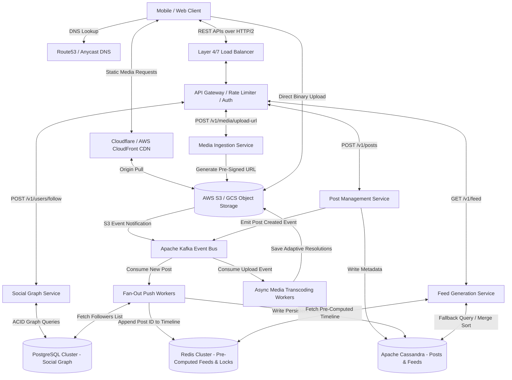

# Instagram

---

## 1. Scope & System Requirements

### Core Functional Requirements
* **Media Ingestion:** Users can upload photos and videos with captions and location metadata.
* **Social Graph:** Unidirectional relationships (User A follows User B without requiring User B to follow User A).
* **Timeline Generation:** A personalized, reverse-chronological or ranked news feed merging content from followed accounts.
* **Proactive Engineering Additions:**
  * **Asynchronous Media Transcoding:** Background processing to generate multiple adaptive bitrate streaming (ABR) formats and image thumbnails without blocking client UI.
  * **Cursor-Based Pagination:** Stable feed scrolling using an indexed pointer (`WHERE post_id < last_seen_id LIMIT 20`) that prevents O(N) database performance degradation caused by standard SQL `OFFSET`.

### Non-Functional Requirements (NFRs) & Architectural Justifications
* **High Availability over Consistency (AP in CAP Theorem):**
  * *Justification:* Serving slightly stale data (e.g., a friend's post appearing 2 seconds late) does not impact user experience. However, a database partition causing a full outage directly destroys engagement. We optimize for availability using Eventual Consistency.
* **Feed Read Latency < 200ms (P99):**
  * *Justification:* Human visual perception perceives responses under 100ms as instantaneous; delays exceeding 300ms break scrolling flow. To maintain sub-200ms latency at P99 across distributed networks, we must aggressively cache pre-computed timelines in RAM.
* **Read-to-Write Ratio (~100:1):**
  * *Justification:* Users consume significantly more media than they produce. Infrastructure must favor read throughput via replication, caching layers, and read-optimized database partitioning.
* **Zero Media Data Loss (High Durability):**
  * *Justification:* Uploaded media files represent irreplaceable user data. Object storage must guarantee 99.999999999% (11 nines) of durability via multi-region replication.

---

## 2. Scale Estimation & Hardware Boundaries

### Traffic & Volumetric Parameters
* **Daily Active Users (DAU):** 500,000,000
* **Average Read Actions:** 20 requests/user/day
* **Average Write Actions:** 0.2 posts/user/day (1 upload per user every 5 days)

### Queries Per Second (QPS) Math
We use 86,400 seconds/day and apply a **2x Peak Traffic Multiplier** to account for regional evening spikes and viral events.
* **Average Read QPS:** `(500,000,000 * 20) / 86,400` ≈ **115,740 QPS**
* **Peak Read QPS:** `115,740 * 2` ≈ **231,480 QPS**
* **Average Write QPS:** `(500,000,000 * 0.2) / 86,400` ≈ **1,157 QPS**
* **Peak Write QPS:** `1,157 * 2` ≈ **2,314 QPS**

### Storage Footprint & Replication Needs
* **Daily New Media Uploads:** `500,000,000 * 0.2` = **100,000,000 files/day**
* **Raw Media Storage (Assuming 2 MB average bundle size):**
  * Daily Raw Storage: `100,000,000 * 2 MB` = **200 TB/day**
* **Transcoding Multiplier (3x):** Storing 1080p, 720p, 480p, and thumbnails increases daily media growth to **600 TB/day** (~219 PB/year).
* **Replication Multiplier (3x Across AZs):** Total physical storage required ≈ **657 PB/year**.
* **Structured Metadata (Post ID, User ID, Timestamp, Caption ≈ 1 KB):**
  * Daily Metadata Storage: `100,000,000 * 1 KB` = **100 GB/day** (~36.5 TB/year).
* **Infrastructure Boundary Conclusion:** Media must reside in horizontally scalable Blob/Object Storage served via Content Delivery Networks (CDNs). Metadata must be partitioned across distributed NoSQL clusters; a single relational database instance cannot handle the IOPS for 231,480 Peak Read QPS.

---

## 3. High-Level Design (HLD) & Architecture Flow

### API Contracts (REST over HTTP/2)
*Why REST over WebSockets?* Feed scrolling is a unidirectional **client-pull** pattern. Persistent, bi-directional WebSockets add unnecessary memory overhead to stateful gateway servers without providing architectural benefits for static feed loading. Synchronous REST over HTTPS with HTTP/2 multiplexing is optimal.

* **`POST /v1/media/upload-url`**
  * *Request:* `{ "file_size": 2048576, "file_type": "video/mp4" }`
  * *Response:* `{ "upload_url": "https://s3-accelerate.amazonaws.com/...", "media_id": "med_987654" }`
  * *Purpose:* Generates a pre-signed URL allowing clients to upload binary payloads directly to Object Storage, bypassing backend API servers entirely.
* **`POST /v1/posts`**
  * *Request:* `{ "media_id": "med_987654", "caption": "Sunset #nature", "location_id": "loc_123" }`
  * *Response:* `{ "post_id": "post_555111", "status": "PROCESSING" }`
  * *Purpose:* Commits post metadata to the database and emits an asynchronous event to trigger feed distribution.
* **`GET /v1/feed?cursor=0987654321&limit=20`**
  * *Response:* `{ "data": [ { "post_id": "...", "media_url": "...", "author": "..." } ], "next_cursor": "0987654300" }`
  * *Purpose:* Fetches timeline using an indexed, constant-time O(1) cursor instead of an O(N) SQL `OFFSET`.

### System Architecture Diagram

---

## 4. The Polyglot Persistence Data Tier

We strictly decouple storage architectures based on access patterns, transactional requirements, and data structures.

| Storage Technology | Selected Engine | Target Use Case | Access Pattern & Engineering Justification |
| :--- | :--- | :--- | :--- |
| **Object Storage** | AWS S3 / GCS | Raw images, videos, thumbnails, and transcoded ABR video chunks. | **Why:** Databases degrade rapidly when storing binary large objects (BLOBs) due to buffer pool eviction and massive I/O bloat. Object storage provides horizontal scaling, byte-range requests, and native integration with edge CDNs. |
| **Relational SQL** | PostgreSQL (Sharded) | User accounts, authentication credentials, and core **Social Graph** (Follower/Following tables). | **Why:** The social graph requires **strict ACID transactions** and relational integrity. If User A follows User B, the bidirectional state must update atomically. SQL excels at structured joins and referential integrity. |
| **Wide-Column NoSQL** | Apache Cassandra | Post metadata, user profile timelines, and persistent pre-computed home feed timelines. | **Why:** Designed for massive write throughput (2,314 Peak Write QPS) and high-speed sequential reads. By defining the partition key as `user_id` and clustering key as `timestamp DESC`, all posts for a user's feed are stored contiguously on disk, converting queries into constant-time O(1) range scans. |
| **In-Memory Cache** | Redis Cluster | Pre-computed home feed timelines for active users, session data, and distributed mutex locks. | **Why:** Bypasses disk I/O entirely to guarantee the <200ms latency NFR. Uses Redis Sorted Sets (`ZSET`) where the score is the timestamp and the value is the `post_id`, enabling sub-millisecond timeline retrieval and pagination. |

### Deep-Dive Justification: When to Use Cassandra (And Why Not Everywhere)
* **Why it works for fast writes (e.g., activity logs, swipe history):** Cassandra uses a Log-Structured Merge (LSM) tree. Writing data is sequentially appending to an immutable commit log in memory/disk without B-tree locking overhead.
* **Why it works for Instagram Feeds (Fast Reads):** Because we define our partition key as `user_id`, Cassandra stores all feed posts for a single user physically clustered together on the exact same disk. Reading `LIMIT 20` is a localized, sequential read from one node.
* **Why NOT use Cassandra everywhere:** Cassandra **does not support JOINs, ad-hoc queries, or multi-row ACID transactions.** If you query Cassandra without knowing the exact partition key (e.g., *"Find users who live in NY"*), it executes a "scatter-gather" query across thousands of nodes, causing performance to collapse. Use PostgreSQL whenever relational integrity and complex JOINs are mandatory.

---

## 5. Architectural Clarification: Direct-to-S3 Uploads vs. Background Transcoding

### The Potential Misconception
If a mobile client uploads directly to Object Storage (bypassing backend servers), how do background workers transcode the media without causing extra network hops and bandwidth bloat?

### The Engineering Reality (Event-Driven Architecture)
1. **Direct-to-S3 Saves Public Internet & API Server CPU:** The mobile client requests a pre-signed URL from our API Gateway, then uploads the 100MB video directly to AWS S3. **Our public API servers handle 0% of this heavy media payload.** Thousands of simultaneous uploads won't exhaust API server TCP connections or RAM.
2. **Internal Event Notifications:** The instant S3 finishes saving the file, S3 natively fires an event notification into Apache Kafka (`video_uploaded_event`).
3. **Internal VPC Cloud Routing:** Background workers consume the Kafka message and download the raw file from S3 **over the internal AWS cloud network (VPC)**. Internal VPC data transfer operates at multi-gigabit speeds, costs $0 in public data transfer, and keeps API servers 100% free to serve lightweight JSON read requests. Workers transcode the file into multiple adaptive resolutions, upload them back to S3, and update the Cassandra post metadata status to `ACTIVE`.

---

## 6. Deep-Dive: Production Bottlenecks & Architectural Solutions

### Bottleneck 1: The Celebrity Fan-Out (Thundering Herd on Write)
**The Problem:** In a pure **Push Model (Fan-out-on-Write)**, when a user posts, the system appends that `post_id` to the timeline caches of all followers. If a celebrity with 600M followers posts, a single HTTP write triggers **600 million database/cache writes**. This causes severe write amplification, clogs message queues, spikes Redis CPU to 100%, and creates a Thundering Herd outage.

**The Solution: Hybrid Push-Pull Architecture with Follower Thresholds**
We categorize users based on their follower count using a dynamic threshold (`Threshold = 25,000 followers`).

1. **Normal Users (< 25,000 followers) -> Pure Push:** When a normal user posts, asynchronous workers push the `post_id` directly into the Redis `ZSET` feed caches of their followers. Write amplification is negligible.
2. **Celebrities (>= 25,000 followers) -> Pure Pull:** When a celebrity posts, **zero fan-out occurs**. The post metadata is written exactly once to the celebrity’s personal timeline table in Cassandra.
3. **Read-Time Merge Sort:** When an active user opens their app:
   * The Feed Service pulls their pre-computed home timeline from Redis (containing posts from normal friends).
   * It queries the Social Graph Service for a list of celebrities the user follows.
   * It executes a concurrent read to Cassandra to fetch the latest N posts from those specific celebrity timelines.
   * The service performs an in-memory merge-sort based on timestamps, caches the top results, and returns the unified timeline to the client.

> #### Word-for-Word Interview Script: Celebrity Fan-Out
> *"If we use a pure Push model, a celebrity posting to 600 million followers creates massive write amplification. Attempting 600 million cache writes instantly will clog our message brokers and cause a Thundering Herd outage. Instead, I would implement a Hybrid Push-Pull architecture. We set a threshold—say, 25,000 followers. Normal users fan-out on write because their follower count is small. Celebrities fan-out on read; we write their post once to their personal timeline. When an active user loads their feed, our Feed Service fetches their pre-computed timeline of normal friends and merges it in real-time with the latest posts from the specific celebrities they follow."*

---

### Bottleneck 2: Cache Stampede (Thundering Herd on Read)
**The Problem:** Active user feeds and viral post metadata are served from Redis. When a cache key hits its Time-To-Live (TTL) expiration or is evicted due to memory pressure, the next read results in a **Cache Miss**. If 50,000 concurrent requests hit an expired key simultaneously, all 50,000 threads bypass Redis and hammer Cassandra for the exact same data. Database connection pools exhaust instantly, causing cascading system failures.

**The Solution: Distributed Mutex Locking via Redis `SETNX`**
To prevent concurrent read stampedes on cache misses, we implement a distributed mutex pattern:

1. When a read thread experiences a cache miss for key `feed:user_123`, it attempts to acquire a short-lived distributed lock in Redis using the `SETNX` (Set if Not Exists) command: `SETNX lock:feed:user_123 "locked" EX 5`.
2. **Lock Winner:** Exactly one thread succeeds in acquiring the lock. This thread queries Cassandra, re-computes the timeline, writes the fresh data back to the Redis `ZSET`, and releases the lock.
3. **Lock Losers:** All other concurrent threads fail to acquire the lock. Instead of querying the database, they enter a brief sleep (50ms) and retry reading from the Redis cache, successfully fetching the newly populated data without touching Cassandra.

> #### Word-for-Word Interview Script: Cache Stampede
> *"To prevent a Cache Stampede when a popular feed's TTL expires, we cannot allow thousands of concurrent cache-miss requests to query the underlying database simultaneously. I would implement a Distributed Lock using Redis `SETNX`. When a cache miss occurs, the first thread acquires the lock and queries Cassandra to rebuild the feed cache. All concurrent threads attempting to read that same feed will fail to acquire the lock and will either wait 50 milliseconds to read the freshly populated cache or be served a slightly stale fallback payload. This protects our storage tier from traffic spikes."*

---

### Deep-Dive Justification: Shared Cache Stampedes vs. Unique Personal Home Feeds
Why do we worry about a 50,000-user stampede if every user's personal home feed is unique?

1. **Where the 50,000-User Stampede Actually Happens (Shared Data):**
   * **Celebrity Profile Grids:** Millions read the exact same cache key for a celebrity's profile timeline. If that shared key expires during peak traffic, 50,000 concurrent users stampede the database for that single grid.
   * **Viral Reel/Post Metadata:** When a video goes viral, thousands of users request the exact same `post_id` metadata object per second. If that object's cache expires, thousands of threads hit Cassandra simultaneously.
2. **Why We Still Lock Unique Personal Home Feeds (Private Data):**
   * Even though 50,000 strangers aren't reading Alice's unique home feed, Alice's **own devices can cause a single-user mini-stampede**. If her cache expires while she has the app open on her phone and iPad, or if she rapidly scrolls down triggering multiple simultaneous AJAX pagination requests (`limit=20`, `limit=40`), an unlocked system will execute multiple duplicate Cassandra queries for the exact same data. Mutex locking ensures only one internal thread rebuilds her feed.

---

## 7. First-Principles Jargon Glossary & Architecture Component Breakdown

Every term in our architecture diagram explained in plain English with simple analogies so you can defend them confidently in an interview:

* **Layer 4 (L4) Load Balancer (The Traffic Cop):** Operates at the **Transport Layer** (TCP/UDP). It routes network packets based *purely* on IP addresses and port numbers without inspecting the content of the HTTP request. 
  * *Why we use it:* Because it doesn't waste CPU reading the payload, it is blazing fast and can handle millions of connections per second. It acts as our outer shield against DDoS attacks and distributes raw traffic across data centers.
* **Layer 7 (L7) Load Balancer (The Receptionist):** Operates at the **Application Layer** (HTTP/HTTPS). It decrypts and reads the actual HTTP headers, cookies, and URL paths (e.g., `/v1/media/upload` vs. `/v1/feed`).
  * *Why we use it:* It allows **smart routing**. If a user sends an upload request, L7 routes it directly to high-bandwidth Media Services. If they request a timeline, it routes to lightweight Feed Services. It also terminates SSL/TLS encryption so backend microservices don't waste CPU decrypting security certificates.
* **Anycast DNS (The Nearest Post Office):** A network routing technique where identical IP addresses are assigned to servers in different geographical locations worldwide.
  * *Why we use it:* When a user in Tokyo types `instagram.com`, Anycast automatically routes their request to our Tokyo data center rather than New York. It guarantees the lowest possible latency by physically routing users to the geographically closest server.
* **CDN Origin Pull (The Library Interlibrary Loan):** When a user requests a photo from our Content Delivery Network (CDN) edge server, if the CDN doesn't have it in local cache, it "pulls" the file from our backend AWS S3 bucket (the Origin), caches a copy at the edge, and serves it to the user. Subsequent users get the cached copy instantly.
* **HTTP/2 Multiplexing (The Multi-Lane Highway):** Older HTTP/1.1 required opening a new network connection for every image loaded on a page (causing slow queues). HTTP/2 allows your phone to download 50 different post images simultaneously over **a single TCP connection**, drastically accelerating scroll loading speeds.
* **Log-Structured Merge (LSM) Tree:** The underlying engine inside Apache Cassandra. Relational databases use B-Trees, which require slowly jumping around on a hard drive to overwrite data in-place. LSM Trees simply **append all new writes sequentially to the end of an immutable log** in memory and dump it to disk. This eliminates disk locks and is why Cassandra handles 2,000+ writes per second effortlessly.
* **Redis Sorted Sets (`ZSET`):** An in-memory data structure where every value (e.g., `post_id`) is tied to a numerical score (e.g., the `timestamp`). Redis automatically keeps the list sorted in RAM by score, allowing us to fetch the top 20 newest posts for a timeline in sub-millisecond $O(\log N)$ time.
* **Write Amplification:** When 1 logical action by a user (e.g., clicking "Post") forces your backend servers to execute millions of hidden physical database writes (e.g., updating 600 million follower timelines).
* **Distributed Mutex (Mutual Exclusion):** A shared digital "restroom key" stored in fast RAM (Redis). When 50,000 servers try to calculate an expired cache simultaneously, only the single server that successfully grabs the Redis key (`SETNX`) is allowed to query the database. All other servers wait outside until the key is returned.

---

## 8. Interviewer Evaluation Rubric (What Earns a "Strong Hire")

A candidate architecture is evaluated against three core engineering pillars:
1. **Proactive Resource Decoupling:** The candidate explicitly isolates heavy binary workloads (media ingestion/serving via CDN/S3) from lightweight transactional workflows (JSON APIs/social graph), recognizing that combining them leads to resource starvation.
2. **Deep Access-Pattern Alignment:** The candidate rejects "one-size-fits-all" databases. They explicitly match relational ACID needs to SQL, sequential append-only time-series data to wide-column NoSQL, and sub-100ms read timelines to in-memory sorted sets.
3. **Scale-Induced Edge Case Mastery:** The candidate demonstrates that designs working for 10,000 users fail at 500 million users. Proactively identifying and engineering concrete solutions for **Thundering Herds** (via Hybrid Push-Pull) and **Cache Stampedes** (via Mutex Locking) separates junior candidates from principal architects.