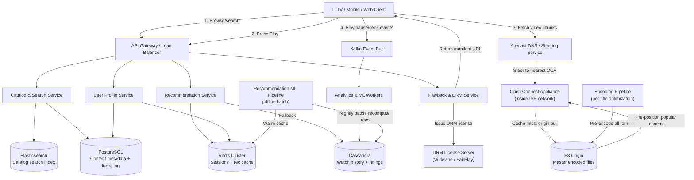

# System Design: Video-on-Demand Streaming Platform (Netflix / Amazon Prime Video / Disney+)

**Level:** SDE Internship / Junior SDE Interview
**Style:** Read-heavy content delivery + ML-driven recommendations + DRM-protected streaming
**Contrast with your other builds:** your YouTube Live note designs a **live** system — real-time ingestion, sub-5-sec glass-to-glass latency, live chat. Netflix is the opposite: content is uploaded **days or weeks before** anyone watches it. The engineering challenge shifts entirely from "transcode fast enough for live" to "pre-transcode into 100+ formats, predict what users will watch, and place content on CDN nodes *before* demand arrives." Latency doesn't mean fast encoding — it means fast playback start.

---

## 1. Requirements

### Functional
- **Content catalog:** browse, search, and filter a library of movies, TV shows, and documentaries
- **Personalized recommendations:** homepage shows content ranked by predicted relevance to each user
- **Video playback:** stream video with adaptive quality, resume from where you left off, subtitle/audio track selection
- **User profiles:** multiple profiles per account, each with independent watch history and recommendations
- **Watchlist:** save titles to "My List" for later

### Proactive Engineering Features
- **Per-title encoding optimization:** instead of encoding every movie at the same bitrate, analyze each scene's complexity and allocate bits where they matter — a dark, static dialogue scene needs far fewer bits than a fast-action explosion
- **Personalized artwork:** serve different thumbnail images for the same movie to different users based on their viewing history (e.g., a romance viewer sees the lead couple; an action viewer sees the car chase)
- **Proactive CDN pre-positioning:** push predicted-popular content to edge servers *before* users request it, based on time-of-day and regional viewing patterns

### Non-Functional Requirements
| Requirement | Target | Justification |
|---|---|---|
| **Playback start latency** | < 2 sec | Users expect video to begin almost instantly after pressing play — past 3 sec, they hit back and pick something else |
| **Rebuffering ratio** | < 0.1% of playback time | Even a single visible buffer spin causes user dissatisfaction and increases churn |
| **Availability** | 99.99% | Subscription service — users pay monthly and expect it to "just work" |
| **Consistency model** | **AP** | If a user's watchlist update takes 2 seconds to propagate across regions, that's invisible. If the entire catalog goes down, that's a cancelled subscription. |
| **Catalog search latency** | < 200 ms | Same as Instagram — below this, it feels instant |

> **Why AP and not CP?** There is no "double-spend" risk here. The worst case of eventual consistency is a user seeing a slightly stale recommendation list for a few seconds. Nobody loses money, nobody gets a corrupted state. Availability is everything for a subscription service — every minute of downtime is measurable churn.

---

## 2. Scale Estimation

**Assume:** 250M subscribers, 100M DAU, each user streams ~2 hours/day, browses for ~10 min/day

| Metric | Calculation | Result |
|---|---|---|
| Concurrent streamers at peak | 100M × 20% (peak overlap) | ~20M simultaneous streams |
| Average streaming bitrate | ~5 Mbps (weighted across 4K/1080p/720p) | — |
| **Peak egress bandwidth** | 20M × 5 Mbps | **100 Tbps** |
| Browse/search reads/day | 100M × 30 actions | 3B/day |
| Browse read QPS | 3B ÷ 86,400s | ~35,000 QPS |
| Peak browse QPS (2×) | 35,000 × 2 | ~70,000 QPS |
| Writes (ratings, watchlist, progress) | 100M × 5 | 500M/day → ~5,800 QPS |

**Storage:**
| Data | Size | Notes |
|---|---|---|
| Content library | ~20,000 titles | Not the bottleneck — the number of titles is small |
| Encoded files per title | ~100–200 files (resolution × codec × audio × subtitle combos) | ~15 GB average per title across all profiles |
| Total encoded content | 20,000 × 15 GB | ~300 PB — and growing with every new release |
| User metadata (profiles, history, watchlist) | 250M × 5 KB | ~1.25 TB — trivially small |

**Key insight:** the dominant cost is **100 Tbps of egress bandwidth**, not storage or QPS. This is why Netflix built its own CDN (Open Connect) instead of paying AWS CloudFront — at this scale, bandwidth from a third-party CDN would cost billions per year.

---

## 3. Storage: Why Five Different Systems

| Layer | Choice | Stores | Why |
|---|---|---|---|
| **Encoded video files** | S3 / GCS (origin) + Open Connect (edge) | All encoded video chunks, manifests, subtitle files | Object storage for cheap, infinite-scale blob hosting. Open Connect edge boxes serve 95%+ of traffic without ever hitting origin. |
| **Content metadata + catalog** | PostgreSQL / Aurora | Title info, cast, genres, release dates, licensing windows | Relational integrity needed — a title's availability depends on licensing agreements per region, and those rules have complex joins and constraints |
| **Search & discovery** | Elasticsearch | Full-text search, autocomplete, faceted filtering (genre, year, language) | Inverted indices make multi-field fuzzy search fast — Postgres full-text search can't keep up at 70K peak QPS |
| **User activity & recommendations** | Cassandra | Watch history, ratings, "continue watching" progress, recommendation pre-computations | Massive write throughput (every play/pause/seek generates events). Partition by `user_id`, cluster by `timestamp`. 250M users × years of history = too large for SQL |
| **Session + cache** | Redis Cluster | User session tokens, recently-computed recommendation lists, playback position cache | Sub-100ms reads for the "Continue Watching" row and personalized homepage — can't afford a Cassandra round-trip on every app open |

> **Why not just use a CDN like CloudFront?** At 100 Tbps of egress, a generic CDN would cost Netflix an estimated $5–10B+ per year in bandwidth fees. Instead, Netflix built **Open Connect** — they ship custom hardware appliances loaded with hard drives directly into ISP data centers worldwide. The ISP hosts the box for free (because it reduces their own backbone traffic), and Netflix serves video from inside the user's own ISP network. This is the single most important architectural decision in Netflix's entire stack.

---

## 4. High-Level Architecture



**Flow summary:**
1. **Browse:** client hits API Gateway → Catalog Service queries Elasticsearch for search, Postgres for metadata → Recommendation Service pulls pre-computed recs from Redis (warmed nightly by the ML pipeline)
2. **Press Play:** Playback Service issues a DRM license (Widevine for Android/Chrome, FairPlay for Apple) → returns the HLS/DASH manifest URL pointing to the nearest Open Connect Appliance
3. **Stream:** client fetches video chunks directly from the OCA inside their ISP — the API servers are no longer involved. If the OCA doesn't have the content, it pulls from S3 origin once and caches locally.
4. **Telemetry:** every play, pause, seek, rewind, and abandon event flows to Kafka → async workers persist to Cassandra → the nightly ML pipeline trains on this data to update recommendations

---

## 5. API Contracts

**Search catalog** (REST)
```
GET /v1/catalog/search?q=Interstellar&genre=sci-fi&limit=20
```
```json
{
  "results": [
    { "title_id": "tt_80016", "title": "Interstellar", "year": 2014,
      "artwork_url": "https://cdn.netflix.com/art/tt_80016/usr_505.jpg",
      "match_score": 97 }
  ]
}
```
> Notice `artwork_url` contains the `user_id` — different users get different thumbnail images for the same title.

**Get personalized homepage** (REST)
```
GET /v1/feed?profile_id=prof_02
```
```json
{
  "rows": [
    { "row_title": "Continue Watching", "titles": ["tt_80016", "tt_70274"] },
    { "row_title": "Because You Watched Interstellar", "titles": ["tt_91203", "tt_42011"] },
    { "row_title": "Trending in India", "titles": ["tt_55019", "tt_66082"] }
  ]
}
```

**Start playback** (REST, transactional)
```
POST /v1/playback/start
```
```json
{ "title_id": "tt_80016", "profile_id": "prof_02", "resume_position_sec": 3420 }
```
```json
{
  "manifest_url": "https://oca-del-1.nflx.net/hls/tt_80016/master.m3u8",
  "drm_license_url": "https://drm.netflix.com/v1/license?session=abc123",
  "audio_tracks": ["en", "hi", "ja"],
  "subtitle_tracks": ["en", "hi", "ja", "ko"]
}
```

**Playback telemetry** (fire-and-forget, high volume)
```
POST /v1/telemetry
```
```json
{ "profile_id": "prof_02", "title_id": "tt_80016", "event": "PAUSE", "position_sec": 4200, "bitrate_kbps": 5800, "buffer_health_sec": 12 }
```

---

## 6. Deep Dive: Production Bottlenecks & Fixes

### A. The Content Encoding Explosion

**The problem:** a single movie must be watchable on a 4K OLED TV, a 720p laptop, a 480p phone on 3G, and everything in between. Each device/network combination needs a different resolution, codec, and bitrate. A single Netflix title is encoded into **~100–200 different files** (resolution × codec × audio language × subtitle).

**The fix — per-title encoding optimization (Netflix's "EVA" pipeline):**
- Traditional approach: encode every movie at the same fixed bitrate ladder (e.g., 720p = 3 Mbps, 1080p = 5 Mbps, 4K = 15 Mbps)
- **Netflix's approach:** analyze each title's visual complexity *scene by scene*. A dark, dialogue-heavy scene (low complexity) gets encoded at a lower bitrate with no visible quality loss. A fast-action explosion scene (high complexity) gets a higher bitrate allocation.
- **Result:** the same perceived quality at **20–50% less bandwidth** per stream. At 100 Tbps of global egress, a 30% reduction saves Netflix hundreds of millions in infrastructure costs annually.

> **Plain English:** instead of "every movie gets 5 Mbps for 1080p," Netflix says "this boring dialogue scene only needs 2 Mbps and still looks perfect — we'll save the extra bandwidth for the explosion scene that actually needs it."

### B. The Recommendation Cold Start Problem

**The problem:** a brand new user has zero watch history. The recommendation engine has nothing to work with — returning random content leads to poor first-session engagement, and users who don't find something good in the first 90 seconds are at high risk of churning.

**The fix — layered recommendation strategy:**
1. **Content-based filtering (no user data needed):** analyze the title's metadata (genre, cast, director, tags) and show globally popular + critically acclaimed content in the user's region
2. **Collaborative filtering (once there's some data):** "users who watched X also watched Y" — kicks in after just 2–3 titles watched. Uses matrix factorization or neural collaborative filtering on the entire user × title interaction matrix
3. **Hybrid:** as the user builds history, the system blends content-based (what the *content* looks like) with collaborative (what *similar users* liked) — the weights shift over time from content-based toward collaborative

> **Why not just show "Top 10 in India"?** Because that list is the same for everyone — it doesn't create the feeling of personalization that drives retention. Even for a cold-start user, Netflix shows region + genre + popularity-weighted rows, not a single generic list.

### C. DRM — Preventing Piracy Without Hurting Experience

**The problem:** you're streaming a $200M movie over HTTP. The video chunks themselves are just files on a CDN — what stops someone from downloading them with `curl` and redistributing?

**The fix — encrypted streaming with license-gated decryption:**
1. **All video chunks are AES-encrypted before being stored on the CDN.** The CDN serves ciphertext — useless without the key.
2. **When the user presses Play,** the client contacts the DRM License Server, proves it's a legitimate paid subscriber (via session token), and receives a short-lived decryption key.
3. **The key lives in a hardware-protected enclave** on the device (Trusted Execution Environment on Android, Secure Enclave on Apple). The app itself never sees the raw key — the hardware decrypts the video frames directly to the display pipeline.
4. **DRM standards:** Widevine (Google/Android/Chrome), FairPlay (Apple), PlayReady (Microsoft). Netflix must integrate with all three.

> **Plain English:** the video file on the CDN is scrambled. Only your device, after proving you've paid, gets a temporary unscrambling key — and that key lives inside a locked hardware chip that even the app can't read. It just says "decrypt this frame and show it on screen."

### D. CDN Cache Misses on Long-Tail Content

**The problem:** Netflix's content library follows a power-law distribution — the top 100 titles account for ~80% of all views, but there are 20,000 titles total. An Open Connect Appliance has finite disk space (e.g., 100 TB). When a user in a small town watches an obscure 2009 documentary, the local OCA probably doesn't have it cached — the request falls back to origin (S3), adding 500ms+ of latency and breaking the < 2 sec playback start target.

**The fix — predictive pre-positioning:**
1. **Nightly fill:** every OCA receives a ranked list of titles predicted to be watched in its region within the next 24 hours (based on regional trends, new releases, day-of-week patterns). It pre-downloads these during off-peak hours (2–6 AM local time) when network utilization is low.
2. **Popularity tiering:** hot titles (top 500 globally) are replicated to every OCA. Warm titles (regional popularity) go to region-specific OCAs. Cold titles (long-tail) stay on S3 origin and are fetched on-demand.
3. **If a cache miss happens:** the OCA fetches from S3, serves the user, and caches the content locally for future requests. The playback start may be slightly slower (~3–4 sec instead of < 2 sec), but subsequent viewers of the same title in that ISP get the fast path.

---

## 7. Netflix vs YouTube (Why They Need Separate Notes)

| Dimension | Netflix (this note) | YouTube Live (your existing note) |
|---|---|---|
| **When content is encoded** | Days/weeks before anyone watches — encoding can be slow and thorough | In real-time during the live broadcast — encoding must be ultra-fast (< 2 sec) |
| **CDN strategy** | Proactive pre-positioning (push content before demand) | Reactive caching (pull content as viewers request it) |
| **Recommendation** | Core product feature — the entire homepage is ML-driven | Not the focus — YouTube's live discovery is search + notification based |
| **DRM** | Mandatory — content worth hundreds of millions of dollars | Optional — most live content is free/ad-supported |
| **Chat / interactivity** | None — passive viewing | Core feature — live chat is integral to the experience |

---

## 8. Real-World Netflix Engineering Facts (Interview Color)

- **Open Connect:** Netflix serves 95%+ of all video traffic from Open Connect Appliances (OCAs) — custom hardware boxes with 100+ TB of SSDs, physically installed inside ISP data centers in 1,000+ locations worldwide. The ISP hosts the box rent-free because it massively reduces their backbone traffic (Netflix alone accounts for ~15% of all downstream internet traffic in North America). Mention this as: *"Netflix doesn't use a third-party CDN — they built their own by placing hardware inside ISPs, turning video delivery into a local-network problem instead of an internet-scale problem."*

- **Chaos Monkey & Chaos Engineering:** Netflix pioneered the practice of intentionally killing production servers to test system resilience. Chaos Monkey randomly terminates EC2 instances during business hours; Chaos Kong simulates an entire AWS region failure. Mention this to show you understand that reliability isn't just redundancy — it's *tested* redundancy: *"Netflix runs Chaos Monkey in production — it randomly kills servers during business hours to prove the system auto-recovers. If you haven't tested your failover, you don't have failover."*

- **Zuul:** Netflix's open-sourced API gateway that handles dynamic routing, load shedding, and authentication at the edge. At one point, all Netflix API traffic passed through Zuul — a useful reference if the interviewer asks about gateway design.

- **Personalized Artwork:** Netflix runs A/B tests on thumbnail images per user. For the movie *Stranger Things*, a horror fan might see a scary thumbnail while a drama fan sees a character-focused one. The system generates dozens of candidate thumbnails per title, then uses multi-armed bandit algorithms to converge on the best-performing image per user segment. Drop this as: *"Even the thumbnail you see is ML-optimized — Netflix serves different artwork to different users for the same title."*

---

## 9. Quick-Reference Glossary

| Term | One-Line Plain-English Meaning |
|---|---|
| **Open Connect** | Netflix's custom CDN — hardware boxes installed inside ISPs worldwide, serving 95%+ of all video traffic locally |
| **HLS / DASH** | Streaming protocols that chop video into small HTTP-downloadable chunks with a manifest (playlist) file listing available qualities |
| **Adaptive Bitrate (ABR)** | The video player automatically switches between quality levels based on current network speed — no manual "set quality" needed |
| **Per-title encoding** | Analyzing each movie's scene complexity to allocate bitrate efficiently — saving bandwidth with no visible quality loss |
| **DRM (Digital Rights Management)** | Encrypting video content so only authorized, paid devices can decrypt and play it |
| **Widevine / FairPlay** | Google's and Apple's DRM systems — the device-level hardware that holds decryption keys in a secure enclave |
| **Collaborative filtering** | "Users like you also watched…" — recommending content based on behavior patterns of similar users |
| **Content-based filtering** | Recommending based on the content's own attributes (genre, cast, director) rather than other users' behavior |
| **Cold start** | A new user with zero history — the recommendation engine has no signal to personalize with |
| **Chaos Monkey** | Netflix's tool that randomly kills production servers to test that the system auto-recovers |
| **Multi-armed bandit** | An algorithm that balances exploring new options (trying different thumbnails) with exploiting known winners (showing the best-performing one) |
| **Pre-positioning** | Pushing predicted-popular content to CDN edge servers *before* users request it, based on regional forecasts |

---

## 10. Talking Points Checklist (for the actual interview)

- [ ] Open with "Netflix is a VOD system, not a live system — the engineering challenges are completely different from YouTube Live" and explain why
- [ ] Explain Open Connect as the reason Netflix doesn't use a third-party CDN — and tie it to the 100 Tbps egress cost problem
- [ ] Walk through the playback flow: API Gateway → DRM license → manifest URL → OCA → encrypted chunk delivery
- [ ] Raise the recommendation cold-start problem yourself and explain the content-based → collaborative → hybrid progression
- [ ] Mention per-title encoding optimization — "same quality at 30% less bandwidth" — this shows you understand cost optimization at scale
- [ ] If asked about reliability, mention Chaos Monkey: *"Netflix tests failover by intentionally breaking production — if you haven't tested it, you don't have it"*
