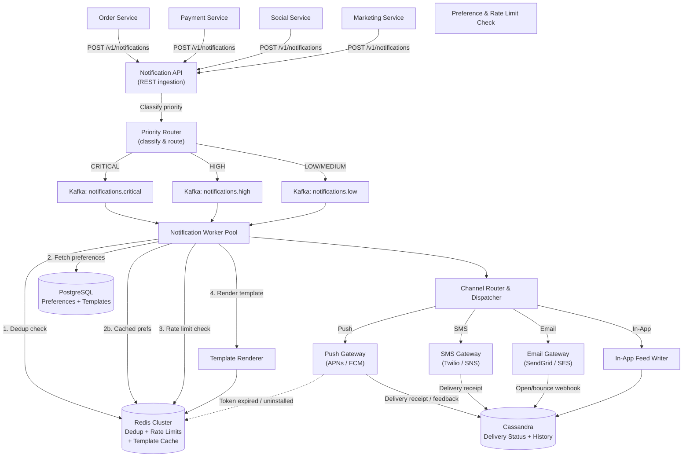

# System Design: Cross-Channel Notification Service (Push / SMS / Email / In-App)

**Level:** SDE Internship / Junior SDE Interview
**Style:** Fan-out pipeline + priority queuing + unreliable third-party integration + retry/backoff
**Contrast with your other builds:** every other system you've designed *uses* a notification service as a downstream consumer ("Kafka → Workers → send SMS/email"). This note designs the notification service **itself** — the internal platform that all your other services call when they need to tell a user something. It's the infrastructure behind the one-liner "send a push notification" that appears in every other architecture diagram.

---

## 1. Requirements

### Functional
- **Multi-channel delivery:** push notification (APNs/FCM), SMS (Twilio), email (SendGrid/SES), in-app notification feed
- **User preferences:** users control which channels they receive notifications on, per notification type (e.g., "send me payment alerts via push + SMS, but marketing only via email")
- **Template rendering:** notifications are defined as templates with variables (`"{{user_name}}, your order #{{order_id}} has been delivered"`) — the service renders them at send time
- **Priority levels:** `CRITICAL` (payment failure, security alert) > `HIGH` (order update) > `MEDIUM` (social activity) > `LOW` (marketing, digest)
- **Aggregation:** batch low-priority notifications ("5 people liked your post" instead of 5 separate notifications)
- **Delivery tracking:** track sent/delivered/opened/failed status per notification

### Proactive Engineering Features
- **Rate limiting per user:** don't send more than N notifications per hour to any single user — even if 50 upstream services each want to notify them
- **Deduplication:** if a retry or duplicate event triggers the same notification twice, send it only once
- **Fallback routing:** if push delivery fails (user uninstalled the app), auto-escalate to SMS for critical notifications

### Non-Functional Requirements
| Requirement | Target | Justification |
|---|---|---|
| **Critical notification latency** | < 30 sec end-to-end | Payment failure or security alerts must reach the user fast enough to act on — minutes of delay means unauthorized transactions continue |
| **Standard notification latency** | < 5 min | Social activity, order updates — users expect these reasonably soon but not instantly |
| **Availability** | 99.99% | If the notification service goes down, every product team's alerts stop — it's shared infrastructure |
| **At-least-once delivery** | Guaranteed | Missing a notification is worse than sending a duplicate — duplicates can be suppressed client-side, but a lost security alert can't be recovered |
| **Throughput** | 1M+ notifications/min at peak | Black Friday, New Year's, viral events — every upstream service spikes simultaneously |

> **Why at-least-once and not exactly-once?** True exactly-once delivery across unreliable third-party providers (APNs, Twilio, SendGrid) is impossible — a network timeout after sending means you can't tell if the provider received it or not. So we guarantee at-least-once (retry on failure) and add a **client-side dedup layer** (notification ID check) to suppress visible duplicates. This is the same pattern as Stripe's idempotency key — accept the duplicate at the infrastructure level, suppress it at the UI level.

---

## 2. Scale Estimation

**Assume:** platform with 100M DAU, each user receives ~10 notifications/day on average

| Metric | Calculation | Result |
|---|---|---|
| Daily notifications | 100M × 10 | 1B/day |
| Average send rate | 1B ÷ 86,400s | ~11,600/sec |
| Peak send rate (5× — Black Friday, app-wide event) | 11,600 × 5 | ~58,000/sec (~3.5M/min) |
| Channel distribution (typical) | 60% push, 25% email, 10% in-app, 5% SMS | — |
| Daily push notifications | 600M | — |
| Daily emails | 250M | — |
| Daily SMS | 50M | At ~$0.01/SMS = $500K/day → $180M/year — SMS is expensive, use it sparingly |

**Storage:**
| Data | Size | Notes |
|---|---|---|
| Notification record (~500 bytes: recipient, channel, template, status, timestamps) | 1B × 500 bytes = 500 GB/day | ~180 TB/year — needs efficient time-series storage |
| User preference records | 100M × 200 bytes = 20 GB | Trivially small — fits in Postgres |
| Templates | ~10,000 templates × 2 KB = 20 MB | Trivially small — cache in Redis |

**Key insight:** the engineering challenge is NOT storage or compute — it's **reliable delivery across 4 unreliable channels at 58,000/sec peak while respecting per-user rate limits, priorities, and preferences.** This is an orchestration problem, not a data problem.

---

## 3. Storage: Why Four Different Systems

| Layer | Choice | Stores | Why |
|---|---|---|---|
| **Notification queue** | Kafka (with priority topics) | Pending notifications, organized by priority level | Kafka handles 58,000 msgs/sec easily with partitioned topics. Separate topics per priority (`notifications.critical`, `notifications.high`, `notifications.low`) ensure critical alerts aren't blocked behind a marketing email backlog. |
| **Delivery status & history** | Cassandra | Sent/delivered/failed/opened status per notification, full history per user | Append-only, time-series writes. Partition by `user_id`, cluster by `timestamp DESC`. "Show me my last 50 notifications" = fast sequential read on one partition. |
| **User preferences & templates** | PostgreSQL | Per-user channel preferences, notification type configs, template definitions, rate limit rules | Relational integrity — a preference update must be ACID (disabling push notifications must take effect atomically, not eventually). |
| **Dedup + rate limit counters + template cache** | Redis Cluster | Idempotency keys (dedup), per-user sliding window counters, cached templates, device token registry | Sub-ms lookups for the hot path. `SETNX` for dedup (same pattern as Stripe). `INCR` + `EXPIRE` for rate limit counters. |

> **Why separate Kafka topics per priority?** If critical payment alerts and marketing emails share the same Kafka topic, a spike of 10 million marketing emails will fill up the consumer lag, and the payment alert sits behind them in the queue — arriving minutes late. Separate topics with dedicated consumer groups ensure critical notifications are processed immediately regardless of low-priority volume.

---

## 4. High-Level Architecture



**Flow summary:**
1. **Any upstream service** (Order, Payment, Social, Marketing) calls `POST /v1/notifications` with recipient, type, priority, and template variables
2. **Priority Router** classifies the notification and publishes to the appropriate Kafka topic — critical alerts go to a dedicated fast lane
3. **Worker Pool** consumes from all topics (with more consumers on the critical topic):
   - **Dedup:** check Redis `SETNX notification:{idempotency_key}` — if already sent, skip
   - **Preferences:** fetch user's channel preferences (cached in Redis, backed by Postgres) — does this user want push for order updates? Email? Both?
   - **Rate limit:** check Redis sliding window counter — has this user exceeded their hourly notification quota? If yes, drop low-priority, still send critical.
   - **Template render:** fill in variables (`{{user_name}}`, `{{order_id}}`) from the cached template
4. **Channel Router** dispatches to the appropriate gateway(s) — push, SMS, email, in-app — potentially multiple channels for the same notification
5. **Delivery feedback** flows back from providers (APNs delivery receipt, SendGrid open/bounce webhook, Twilio delivery status) → persisted to Cassandra for analytics
6. **Token management:** if APNs/FCM reports "token expired" (user uninstalled), update Redis device token registry to stop wasting future push attempts

---

## 5. API Contracts

**Send notification** (REST, called by upstream services)
```
POST /v1/notifications
Idempotency-Key: notif_7b9b8084
```
```json
{
  "recipient_user_id": "usr_505",
  "notification_type": "ORDER_DELIVERED",
  "priority": "HIGH",
  "template_id": "tmpl_order_delivered",
  "template_vars": {
    "user_name": "Saharsh",
    "order_id": "ord_88901",
    "restaurant_name": "Pizza Palace"
  },
  "channels": ["PUSH", "EMAIL"],
  "scheduled_at": null
}
```
```json
{
  "notification_id": "notif_990011",
  "status": "QUEUED",
  "estimated_delivery": "< 30 seconds"
}
```

**Get notification history** (REST, user-facing — powers the in-app notification feed)
```
GET /v1/users/{user_id}/notifications?limit=20&cursor=notif_990010
```
```json
{
  "data": [
    { "notification_id": "notif_990011", "type": "ORDER_DELIVERED",
      "title": "Order Delivered!", "body": "Saharsh, your order #ord_88901 from Pizza Palace has been delivered.",
      "read": false, "created_at": "2026-07-15T18:30:00Z" }
  ],
  "next_cursor": "notif_989990"
}
```

**Update user preferences** (REST)
```
PUT /v1/users/{user_id}/notification-preferences
```
```json
{
  "preferences": [
    { "type": "ORDER_UPDATE", "channels": ["PUSH", "EMAIL"] },
    { "type": "MARKETING", "channels": ["EMAIL"] },
    { "type": "SECURITY_ALERT", "channels": ["PUSH", "SMS", "EMAIL"] }
  ]
}
```

> **Why does the send API return immediately with "QUEUED"?** Because the caller (Order Service, Payment Service) shouldn't block its own response waiting for APNs or Twilio to acknowledge delivery. The notification service is asynchronous by design — "fire and forget" from the caller's perspective, with delivery tracking available via the history API or webhooks.

---

## 6. Deep Dive: Production Bottlenecks & Fixes

### A. Third-Party Provider Failures (APNs / Twilio / SendGrid)

**The problem:** you don't control Apple's push notification servers, Twilio's SMS gateway, or SendGrid's email infrastructure. Any of them can return 500 errors, rate-limit you, or go down entirely for minutes. If your worker retries aggressively, you'll get IP-banned. If it gives up, critical notifications are lost.

**The fix — exponential backoff with jitter + dead letter queue:**
1. **Retry strategy:** on a provider failure, retry with exponential backoff: 1s → 2s → 4s → 8s → 16s, with random jitter (±30%) to prevent all failed notifications from retrying at the same instant
2. **Retry budget:** max 5 retries per notification per channel. After 5 failures, move to the Dead Letter Queue (DLQ) for manual investigation.
3. **Fallback escalation:** for CRITICAL priority, if push fails after 2 retries, **auto-escalate to SMS** (even if the user didn't explicitly opt into SMS for that notification type). A security alert reaching the user via SMS is better than not reaching them at all.
4. **Circuit breaker:** if a provider's error rate exceeds 50% over a 60-second window, trip the circuit breaker — stop sending to that provider entirely for 30 seconds, then try a single probe request. If the probe succeeds, re-open the circuit. This prevents wasting quota and getting IP-banned during a provider outage.

> **Plain English:** if Apple's push server is down, don't keep hammering it — back off, wait, try again gently. If it stays down, send the alert via SMS instead. And if 50%+ of your pushes are failing, assume the whole provider is broken and stop for 30 seconds before probing again.

### B. Notification Storms (Thundering Herd on the Send Side)

**The problem:** a viral event happens — 10 million users should each get a push notification. If the Marketing Service publishes 10 million notification requests to Kafka at once, the worker pool processes them all within seconds and hits APNs with 10 million push requests simultaneously. APNs rate-limits you, most pushes fail, and the retry storm makes it worse.

**The fix — controlled drain rate + provider-aware throttling:**
1. **Kafka consumer concurrency control:** limit the number of concurrent worker goroutines/threads per provider. E.g., max 5,000 concurrent APNs requests, max 1,000 concurrent Twilio requests — calibrated to each provider's published rate limit.
2. **Token bucket per provider:** implement a token bucket in Redis (`provider:apns:tokens`) that refills at the provider's safe rate (e.g., 10,000/sec for APNs). Workers must acquire a token before dispatching. If the bucket is empty, the worker waits — back-pressure propagates to Kafka consumer lag naturally.
3. **Priority preemption:** even during a marketing blast, critical/high-priority notifications bypass the token bucket — they're dispatched immediately via a separate, dedicated worker pool that never competes with bulk sends.

> **Why not just increase Kafka partitions?** More partitions = more parallel consumers = hitting the provider even faster = more rate-limit errors. The bottleneck isn't your infrastructure — it's the third-party provider's capacity. You need to throttle *yourself* to match *their* limits.

### C. Per-User Rate Limiting (Don't Spam Your Users)

**The problem:** a user follows 500 accounts on Instagram. All 500 post within an hour. Without rate limiting, the user gets 500 push notifications in 60 minutes — their phone is vibrating non-stop and they uninstall the app.

**The fix — sliding window counter + aggregation:**
1. **Sliding window in Redis:** for each user, maintain a counter: `INCR user:{usr_505}:notif_count:{hour_bucket}` with a 1-hour TTL. Before sending any non-critical notification, check if the count exceeds the user's hourly cap (e.g., 20/hour).
2. **If over the limit:**
   - LOW priority → drop silently (marketing can wait for the next cycle)
   - MEDIUM priority → aggregate into a digest: batch "Rahul, Priya, and 3 others liked your post" into a single notification, delivered at the end of the window
   - HIGH/CRITICAL → always send, regardless of rate limit (payment alerts don't obey marketing caps)
3. **Aggregation buffer:** Redis sorted set keyed by `user:{usr_505}:pending_digest`, scored by timestamp. A scheduled worker runs every 15 minutes, drains the buffer, and sends one aggregated notification per user.

> **Plain English:** instead of sending "Person 1 liked your post," "Person 2 liked your post," "Person 3 liked your post" separately, the system holds them, counts to 5, and sends one notification: "5 people liked your post." Your phone buzzes once instead of five times.

### D. Device Token Staleness

**The problem:** users uninstall the app, switch phones, or disable push permissions. Their APNs/FCM device tokens become invalid. If you keep sending to stale tokens, you waste API quota, increase error rates, and eventually get rate-limited or flagged by the provider.

**The fix — feedback loop processing:**
1. **APNs feedback service:** Apple provides a feedback endpoint that returns a list of device tokens that are no longer valid. Poll it periodically (every hour) and remove stale tokens from Redis.
2. **FCM error codes:** Google FCM returns specific error codes (`NotRegistered`, `InvalidRegistration`) per push attempt. On receiving these, immediately invalidate the token in Redis.
3. **Proactive pruning:** if a token hasn't successfully delivered a notification in 30 days, mark it as `STALE` and stop sending. When the user opens the app again, a fresh token is registered.

---

## 7. Real-World Engineering Facts (Interview Color)

- **APNs (Apple Push Notification service):** Apple requires a persistent HTTP/2 connection with TLS client certificates for sending push notifications. Each push is a single HTTP/2 request on a multiplexed connection — you can send thousands of pushes over one connection without reconnecting. Mention this as: *"APNs uses persistent HTTP/2 connections — we maintain a pool of long-lived connections to Apple's servers rather than reconnecting per push."*

- **FCM (Firebase Cloud Messaging):** Google's equivalent supports both push and "topic" notifications (publish to a topic, all subscribed devices receive it). Topic-based fan-out offloads the fan-out work to Google's servers — useful for broadcast notifications where you'd otherwise need to enumerate millions of device tokens yourself.

- **Amazon SNS + SES:** AWS offers SNS (Simple Notification Service) for push/SMS fan-out and SES (Simple Email Service) for email. Many companies use these as a managed layer instead of integrating directly with APNs/Twilio/SendGrid — the trade-off is less control over retry behavior but simpler integration.

- **Twilio's rate limits:** Twilio imposes per-account SMS throughput limits (1 msg/sec by default per phone number, up to ~100/sec with toll-free or short codes). This is why you need the token bucket pattern — your internal throughput might be 58,000/sec, but Twilio can only absorb a fraction of that.

---

## 8. Quick-Reference Glossary

| Term | One-Line Plain-English Meaning |
|---|---|
| **APNs** | Apple Push Notification service — Apple's server that delivers push notifications to iPhones/iPads |
| **FCM** | Firebase Cloud Messaging — Google's server that delivers push notifications to Android devices and web browsers |
| **Idempotency key** | A unique ID per notification request so retries don't send the same notification twice |
| **Dead Letter Queue (DLQ)** | A separate queue where permanently failed notifications are stored for manual investigation instead of being lost |
| **Circuit breaker** | A pattern that stops calling a failing provider after too many errors, waits, then probes cautiously before resuming |
| **Exponential backoff + jitter** | Retrying with increasing wait times (1s, 2s, 4s...) plus a random offset so retries from different workers don't all hit at the same instant |
| **Token bucket** | A rate-limiting algorithm where a bucket fills with "tokens" at a fixed rate — each request consumes one token, and requests are blocked when the bucket is empty |
| **Sliding window counter** | A rate-limiting pattern that counts events in a rolling time window (e.g., "last 60 minutes") rather than fixed clock-aligned intervals |
| **Notification digest** | Batching multiple low-priority notifications into a single summary ("5 people liked your post") to reduce user annoyance |
| **Device token** | A unique identifier assigned by APNs/FCM to a specific app installation on a specific device — used to route push notifications |
| **Fallback escalation** | Automatically trying a different channel (e.g., SMS) when the primary channel (e.g., push) fails for critical notifications |

---

## 9. Talking Points Checklist (for the actual interview)

- [ ] Open with "this is the shared infrastructure behind every other system's 'send notification' step — it's a fan-out orchestration problem across unreliable third-party providers"
- [ ] Explain priority-based Kafka topics and why critical alerts must not compete with marketing blasts
- [ ] Walk through the worker pipeline: dedup (SETNX) → preferences → rate limit → template render → channel dispatch
- [ ] Raise the third-party failure problem yourself: exponential backoff + jitter, circuit breaker, fallback escalation to SMS
- [ ] Explain per-user rate limiting and notification aggregation: "5 people liked your post" instead of 5 separate pushes
- [ ] Mention the at-least-once delivery guarantee and why exactly-once is impossible across external providers — dedup happens client-side
