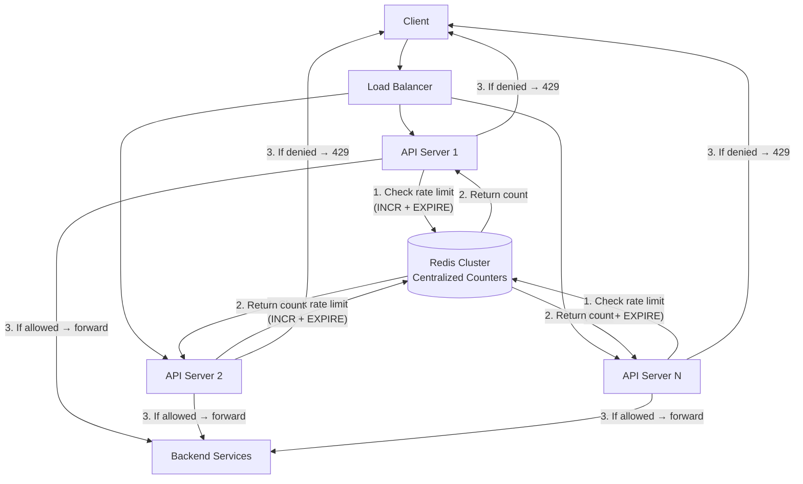

# System Design: Distributed Rate Limiter & API Gateway

**Level:** SDE Internship / Junior SDE Interview
**Style:** Focused component design — algorithm comparison + distributed implementation
**Contrast with your other builds:** this isn't a full application — it's the **infrastructure component** that sits in front of every application you've designed. Your BookMyShow has a virtual waiting room, your Instagram has an API Gateway, your Notification System has per-user rate limits — this note designs the actual rate limiting engine behind all of them.

---

## 1. Requirements

### Functional
- **Limit request rates** per user, per IP, per API endpoint, or globally — configurable per rule
- **Multiple rate limit rules** can apply simultaneously (e.g., 100 requests/min per user AND 1,000 requests/min per endpoint AND 10,000 requests/min globally)
- **Return standard rate limit headers** so clients know their remaining quota and when to retry
- **Configurable responses:** return `429 Too Many Requests` with `Retry-After` header, or silently drop/throttle

### Non-Functional Requirements
| Requirement | Target | Justification |
|---|---|---|
| **Latency overhead** | < 5 ms added per request | The rate limiter sits in the critical path of every single API call — if it adds 50 ms, it ruins the latency targets of every downstream service |
| **Availability** | 99.999% ("five nines") | If the rate limiter goes down, you must choose: allow all traffic through (unsafe) or block all traffic (outage). Neither is acceptable. |
| **Consistency** | Best-effort (slightly over-counting is acceptable) | It's fine if 2–3 extra requests slip through during a race condition — much better than blocking legitimate users. Exact counting at 100K+ QPS across distributed nodes is prohibitively expensive. |
| **Throughput** | 500K+ checks/sec | Must handle the combined QPS of all services behind it |

> **Why is slightly over-counting acceptable?** A rate limiter's job is to protect the system from abuse and overload — it's a safety valve, not a billing meter. If the limit is 100 req/min and 102 slip through during a race condition, the system is still protected. The alternative — distributed locking for exact counts — adds latency and complexity that doesn't justify the marginal accuracy gain.

---

## 2. The Five Algorithms: When to Use Which

### Algorithm 1: Fixed Window Counter
**How it works:** divide time into fixed windows (e.g., 1-minute intervals: 12:00–12:01, 12:01–12:02). Maintain a counter per window. Increment on each request. Reject if counter > limit.

**Implementation (Redis):**
```
key = "rate:usr_505:12:00"
INCR key
EXPIRE key 60  (auto-cleanup)
if count > 100 → reject
```

| Pros | Cons |
|---|---|
| Dead simple, O(1) per request, minimal memory | **Boundary burst problem:** user sends 100 requests at 12:00:59, then 100 at 12:01:00 — 200 requests in 2 seconds, both within their respective windows |

**Use when:** simplicity matters more than precision — internal service-to-service rate limiting.

---

### Algorithm 2: Sliding Window Log
**How it works:** store the timestamp of every single request in a sorted set. On each new request, remove all timestamps older than the window, count remaining entries. Reject if count > limit.

**Implementation (Redis ZSET):**
```
ZADD rate:usr_505 <timestamp> <request_id>
ZREMRANGEBYSCORE rate:usr_505 0 <timestamp - 60s>
count = ZCARD rate:usr_505
if count > 100 → reject
```

| Pros | Cons |
|---|---|
| Perfectly accurate — no boundary burst problem | **Memory hungry:** stores every request's timestamp. At 100K QPS, that's 6M entries per minute per key. Also O(N) cleanup. |

**Use when:** precision is critical and QPS is low (e.g., expensive API endpoints, paid tier limits).

---

### Algorithm 3: Sliding Window Counter (Recommended Default)
**How it works:** combines fixed window and sliding window. Maintain counters for the current and previous window. Estimate the sliding window count using a weighted average:

```
count = (previous_window_count × overlap_percentage) + current_window_count
```

Example: at 12:00:45 (75% through the current minute):
- Previous window (11:59–12:00) had 80 requests
- Current window (12:00–12:01) has 30 requests so far
- Estimated sliding count = 80 × 0.25 + 30 = 50

| Pros | Cons |
|---|---|
| O(1) per request, constant memory (just 2 counters), smooths out boundary bursts | Approximate — not perfectly accurate, but within ~1–2% of the true count |

**Use when:** general-purpose rate limiting — the best balance of accuracy, speed, and memory. **This is what most production systems use.**

---

### Algorithm 4: Token Bucket
**How it works:** imagine a bucket that holds up to N tokens. Tokens are added at a fixed rate (e.g., 10 tokens/sec). Each request removes one token. If the bucket is empty, reject. If the bucket is full, new tokens are discarded (no stockpiling beyond N).

**Key properties:**
- **Allows controlled bursts:** if the bucket is full (N tokens), a burst of N requests is allowed instantly, then the rate drops to the refill rate
- **Two parameters:** `bucket_size` (max burst) and `refill_rate` (sustained throughput)

**Implementation (Redis — lazy refill):**
```
last_refill_time = GET rate:usr_505:last_refill
tokens = GET rate:usr_505:tokens
elapsed = now - last_refill_time
tokens = min(bucket_size, tokens + elapsed × refill_rate)
if tokens >= 1:
    tokens -= 1
    SET rate:usr_505:tokens tokens
    SET rate:usr_505:last_refill now
    → ALLOW
else:
    → REJECT
```

| Pros | Cons |
|---|---|
| Intuitive, allows controlled bursts, used by AWS/Stripe/GitHub | Slightly more complex than fixed window — two values to track per key |

**Use when:** you want to allow bursts (e.g., a user can make 50 rapid requests but sustained rate is 10/sec). **This is what AWS API Gateway and Stripe use.**

> **Plain English:** a token bucket is like a bus that seats 50 people (burst capacity). The bus arrives every 5 minutes (refill rate). If 50 people are waiting, they all get on at once (burst). But the next group has to wait for the next bus — the sustained rate is limited.

---

### Algorithm 5: Leaky Bucket
**How it works:** requests enter a FIFO queue (the "bucket"). The queue is drained at a fixed rate. If the queue is full, new requests are dropped. Output rate is perfectly smooth — no bursts.

| Pros | Cons |
|---|---|
| Perfectly smooth output rate — good for protecting downstream services from any burstiness | No burst tolerance — legitimate short bursts are penalized. Also requires a queue (more memory). |

**Use when:** you need a perfectly smooth request rate to protect a fragile downstream system (e.g., a legacy database that can't handle any bursts).

---

### Algorithm Comparison Summary

| Algorithm | Accuracy | Memory | Burst Handling | Complexity | Best For |
|---|---|---|---|---|---|
| **Fixed Window Counter** | Low (boundary bursts) | O(1) | No control | Trivial | Internal/non-critical limits |
| **Sliding Window Log** | Perfect | O(N) | No bursts | Medium | Low-QPS, precision-critical |
| **Sliding Window Counter** | ~98–99% | O(1) | Smoothed | Low | **General-purpose default** |
| **Token Bucket** | High | O(1) | Controlled bursts | Medium | **Public APIs (AWS, Stripe)** |
| **Leaky Bucket** | High | O(queue) | No bursts (smooth) | Medium | Fragile downstream protection |

> **Interview tip:** don't just pick one algorithm — walk through 2–3, explain the trade-offs, and then say which you'd choose for the specific scenario and why. The comparison itself is what demonstrates understanding.

---

## 3. Distributed Rate Limiting Architecture

### The Problem: Multiple API Servers, One Rate Limit

In a single-server world, rate limiting is trivial — maintain an in-memory counter. But in a distributed system with 50 API servers behind a load balancer, each server has its own counter. User sends 100 requests → load balancer distributes them across 50 servers → each server sees only 2 requests → nobody enforces the limit.

### The Solution: Centralized Counter in Redis



**Implementation — Atomic Redis Script (Lua):**
The `INCR` and `EXPIRE` must happen atomically — if they're separate commands, a crash between them leaves a counter without a TTL (memory leak). Use a Redis Lua script:

```lua
-- Sliding Window Counter in Redis (Lua script — atomic)
local key = KEYS[1]
local limit = tonumber(ARGV[1])
local window = tonumber(ARGV[2])

local current = redis.call("INCR", key)
if current == 1 then
    redis.call("EXPIRE", key, window)
end

if current > limit then
    return 0  -- REJECTED
else
    return 1  -- ALLOWED
end
```

> **Why Lua?** Redis executes Lua scripts atomically — the entire script runs as a single operation. No other command can interleave between `INCR` and `EXPIRE`. This eliminates the race condition without needing distributed locks.

---

## 4. API Contract: Rate Limit Response Headers

Every rate-limited API should return these standard headers (following the RFC 6585 / IETF draft convention):

**Successful request (under limit):**
```http
HTTP/1.1 200 OK
X-RateLimit-Limit: 100
X-RateLimit-Remaining: 73
X-RateLimit-Reset: 1721050060
```

**Rate-limited request:**
```http
HTTP/1.1 429 Too Many Requests
X-RateLimit-Limit: 100
X-RateLimit-Remaining: 0
X-RateLimit-Reset: 1721050060
Retry-After: 23
Content-Type: application/json

{ "error": "rate_limit_exceeded", "message": "Too many requests. Retry after 23 seconds." }
```

| Header | Meaning |
|---|---|
| `X-RateLimit-Limit` | Max requests allowed in the window |
| `X-RateLimit-Remaining` | How many requests the client can still make before hitting the limit |
| `X-RateLimit-Reset` | Unix timestamp when the window resets and the counter clears |
| `Retry-After` | Seconds until the client should retry (only on 429 responses) |

> **Interview tip:** mentioning these headers unprompted shows you've thought about the **client's experience**, not just the server-side implementation. A rate limiter that returns `429` without telling the client *when* to retry is a bad API.

---

## 5. Deep Dive: Production Bottlenecks & Fixes

### A. Redis Single Point of Failure

**The problem:** all rate limit checks go through Redis. If Redis goes down, every API server can't check limits → either block all traffic (outage) or allow all traffic (no protection). Both are bad.

**The fix — local fallback + Redis Cluster:**
1. **Redis Cluster** with replication — if a primary shard fails, a replica auto-promotes in < 1 second
2. **Local in-memory fallback:** each API server maintains a local approximate counter (updated by the Redis result on each call). If Redis is unreachable for < 5 seconds, use the local counter as a best-effort estimate. It won't be globally accurate, but it prevents both full-block and full-allow.
3. **Fail-open vs fail-closed (configurable per rule):**
   - **Fail-open:** if Redis is down, allow requests through (used for non-critical endpoints — better to serve slightly unprotected than to have a full outage)
   - **Fail-closed:** if Redis is down, block requests (used for payment endpoints or auth endpoints where abuse protection is more important than availability)

> **Plain English:** if the bouncer's walkie-talkie breaks, do you let everyone in (fail-open) or lock the door (fail-closed)? The answer depends on whether you're guarding a concert (fail-open — the show must go on) or a bank vault (fail-closed).

### B. The Race Condition: INCR + EXPIRE Non-Atomicity

**The problem:** if `INCR` succeeds but `EXPIRE` fails (network blip, Redis crash between the two commands), the counter lives forever — eating memory indefinitely and permanently blocking that user.

**The fix — Lua script (shown above).** The Lua script runs atomically within Redis — both commands execute as one unit. Alternatively, use `SET key value EX 60 NX` for simple cases, or the `EVALSHA` command to cache the Lua script on the Redis server (avoiding re-transmitting the script text on every call).

### C. Hot Key Problem (Celebrity User / Viral API)

**The problem:** one user or one API endpoint gets 50,000 requests/sec. All rate limit checks for that key hit the same Redis shard (since the key is the same). That shard maxes out at ~100K ops/sec while other shards sit idle.

**The fix — local aggregation + periodic sync:**
1. Each API server maintains a **local counter** per hot key, incrementing it on every request
2. Every 100ms, it flushes the local count to Redis in a single `INCRBY` call (e.g., `INCRBY rate:usr_505 47`)
3. This reduces Redis ops from 50,000/sec to ~500/sec (50 API servers × 10 flushes/sec each)
4. **Trade-off:** the global count is up to 100ms stale — meaning up to ~5,000 extra requests could slip through before the limit kicks in. Acceptable for a rate limiter (not a billing meter).

---

## 6. Rate Limiting Across Your Other System Designs

| System | Where Rate Limiting Appears | Algorithm Used |
|---|---|---|
| **BookMyShow** | Virtual waiting room — admission control before seat-locking | Token bucket (controlled drain rate from the queue) |
| **Instagram** | API Gateway — per-user request limits | Sliding window counter |
| **Stripe** | Idempotency key check + transfer rate limiting | Token bucket (Stripe's published API uses this) |
| **Uber-Zomato** | Surge pricing zone — demand counting per H3 cell | Fixed window counter (simple, per-zone, reset every 5 min) |
| **Notification System** | Per-user notification quota (20/hour cap) | Sliding window counter with aggregation |
| **Google Docs** | WebSocket operation ingestion — per-document ops/sec cap | Leaky bucket (smooth out bursty keystrokes to protect the OT sequencer) |

> **Interview tip:** if you're asked "Design a Rate Limiter" as a standalone question, close by connecting it back to where you'd use it in a real system. This shows you think of it as infrastructure, not an isolated exercise.

---

## 7. Real-World Engineering Facts (Interview Color)

- **Stripe's rate limiter:** Stripe uses a token bucket algorithm with different tiers per API key type (test mode vs live mode, free tier vs enterprise). Their rate limit headers are the industry standard that most other APIs follow. Mention this as: *"Stripe's API is the canonical example of well-designed rate limiting — token bucket with clear headers and tier-based limits."*

- **Cloudflare's rate limiting:** Cloudflare processes 50M+ HTTP requests/sec globally. Their rate limiting runs on edge servers using an approximate sliding window counter with periodic synchronization to a central store — they explicitly trade accuracy for latency, accepting ~1% over-counting. Mention this as: *"Cloudflare accepts approximate counting at edge scale — perfect accuracy would require distributed locks that add unacceptable latency at 50M QPS."*

- **GitHub API rate limits:** GitHub uses a fixed window (5,000 requests/hour for authenticated users, 60/hour for unauthenticated). They return all three standard headers (`X-RateLimit-Limit`, `X-RateLimit-Remaining`, `X-RateLimit-Reset`) — a good reference implementation.

- **Redis Cell module:** an open-source Redis module that implements the Generic Cell Rate Algorithm (GCRA) — a variant of the leaky bucket — natively in Redis as a single atomic command. Worth mentioning as a production shortcut: *"In practice, I'd evaluate Redis Cell for atomic rate limiting without Lua scripts."*


