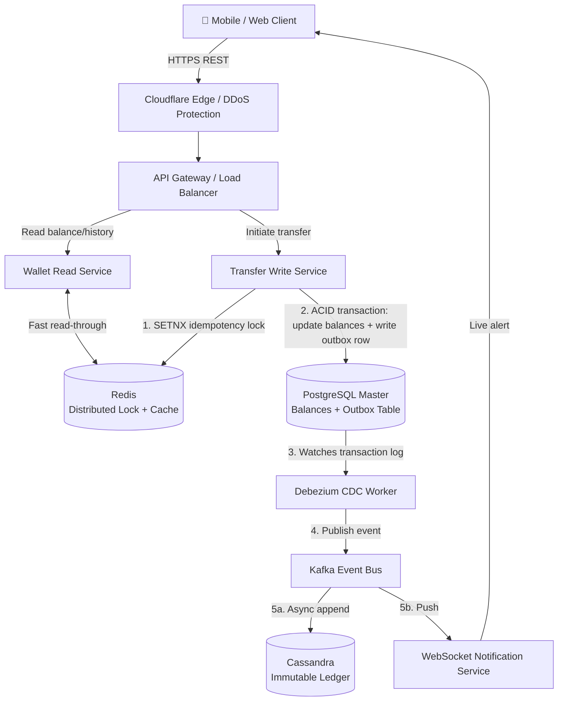

# System Design: Digital Wallet & Payment Ledger (Stripe / PayPal / Venmo / Core Banking)

**Level:** SDE Internship / Junior SDE Interview
**Style:** Strongly-consistent, ACID-first, high-concurrency financial backend
**Contrast with your other builds:** Tinder/Instagram/YouTube/WhatsApp all chose **AP** (availability over consistency). This is the system where you argue the opposite — and that contrast *is* the interview signal.

---

## 1. Requirements

### Functional
- Send/receive money between users
- Check current balance
- View transaction history (paginated ledger)
- Guarantee: no double-spending, no lost transactions, full audit trail

### Non-Functional
| Requirement | Target | Justification |
|---|---|---|
| **Balance read latency** | < 100 ms | Below this, a balance check *feels* instant |
| **Transfer write latency** | < 2 sec | Users tolerate a short pause for security checks, but past 2–3 sec they start double-tapping "send" — which is exactly the race condition you need to defend against |
| **Consistency** | 100% strong consistency | No eventual consistency on balances — a user must see the updated number immediately after a transfer, not "eventually" |
| **Read availability** | 99.99% | We still serve balance/history reads during a partition — we just refuse new **writes** until consistency can be guaranteed |

### The Core Tradeoff: Why CP, Not AP
> **CAP Theorem in plain English:** if the network between two servers breaks, you must choose — keep answering requests with possibly-stale data (**Availability**), or stop answering until every server agrees again (**Consistency**). You cannot have both during the outage.

**Our choice: CP.** If a database loses connectivity mid-transfer, we halt money movement rather than risk someone spending money they don't have. This is the opposite choice from a chat app — a stale WhatsApp read-receipt is harmless; a stale bank balance is not.

### ACID — Non-Negotiable for Financial Data
| Property | What it guarantees |
|---|---|
| **Atomicity** | Debiting A and crediting B happen together, or neither happens — no half-finished transfer |
| **Consistency** | The database never violates its own rules (e.g., balance can't go negative if overdrafts are disallowed) |
| **Isolation** | Two transactions happening at the same millisecond can't corrupt each other — the end result looks as if they ran one after another |
| **Durability** | Once "Transfer Complete" is returned, that data survives a crash immediately afterward |

---

## 2. Scale Estimation

**Assume:** 50M DAU, 10 reads + 2 writes per user/day (interview shortcut: round 86,400 sec/day → 100,000 for clean math)

| Metric | Calculation | Result |
|---|---|---|
| Daily requests | 50M × 12 actions | 600M/day |
| Average total QPS | 600M ÷ 100,000s | ~6,000 QPS (5,000 read / 1,000 write) |
| Peak QPS (2× spike — lunchtime, evenings, rent day) | 6,000 × 2 | ~12,000 QPS (10,000 read / 2,000 write) |
| Daily transactions | 50M × 2 | 100M/day |
| Daily storage (1 KB/record) | 100M × 1 KB | 100 GB/day |
| 5-year raw storage | 100 GB × 365 × 5 | ~180 TB |
| 5-year replicated storage (3×, for durability across AZs) | 180 TB × 3 | ~540 TB |

**Key insight:** 540 TB of append-only, constantly-queried financial history is too much for a single SQL server to hold *and* stay fast on. That single number is what forces the polyglot split below — it's not a style choice.

---

## 3. Storage: Why Four Different Systems

| Layer | Choice | Stores | Why |
|---|---|---|---|
| **Live balances & transfers** | PostgreSQL / Aurora / Spanner | Active account balances, in-flight transfers | Native **multi-row ACID transactions** — locks both the sender's and receiver's row and updates them as one atomic unit |
| **Historical ledger** | Cassandra (wide-column NoSQL) | Immutable transaction history | Built for append-only, time-series writes. Partition by `user_id`, sort by `timestamp DESC` → "last 20 transactions" is a single fast disk seek. Scales horizontally to absorb 540 TB by just adding commodity nodes |
| **Idempotency locks & cache** | Redis | Distributed dedup locks, balance read-through cache | Single-threaded execution — commands run one at a time, so two simultaneous requests literally cannot race each other. Sub-100ms reads |
| **Compliance archive** | S3 Object Lock (WORM) | Regulatory audit logs, nightly snapshots | **Write Once, Read Many** — once written with a retention lock (e.g., 7 years), *nobody* — not even the root AWS account — can delete or edit it until the timer expires |

> **Why not just put everything in NoSQL?** Cassandra's lightweight-transaction mechanism (Paxos) needs multiple network round-trips per write — that's fine for a chat message, but it becomes a bottleneck at 12,000 peak QPS on the write path that actually moves money.
>
> **Why not just put everything in Postgres?** Because 180 TB+ of historical logs bloats its B-tree indexes and turns routine balance checks into slow queries — the historical ledger and the "current truth" need to live in different systems.

---

## 4. High-Level Architecture



**Flow summary:**
1. Client requests hit REST behind a CDN/DDoS layer, split into a **read path** (balances, history) and a **write path** (transfers)
2. Before touching SQL, the write path takes a Redis lock keyed on the request's idempotency key — this is the double-spend guard
3. The actual balance update happens inside a single PostgreSQL ACID transaction, which *also* writes an event row into an `outbox` table in the same transaction (Section 6, Bottleneck 3)
4. A CDC worker (Debezium) tails Postgres's transaction log and publishes outbox rows to Kafka — decoupling "money moved" from "everyone who cares has been told"
5. Kafka fans that event out to the Cassandra ledger (permanent history) and a WebSocket service (real-time balance-updated push to the client)

---

## 5. API Contracts

**Initiate transfer** (REST, write)
```
POST /v1/transfers
Authorization: Bearer <JWT>
Idempotency-Key: 7b9b8084-7a1e-450f-9043-3248383e20bf
```
```json
{
  "sender_id": "usr_987654321",
  "receiver_id": "usr_123456789",
  "amount_cents": 5000,
  "currency": "USD",
  "note": "Dinner split"
}
```
Response:
```json
{ "transfer_id": "tx_888999000111", "status": "COMPLETED", "timestamp": "2026-07-15T17:49:36Z" }
```

**Get balance** (REST, read)
```
GET /v1/wallets/balance
```
```json
{ "user_id": "usr_987654321", "balance_cents": 14250, "currency": "USD", "last_updated": "2026-07-15T17:49:36Z" }
```

**Get transaction history** (REST, read — cursor-paginated)
```
GET /v1/wallets/transactions?limit=20&cursor=tx_888999000111
```
```json
{
  "data": [
    { "transfer_id": "tx_888999000111", "sender_id": "usr_987654321", "receiver_id": "usr_123456789",
      "amount_cents": 5000, "currency": "USD", "status": "COMPLETED", "created_at": "2026-07-15T17:49:36Z" }
  ],
  "next_cursor": "tx_888998999000"
}
```

> Notice the idempotency key rides in the **header**, not the body — it's metadata about the *request*, not the transfer itself, and every retry of the same logical request must carry the identical key.

---

## 6. Deep Dive: Production Bottlenecks & Fixes

### A. The Celebrity / Hot-Key Problem (Row Contention)
**The problem:** a viral merchant receives 5,000 payments in the same millisecond. Postgres places an exclusive row lock (`SELECT ... FOR UPDATE`) on that merchant's balance row — it processes customer #1, unlocks, then customer #2, and so on. 4,999 requests queue up, connection pools exhaust, and requests start timing out past the 2-second SLA.
> **Plain English:** one supermarket checkout lane, 5,000 people in line, 4,999 of them just standing there while the lane processes one person at a time.

**The fix — balance slotting (row sharding):** split the merchant's balance across N rows (e.g., 20) in a `balance_slots` table.
- **Write:** hash the sender's ID (`hash(sender_id) % 20`) to route the deposit into one of 20 slots — instantly cutting lock contention 20×, since 20 transactions can now proceed in parallel instead of queuing behind one row
- **Read:** aggregate on demand — `SELECT SUM(balance_cents) FROM balance_slots WHERE user_id = 'merchant_id'`

### B. Distributed Race Conditions (Double-Spending)
**The problem:** a user on a flaky connection taps "Send $50" three times as the screen freezes. Three identical requests land on three different API servers at the same instant. If each server checks an eventually-consistent cache, all three might see "no record found" and all three deduct $50 — charging $150 total.

**The fix — atomic distributed locking via Redis `SETNX`:**
- Every transfer carries a client-generated **Idempotency Key** (a UUID)
- Before touching SQL: `SETNX(idempotency_key, "PROCESSING", EXPIRE 86400)`
- Because Redis is single-threaded, only the *first* of the three requests gets a success code — the other two are rejected before any money moves, full stop

### C. The Dual-Write Problem
**The problem:** a payment needs to update Postgres (balances) **and** notify Kafka (so Cassandra/WebSockets pick it up). If Postgres commits but the Kafka publish fails (network drop), money moved but the history is silently missing forever. Reverse the order and you can get a history record for a payment that never actually happened.

**The fix — Transactional Outbox + CDC:** never let the app talk to Kafka directly during the write.
1. Inside the *same* Postgres ACID transaction that updates balances, insert a row into an `outbox` table
2. Since it's one transaction, both commit together or both roll back — no split-brain state is possible
3. A background CDC worker (Debezium) tails the database log, picks up new outbox rows, and publishes them to Kafka with **at-least-once delivery**

> **Trade-off worth saying out loud in the interview:** this means the Cassandra ledger is only *eventually* consistent with the source of truth (usually a few ms behind, via Kafka) — acknowledging that trade-off explicitly is what separates a senior answer from a junior one.

### D. Insider Threat & Historical Tampering
**The problem:** how do you prove your ledger is truly immutable if a compromised DBA gets root access and runs `UPDATE transactions SET amount = 1000000 WHERE id = 5`?

**The fix — defense in depth:**
1. **Strict RBAC:** production service accounts get `INSERT`/`SELECT` only — the database engine itself rejects `UPDATE`/`DELETE`/`DROP` from those accounts
2. **Cryptographic hash chaining:** each transaction row stores a SHA-256 hash of its own data *plus* the previous row's hash (blockchain-style). Altering row #10 invalidates the hash of every row after it — a background scanner catches the broken chain instantly
3. **WORM archival:** logs stream continuously to S3 Object Lock (compliance mode) — undeletable for the retention period, by anyone, including root
4. **SIEM isolation:** every DB login and admin query ships to a security vault the database engineers themselves can't access

---

## 7. Quick-Reference Glossary

| Term | One-Line Plain-English Meaning |
|---|---|
| **CAP Theorem (CP choice)** | During a network partition, refuse writes rather than risk an inconsistent balance |
| **ACID** | The four guarantees (atomic, consistent, isolated, durable) that make a transaction trustworthy |
| **Idempotency key** | A unique ID per logical request so retrying it (e.g., a double-tap) never double-charges |
| **SETNX** | "Set if Not Exists" — a Redis command that only succeeds for the *first* caller, rejecting all duplicates |
| **Hot key / hot partition** | One database row/key getting so much traffic its single node can't keep up while others sit idle |
| **Balance slotting** | Splitting one account's balance across many rows to spread write contention |
| **Transactional Outbox** | Writing an event into the same DB transaction as the real change, so the two can never go out of sync |
| **CDC (Change Data Capture)** | A background worker that reads a database's internal log and streams changes elsewhere without touching the main write path |
| **WORM storage** | "Write Once, Read Many" — once written, *nobody* can edit or delete it until a retention timer expires |
| **Hash chaining** | Each record embeds the previous record's hash, so tampering with one record breaks every record after it |

---

## 8. Golden Interview Rules

1. **Never use floats for money.** Binary floating point can't represent decimals exactly (`0.1 + 0.2 = 0.30000000000000004`), and those tiny errors compound into real accounting discrepancies at scale. Store money as **64-bit integers in the smallest currency unit** — $50.00 is stored as `5000` cents, not `50.00`.
2. **Lead with CAP, don't blurt out a database name.** When asked "how would you store balances," open with *"this is a core ledger, so we prioritize Consistency over Availability — that means an ACID-compliant relational store, not a NoSQL cache."* That's the sentence that signals you reason from first principles.
3. **State your trade-offs unprompted.** If asked about the downside of the Outbox pattern, say directly: *"it adds complexity, and it means the Cassandra ledger is eventually consistent — usually a few milliseconds behind — rather than synchronous."* Owning the trade-off, not hiding it, is what a senior engineer sounds like.

---

## 9. Talking Points Checklist (for the actual interview)

- [ ] Open with the CP-over-AP decision and justify it with a concrete "double-spend" scenario
- [ ] Do the QPS/storage math out loud — the reasoning matters more than the exact number
- [ ] Explain *why* each of the four storage systems earns its place, not just name them
- [ ] Walk through at least one bottleneck (hot key, race condition, dual-write) with its fix, unprompted
- [ ] Say "we store money as integer cents, never floats" at some point — it's a near-guaranteed follow-up question