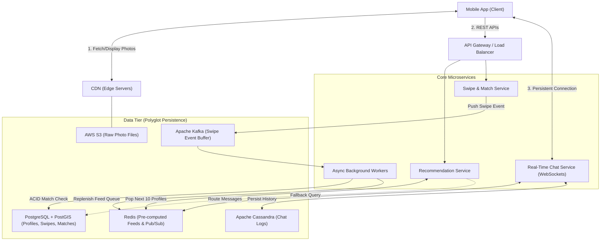

# Comprehensive System Design Notes: Tinder (SDE Internship Prep)

## 1. The Universal Interview Framework
Never jump straight to drawing components or picking databases. Always structure your interview in this exact four-step order:
1. **Scope & Requirements:** Define functional (what it does) and non-functional (speed, availability) goals.
2. **Scale Estimation:** Calculate QPS (Queries Per Second) and storage needs to justify your architecture.
3. **High-Level Design (HLD):** Define APIs first, then connect clients to microservices and databases.
4. **Deep Dive & Bottlenecks:** Identify breaking points at scale (hot-keys, heavy queries, race conditions) and engineer solutions.

---

## 2. Step 1: Requirements Gathering

### Functional Requirements (What the system does)
* **Profile Management:** Users can create profiles, upload photos, and update bios.
* **Geographical Tracking:** System tracks user location to serve localized recommendations.
* **Recommendation Feed:** Users receive a swipeable feed of nearby profiles matching age/gender preferences.
* **Swiping & Matching:** Users swipe right (like) or left (dislike). Reciprocal right-swipes create a match.
* **Real-Time Chat:** Matched users can chat in real time.

### Non-Functional Requirements (How well it performs)
* **Low Latency (Feed & Swiping):** Swiping and generating the next profile must take **< 200 ms**.
* **High Availability (Swiping over Consistency):** The swiping feed must never go down. It is acceptable if a match notification is delayed by 2–3 seconds (Eventual Consistency), but users must always be able to swipe.
* **Real-Time Delivery (Chat):** Message delivery between two active users must take **< 500 ms** end-to-end.

> 💡 **Universal Design Pattern: Latency Benchmarks**
> * **< 100 ms:** Feels instantaneous to a human.
> * **100 ms – 300 ms:** Slight perceptible shift, but feels highly responsive (standard UI target).
> * **> 500 ms:** Feels laggy; users lose focus or double-tap.
> * **CAP Theorem Application:** For social feeds (Tinder, Instagram, Twitter), always choose **Availability over Consistency**. For payments or banking, choose **Consistency over Availability**.

---

## 3. Step 2: Scale Estimation (Back-of-the-Envelope Math)

### Traffic & QPS Calculations
* **Daily Active Users (DAU):** 10 million DAU.
* **Average Swipes per User:** 100 swipes/day.
* **Total Daily Swipes:** 
  $$10,000,000 \times 100 = 1,000,000,000 \text{ swipes/day}$$
* **Average QPS (Swiping):** Assuming **100,000 seconds** in a day (round up from 86,400 for clean mental math):
  $$\frac{1,000,000,000}{100,000} = 10,000 \text{ swipes/second (Average QPS)}$$
* **Peak QPS (Swiping):** Evening traffic spikes require a **2x multiplier**:
  $$10,000 \times 2 = 20,000 \text{ swipes/second (Peak QPS)}$$

### Storage Calculations
* **Total Registered Users:** Assume **50 million** (DAU is typically 1/5th of total users).
* **Text Metadata:** ~500 bytes per user (name, bio, preferences) $\rightarrow$ **~25 GB total** (negligible, fits in RAM).
* **Media Storage (Photos):** Assume 5 photos per user, compressed to **200 KB** each (1 MB per user):
  $$50,000,000 \times 1\text{ MB} = 50\text{ TB of media data}$$

> 💡 **Universal Design Pattern: The 2x Peak Multiplier**
> In any interview, never design for average traffic. Explicitly state: *"I am multiplying average QPS by 2x to account for peak regional usage hours."* This shows real-world operational maturity.

---

## 4. Step 3: API Design

Define the core contracts between the client and backend. Keep it conversational—mention the HTTP method, key parameters, and expected response.

### 1. Fetch Recommendation Feed
* **Method:** `GET /v1/recommendations`
* **Params:** `?limit=10&lat=34.05&long=-118.24` (Fetch in small batches to save mobile data).
* **Response:** Array of user profile objects with CDN photo URLs.

### 2. Swipe on a Profile
* **Method:** `POST /v1/swipes`
* **Payload:** `{"target_user_id": "893201", "action": "LIKE"}`
* **Response:** `{"status": "SUCCESS", "is_match": true}` (If true, app triggers celebration UI).

### 3. Fetch Match List
* **Method:** `GET /v1/matches`
* **Response:** Array of matched user profiles and unique `chat_room_id`s.

### 4. Chat Messaging
* **Protocol:** **WebSocket** (Not REST over HTTP).
* **Why:** HTTP requires establishing a new TCP connection for every message (too slow/chatty). WebSockets provide a persistent, bi-directional pipe for instant push delivery.

---

## 5. Step 4: High-Level Design (HLD) Architecture

Here is how data flows from the client through our decoupled services and storage tiers:

---

## 6. The Data Tier Triad (Why What Where)

Never use a single database for everything. We use **Polyglot Persistence** (picking the right storage tool for each specific job):

| Technology | Type | Used For in Tinder | Justification / Engineering Reason |
| :--- | :--- | :--- | :--- |
| **PostgreSQL + PostGIS** | Relational (SQL) | Profiles, Swipes, Match Records | Needs strict schema enforcement and **ACID transactions** to prevent race conditions during matching. **PostGIS** provides R-Tree spatial indexing for fast geolocation filtering. |
| **AWS S3 + CDN** | Object Storage | Profile Photos | Relational DBs choke on raw binary data (RAM exhaustion). S3 stores immutable files cheaply; CDN caches them at edge servers worldwide for instant loading. |
| **Apache Cassandra** | Wide-Column (NoSQL) | Real-Time Chat Logs | Chat is an append-only, high-velocity time-series workflow. Cassandra handles massive write pipelines without locking tables or degrading primary database performance. |
| **Redis** | In-Memory Cache | Recommendation Queues & Pub/Sub | Sub-millisecond RAM read speeds. Used to store pre-computed profile feeds and route WebSocket messages between servers. |
| **Apache Kafka** | Message Broker | Swiping Event Stream | Acts as a shock absorber. Buffers massive traffic spikes (like 50,000 swipes on a celebrity) and feeds them to workers at a manageable pace. |

---

## 7. Deep Dive & Bottlenecks (The Secret Sauce)

### Bottleneck 1: The "Already Swiped" SQL Meltdown
* **The Problem:** Querying PostgreSQL dynamically with spatial math and an exclusion list of 10,000 previously swiped IDs (`WHERE user_id NOT IN (...)`) causes massive index scans. At 20,000 Peak QPS, the database freezes.
* **The Solution (Async Pre-Computation):** 
  1. Never compute on the fly what can be done asynchronously.
  2. Background workers run heavy spatial SQL queries during off-peak hours or when a user's feed runs low.
  3. The worker loads the top 200 matched profile IDs into a **Redis Queue** dedicated to that user.
  4. When the user opens the app, `GET /v1/recommendations` pops 10 IDs directly from RAM in **< 2 ms**, bypassing PostgreSQL entirely.

### Bottleneck 2: The Celebrity / Hot-Spot Problem
* **The Problem:** If a celebrity joins Tinder or a major festival happens, 50,000 users swipe right on the exact same profile simultaneously. This causes database row-lock contention, CPU spikes, and a system crash (Thundering Herd failure).
* **The Solution (Kafka Buffering + In-Memory Like Aggregation):**
  1. Decouple the API: `POST /v1/swipes` pushes the event to **Apache Kafka** and immediately returns `200 OK` to the phone.
  2. Workers pull swipes from Kafka at a controlled pace (e.g., 500/sec).
  3. For ultra-popular profiles, we cache their outbound right-swipes in Redis. When thousands of incoming likes arrive, the worker checks Redis first: *"Did the celebrity swipe right on this user?"*
  4. **If No:** Drop the event into analytics. No ACID database transaction needed!
  5. **If Yes:** Execute the formal ACID transaction in PostgreSQL to create the match and trigger a notification.

### Bottleneck 3: WebSocket Server Crashes
* **The Problem:** WebSockets are stateful (tied to a specific server's RAM). If Server #5 crashes, 10,000 active chat users are disconnected instantly.
* **The Solution (Pub/Sub Failover Engine):**
  1. The mobile app detects the connection drop and auto-reconnects in background within 1–2 seconds.
  2. The Load Balancer routes reconnecting users to surviving active servers (e.g., Server #1).
  3. A **Redis Pub/Sub broker** sits behind the WebSocket servers. Server #1 subscribes the user to their personal Redis channel. Any chat messages sent during the 2-second failover window are pulled from Cassandra and delivered seamlessly.

### Bottleneck 4: Race Conditions in Matching (Why ACID is Mandatory)
* **The Problem:** User A and User B swipe right on each other at the exact same millisecond.
* **The Disaster without ACID:** Server 1 checks DB ("Did B like A?" $\rightarrow$ Yes). Server 2 checks DB ("Did A like B?" $\rightarrow$ Yes). Both servers attempt to create a match simultaneously, resulting in duplicate chat rooms or a database crash.
* **The Solution:** An **ACID Transaction (Atomicity & Isolation)** locks the database rows for a fraction of a millisecond. It guarantees that checking reciprocal likes and creating the match record happens as an isolated, all-or-nothing unit. Exactly one match room is created.

### Bottleneck 5: Memory Optimization via Bloom Filters
* **The Problem:** Storing lists of 10,000 swiped IDs in RAM for millions of power users consumes too much memory.
* **The Solution:** Use a **Bloom Filter**—a space-efficient probabilistic data structure that uses only **~12 KB of RAM** per user (compared to 80 KB+ for raw integer arrays).
* **How it works:** It tests if an ID is in the "already swiped" set.
  * **"Definitely Not" (100% accurate):** Show profile to user.
  * **"Probably Yes" (1% false positive rate):** Skip profile. Missing 1% of potential matches is an acceptable trade-off to save 90% of memory and eliminate database reads.

---

## 8. Your Concept Clarifications (Quick Reference)

### Why not store photos locally on the application server?
App servers must be **stateless**. If Server A stores a photo on its hard drive and the next request goes to Server B, Server B returns a `404 Not Found`. Additionally, if Server A crashes or auto-scales down, all local photos are permanently lost.

### File vs. Blob (Why S3 instead of saving blobs in DB)?
Storing raw binary image data (BLOBs) inside a relational database table exhausts the database's RAM buffer pool, pushing out useful text indexes. It also makes database backups take days instead of seconds. Store bulk files in **Object Storage (S3)** and save only the lightweight text URL string in the database.

### Isn't a Blob an Object Storage as well?
Confusingly, yes in brand terminology (e.g., "Azure Blob Storage" is an object store). But in system design interviews, "Don't use DB BLOB columns" means don't stuff binary image strings into MySQL/Postgres tables. "Use Object Storage" means use dedicated file-hosting services like S3.

### Why use 10M DAU but calculate storage for 50M users?
DAU (Daily Active Users) measures *traffic* per day. Storage must be calculated using **Total Registered Users**, because even offline or inactive users' profiles and photos must remain saved on your servers.

### Doesn't a CDN only deliver static app code?
CDNs cache any asset that is **immutable (doesn't change frequently)**. While every user has unique photos, User A's profile photo doesn't change every second. Once uploaded to S3, it acts as a static file that the CDN edge server caches locally to serve nearby users instantly.

### Why compress photos to 200 KB? Phone cameras take 4 MB photos!
If the app downloaded five uncompressed 4 MB photos (20 MB total) for every profile card, swiping would lag terribly, buffer constantly, and exhaust users' mobile data plans in minutes. Backend pipelines instantly compress and resize uploads into web-friendly thumbnails (150–200 KB).

### What does "Persist" mean?
Saving data permanently to a hard drive or non-volatile storage (PostgreSQL, S3, Cassandra) so that if the server loses power or crashes, the data remains intact. Data in RAM (like Redis or active WebSockets) is *not* persisted.

---

## 9. Reusable System Design Patterns (For Any Interview)

Memorize these six universal patterns. You can deploy them directly in interviews for Uber, WhatsApp, Instagram, or Airbnb:

| Pattern Name | How It Works | When to Use It in Other Interviews |
| :--- | :--- | :--- |
| **Stateless Compute Tier** | App servers store zero local state or files. All state lives in shared databases or caches. | Universal rule for **all** system designs so servers can auto-scale horizontally behind a load balancer. |
| **Polyglot Persistence** | Use SQL for relational integrity, NoSQL for high-velocity logs, and Object Store for files. | Instagram (SQL for user metadata, S3 for photos, Cassandra for feed pipelines). |
| **Async Pre-Computation** | Heavy read queries are computed in the background by workers and cached in Redis lists. | Instagram/Twitter Timeline feeds, Uber driver-availability heatmaps, E-commerce recommendations. |
| **Write-Buffering (Shock Absorbers)** | Put a message broker (Kafka/RabbitMQ) in front of databases during massive write spikes. | Ticketmaster drops, flash sales, Uber ride requests after a stadium event, viral tweets. |
| **Geospatial Indexing** | Use spatial databases (PostGIS, Google H3, Uber QuadTrees) to divide Earth into grid squares. | Uber driver matching, Airbnb listing searches, DoorDash restaurant discovery. |
| **Probabilistic Filtering** | Use Bloom Filters in RAM to instantly check set membership without hitting a database. | Web crawlers (already visited URLs), Medium/YouTube (already recommended articles/videos). |