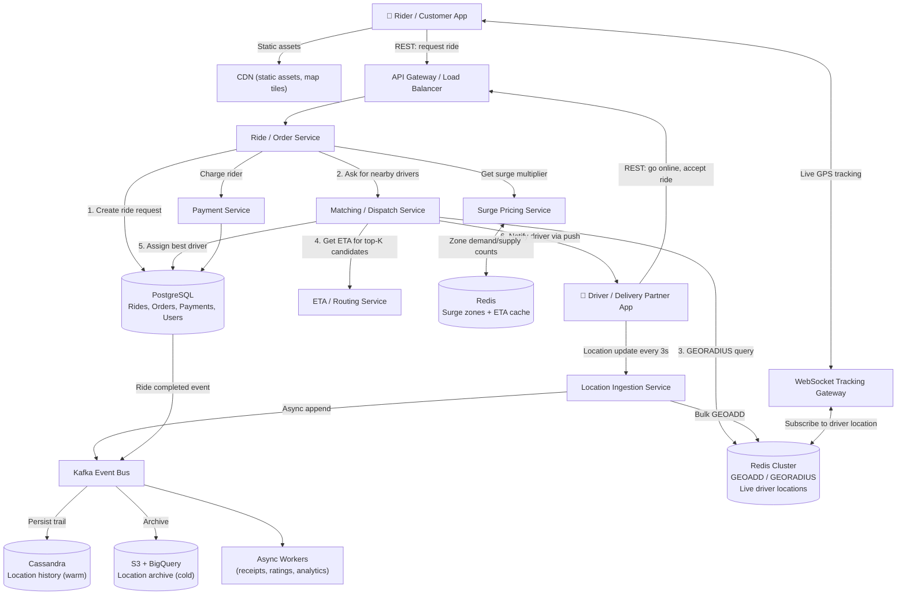

# System Design: Real-Time Ride-Hailing & Food Delivery (Uber / Ola / Zomato / Swiggy / DoorDash)

**Level:** SDE Internship / Junior SDE Interview
**Style:** Geospatial matching + real-time tracking + event-driven order state machine
**Contrast with your other builds:** unlike Instagram/YouTube (read-heavy, fan-out centric) or Stripe (write-heavy, ACID-first), this system's core challenge is **spatial proximity matching under real-time movement** — the data itself is physically moving, and every query's answer changes every 3 seconds.

---

## 1. Requirements

### Functional
- **Rider/Customer request:** enter pickup & dropoff (Uber) or select restaurant & items (Zomato) → see ETA and price → confirm
- **Real-time matching:** system finds the nearest available driver/delivery partner and assigns the order
- **Live tracking:** both parties see real-time GPS movement on a map
- **Payments:** charge rider, pay driver — with surge/dynamic pricing baked in
- **Order state machine:** every order transitions through `REQUESTED → MATCHED → PICKED_UP → IN_TRANSIT → DELIVERED/COMPLETED`

### Proactive Engineering Features
- **ETA computation:** estimate arrival time using live traffic, not just straight-line distance
- **Surge pricing:** dynamically raise prices when demand > supply in a geographic zone to incentivize more drivers online
- **Batching (Zomato/DoorDash-specific):** a single delivery partner picks up orders from 2–3 nearby restaurants on one trip

### Non-Functional Requirements
| Requirement | Target | Justification |
|---|---|---|
| **Matching latency** | < 5 sec | User stares at a "Finding your driver" animation — past 5 sec, they think it's broken and retry or cancel |
| **Location update frequency** | Every 3–5 sec | Frequent enough for smooth map animation; less frequent = jerky movement, more frequent = unnecessary bandwidth/battery drain |
| **Availability** | 99.99% | Revenue stops the moment the app goes down — every minute of downtime = cancelled rides = lost money |
| **Consistency model** | **AP** for tracking & feed, **CP** for payments & matching | A location dot being 3 seconds stale is fine. Assigning the same driver to two riders simultaneously is not. |

> **Why this system is neither pure AP nor pure CP:** live GPS tracking and map rendering are AP — slightly stale coordinates don't hurt. But the matching transaction (assigning one driver to one rider) and the payment transaction must be CP — a double-assignment creates a real-world problem (two angry humans, one confused driver). The system switches consistency models depending on which operation you're in, similar to BookMyShow's approach.

---

## 2. Scale Estimation

**Assume:** 20M DAU riders, 2 rides/user/day, 5M active drivers

| Metric | Calculation | Result |
|---|---|---|
| Daily ride requests | 20M × 2 | 40M/day |
| Average ride request QPS | 40M ÷ 86,400s | ~460 QPS |
| Peak ride request QPS (3× — evening rush + rain) | 460 × 3 | ~1,400 QPS |
| **Location updates/sec (drivers)** | 5M drivers × 1 update/3 sec | **~1.67M writes/sec** |
| **Location updates/sec (active trips — riders tracking)** | ~2M active trips × 1 read/3 sec | **~670K reads/sec** |
| Daily location data points | 5M × 28,800 updates/day (8 hrs active) | ~144B points/day |
| Location record size (~50 bytes: lat, lng, timestamp, driver_id) | 144B × 50 bytes | ~7.2 TB/day |

**Key insight:** the dominant engineering challenge is **1.67 million location writes per second**, not ride requests (~460 QPS). This is a spatial write-throughput problem. No single SQL database on earth handles 1.67M writes/sec — this is what forces the architecture below.

**Storage:**
| Data | Size | Notes |
|---|---|---|
| Location history (hot — last 24 hrs) | ~7.2 TB/day | Needs sub-100ms reads for ETA and tracking — must be in-memory or fast KV store |
| Location history (cold — analytics) | ~2.6 PB/year | Archived to columnar store (BigQuery/Redshift) for route optimization ML |
| Ride/order metadata (~2 KB) | 40M × 2 KB = 80 GB/day | Trivially small — fits in Postgres |
| Driver/rider profiles | ~50M × 1 KB = 50 GB total | Trivially small |

---

## 3. Storage: Why Five Different Systems

| Layer | Choice | Stores | Why |
|---|---|---|---|
| **Live location (hot)** | Redis Cluster (Geospatial) | Driver GPS coordinates updated every 3 sec | Redis has native `GEOADD` / `GEORADIUS` commands — find all drivers within 3 km of a pickup point in **< 1 ms**, entirely in RAM. No disk I/O. |
| **Ride/order state + payments** | PostgreSQL | Ride records, order state machine, payment ledger, driver-rider assignment | Needs ACID — assigning a driver to a ride must be atomic. Double-assignment means two riders wait for the same car. |
| **Location history (warm)** | Cassandra / ScyllaDB | GPS trails for last 7 days — used by ETA service | Append-only time-series writes (1.67M/sec). Partition by `driver_id`, cluster by `timestamp`. LSM-tree handles the write volume. |
| **Location history (cold)** | S3 + BigQuery/Redshift | Archived GPS traces older than 7 days | Cheap columnar storage for ML training (route optimization, demand forecasting). Never queried in real-time. |
| **Matching queue + caching** | Redis (non-geo) | Surge pricing zone buckets, driver availability bitmap, ETA cache | Sub-ms reads for the dispatch service. Surge zone counts use Redis `INCR`/`DECR` atomic counters. |

> **Why not just use Postgres with PostGIS for everything?** PostGIS handles spatial queries beautifully — for hundreds or thousands of QPS. But at 1.67M location writes/sec plus 670K spatial reads/sec, any disk-backed database falls over. Redis `GEOADD` keeps the entire spatial index in RAM, which is the only way to absorb this write volume. PostGIS is used as a **fallback** for complex polygon queries (geofencing, zone boundaries) that Redis can't express.

---

## 4. High-Level Architecture



**Flow summary:**
1. **Driver goes online** → app starts pushing GPS every 3 sec to Location Service → `GEOADD` into Redis (lat, lng, driver_id)
2. **Rider requests a ride** → Ride Service creates a `REQUESTED` record in Postgres, asks Match Service
3. **Matching:** `GEORADIUS` finds all available drivers within 3 km → ETA Service ranks them by actual road-time → best driver assigned atomically in Postgres → push notification sent to driver
4. **Driver accepts** → order state moves to `MATCHED` → rider sees driver's live GPS via WebSocket subscribing to that driver's Redis geo key
5. **Trip in progress** → location updates continue flowing → Kafka persists trails to Cassandra for ETA model training
6. **Trip completed** → payment charged via Payment Service (same outbox pattern as Stripe) → Kafka fans out to receipt generation, rating prompt, analytics

---

## 5. API Contracts

**Request a ride** (REST, write)
```
POST /v1/rides
```
```json
{
  "pickup": { "lat": 28.6139, "lng": 77.2090 },
  "dropoff": { "lat": 28.5355, "lng": 77.3910 },
  "ride_type": "ECONOMY",
  "payment_method_id": "pm_abc123"
}
```
```json
{
  "ride_id": "ride_88901",
  "status": "MATCHING",
  "estimated_fare_cents": 35000,
  "surge_multiplier": 1.5,
  "eta_seconds": 180
}
```

**Driver location update** (REST or UDP, high-frequency write)
```
POST /v1/drivers/location
```
```json
{ "driver_id": "drv_5050", "lat": 28.6145, "lng": 77.2095, "heading": 45, "speed_kmh": 32, "timestamp": 1721050000 }
```
> This endpoint is the highest-QPS call in the entire system (~1.67M/sec). It must be stateless, non-blocking, and write to Redis in fire-and-forget mode. No ACID needed — a lost location update is harmless (the next one arrives in 3 seconds).

**Live tracking** (WebSocket, push)
```
WSS /ws/v1/rides/{ride_id}/track
```
```json
{ "event": "DRIVER_LOCATION", "lat": 28.6145, "lng": 77.2095, "heading": 45, "eta_seconds": 120 }
```

**Accept ride** (REST, driver action)
```
POST /v1/rides/{ride_id}/accept
```
```json
{ "driver_id": "drv_5050" }
```
```json
{ "status": "MATCHED", "rider_name": "Saharsh", "pickup": { "lat": 28.6139, "lng": 77.2090 } }
```

---

## 6. Deep Dive: Production Bottlenecks & Fixes

### A. The Spatial Indexing Problem: How Do You Find Nearby Drivers?

**The problem:** "Find all available drivers within 3 km of this GPS coordinate" sounds simple, but at 1.67M location updates/sec with 5M drivers, a naive approach (scan all 5M drivers, compute Haversine distance for each) would take seconds per query.

**The fix — geospatial indexing with hierarchical grids:**

Three approaches, escalating in sophistication:

1. **PostGIS R-Tree (simplest, for low scale):** Postgres extension that creates a spatial index — works great up to ~10K QPS but chokes at 1M+ writes/sec because it's disk-backed.

2. **Redis GEOADD / GEORADIUS (production choice for Uber-scale):** Redis stores all driver locations in a sorted set indexed by geohash. `GEORADIUS pickup_lat pickup_lng 3 km` returns all matching drivers in < 1 ms from RAM. Handles millions of writes because it's in-memory and single-threaded (no lock contention).

3. **Uber H3 hexagonal grid (the gold standard):**
   - Uber open-sourced **H3**, which divides the Earth's surface into hexagonal cells at multiple resolutions (from continent-sized to ~1 m²)
   - Every driver's GPS coordinate maps to one hex cell ID at a given resolution
   - "Find nearby drivers" = look up the hex cell containing the pickup point + its 6 neighboring cells = 7 Redis key lookups, each returning drivers in that cell
   - **Why hexagons?** Unlike square grids, every hexagonal neighbor is equidistant from the center — no corner-distortion problem. This makes radius queries more uniform and accurate.

> **Plain English:** instead of searching the entire city for nearby drivers, H3 divides the map into a honeycomb grid. You only search the 7 honeycomb cells around the pickup point — turning a "search the whole city" query into "check 7 small buckets."

### B. The Dispatch Race Condition (Double-Assignment)

**The problem:** rider Alice requests a ride. Driver Dave is 2 km away and is the best match. But at the same instant, rider Bob (1.5 km from Dave) also requests. Two Match Service instances both query Redis, both see Dave as available, both try to assign Dave — Dave gets two ride assignments simultaneously.

**The fix — atomic claim with Redis + Postgres:**
1. **Redis atomic claim:** `SETNX driver:drv_5050:assignment ride_88901 EX 30` — only the first Match Service instance gets `SUCCESS`. The second gets `FAIL` and falls back to the next-best driver.
2. **Postgres backstop:** the winning instance writes the assignment to Postgres inside a transaction. If the Postgres write fails for any reason, the Redis lock expires in 30 seconds and Dave becomes available again.
3. **Driver response timeout:** if Dave doesn't accept within 15 seconds, the assignment expires, Dave is released, and the system re-matches to the next candidate.

> **Plain English:** Redis is the "claim ticket" — only one person can grab it. Postgres is the legal contract that makes it official. If the contract falls through, the claim ticket auto-expires.

### C. Surge Pricing Under Demand Spikes

**The problem:** it starts raining at 6 PM in a business district. Ride requests spike 10× in 5 minutes. If prices stay flat, all available drivers get booked instantly, and new riders see "no drivers available" — terrible user experience plus lost revenue.

**The fix — zone-based dynamic pricing:**
1. **Divide the city into H3 hex zones** at a resolution where each zone is ~1–2 km²
2. **Track demand and supply per zone in Redis:**
   - `INCR zone:{h3_cell}:demand` on every ride request
   - `INCR zone:{h3_cell}:supply` when a driver enters the zone
   - Read both counters, compute ratio: `surge_multiplier = demand / supply` (clamped to a max, e.g., 3.0×)
3. **Counters reset on a sliding window** (every 5 minutes) so the surge responds quickly to changing conditions
4. **Show the surge price to the rider before they confirm** — transparency prevents backlash

> **Why not just queue riders?** Because unlike BookMyShow (where the seat will still be there in 10 minutes), ride-hailing is time-critical. A rider in the rain doesn't want to wait in a queue — they want a car *now*. Surge pricing is the market mechanism that gets more drivers to move toward the high-demand zone.

### D. Handling 1.67M Location Writes/Second

**The problem:** 5 million drivers each sending GPS every 3 seconds = 1.67M writes/sec. Even Redis can't handle this on a single node (Redis maxes out at ~100K–200K ops/sec per node).

**The fix — sharded write pipeline:**
1. **Shard by geography:** partition drivers across multiple Redis Cluster nodes by H3 zone. Drivers in Delhi hit Redis shard 1; drivers in Mumbai hit shard 2. No single shard sees the full global write volume.
2. **Batch + pipeline:** the Location Ingestion Service buffers incoming GPS updates for 100ms, then sends them as a Redis pipeline batch (1 network round-trip for 500 commands instead of 500 round-trips).
3. **Fire-and-forget writes:** location updates use Redis `GEOADD` without waiting for acknowledgement. If one update is lost, the next one arrives in 3 seconds — eventual consistency is fine for GPS dots on a map.
4. **Kafka side-channel:** every location update is also published to Kafka for async persistence to Cassandra (warm) and S3 (cold). The hot path (Redis) and the durable path (Cassandra) are decoupled.

---

## 7. Uber & Zomato Differences (Same Architecture, Different Product Knobs)

| Dimension | Uber (Ride-Hailing) | Zomato/Swiggy (Food Delivery) |
|---|---|---|
| **Matching target** | Nearest *available* driver | Nearest *available* delivery partner who is near the *restaurant*, not the customer |
| **ETA components** | Driver → Rider pickup + Rider → Dropoff | Partner → Restaurant + Food prep time + Restaurant → Customer |
| **Food prep time** | N/A | A new variable: the restaurant tells the system "order will be ready in 15 min" — matching should prefer partners who will arrive *when the food is ready*, not immediately |
| **Batching** | Rare (UberPool is the exception) | Common — one partner picks up from 2–3 nearby restaurants on one trip to save delivery costs |
| **Surge pricing** | Rider-facing price goes up | Delivery fee goes up, but food price stays the same (set by restaurant) |

> **Interview tip:** if asked "Design Uber" or "Design Zomato," say upfront that the core architecture is identical — then call out these product-level differences. It shows you can distinguish infrastructure patterns from business logic.

---

## 8. Real-World Engineering Facts (Interview Color)

- **Uber H3:** Uber open-sourced their hexagonal grid indexing library. It recursively subdivides the globe into hexagons at 16 resolution levels. At resolution 9 (~175 m edge), each hex contains a few city blocks — the sweet spot for driver matching. Drop this in an interview as: *"Uber uses H3 hexagonal cells because, unlike square grids, every hex neighbor is equidistant from the center — no corner-distortion artifacts."*
- **Uber Ringpop:** Uber built Ringpop (open-sourced), a consistent hashing library that assigns geographic zones to specific dispatch servers. If a server dies, the hash ring redistributes its zones to neighbors — no central coordinator needed.
- **Google S2 Geometry:** Google Maps and Google-backed services use S2, which projects the globe onto a cube face and fills it with a Hilbert curve, converting 2D spatial proximity into 1D sort order. Mention this as an alternative to H3 if the interviewer asks.
- **Zomato's Hyperpure:** Zomato vertically integrated their supply chain (Hyperpure supplies raw ingredients to restaurants) — an interesting business-architecture coupling, but not relevant to the tech interview.


