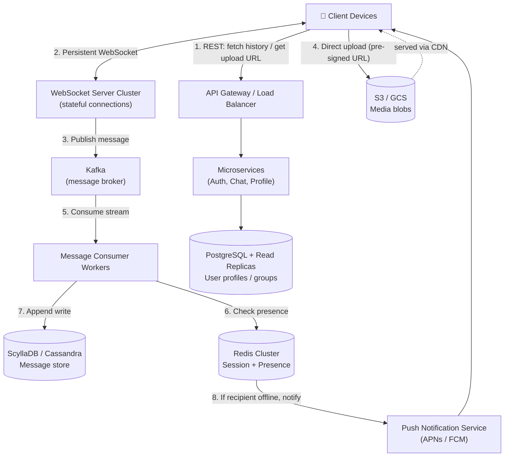

# System Design: Scalable Real-Time Chat (WhatsApp-style)

**Level:** SDE Internship / Junior SDE Interview
**Style:** Event-driven, polyglot-storage, async microservices

---

## 1. Requirements

### Functional
- 1-on-1 messaging, group chats (up to 256 members)
- Media sharing (image/video/audio/docs)
- Delivery states: **Sent (✓) → Delivered (✓✓) → Read (✓✓ blue)**
- Store-and-forward: messages queue for offline users, deliver on reconnect

### Non-Functional
| Requirement | Target | Why |
|---|---|---|
| Latency | < 100 ms | Below this, humans perceive it as instant. Above ~300 ms, conversation "feels" laggy |
| Availability | 99.99% ("four nines") | ≤ 52 min downtime/year — this is a communication utility, not optional |
| Consistency model | **AP** over CP (CAP theorem) | Partitions are inevitable; better to deliver a message 500 ms late than reject a write or freeze the app |

---

## 2. Scale Estimation

**Assume:** 500M DAU, 40 messages/user/day

| Metric | Calculation | Result |
|---|---|---|
| Daily messages | 500M × 40 | 20B/day |
| Average QPS | 20B ÷ 86,400s | ~230K QPS |
| Peak QPS (2× spike factor) | 230K × 2 | ~460K QPS |
| Text storage/day | 20B × 100 bytes | ~2 TB/day (~730 TB/yr) |
| Media messages/day (10% of total) | 2B msgs | — |
| Media storage/day | 2B × 500 KB | ~1 PB/day (~365 PB/yr) |

**Key insight:** text and media differ in storage growth by ~500×. This alone forces a **polyglot storage split** — they cannot live in the same system.

---

## 3. High-Level Architecture



**Flow summary:**
1. Client hits REST for stateless stuff (chat history, upload URLs)
2. Client holds a persistent WebSocket for real-time send/receive
3. WebSocket server doesn't process the message itself — it publishes to Kafka (decouples ingestion from processing)
4. Media uploads bypass app servers entirely (client → S3 directly)
5–7. Kafka consumers persist to the message store and check presence
8. If the recipient is offline, fall back to a push notification instead of trying to deliver over a dead socket

---

## 4. Storage: Why Four Different Databases

| Layer | Choice | Access Pattern | Why |
|---|---|---|---|
| **Message store** | Cassandra / ScyllaDB | Heavy append-only writes, chronological range reads per `chat_id` | LSM-tree storage engine = fast sequential writes, no lock contention. Partition key = `chat_id`, clustering key = `message_id` (time-sortable) |
| **Session & presence** | Redis Cluster | Sub-ms lookup: `user_id → websocket_server_ip`, online/offline flag | Fully in-memory, handles millions of volatile ops/sec — perfect for something that changes constantly and doesn't need durability |
| **Core metadata** | PostgreSQL + read replicas | Relational queries: profiles, friend lists, group ACLs | Needs ACID + schema validation (e.g., verify group permission before broadcasting). Write volume here is low, so replicas scale reads easily |
| **Media** | S3 / GCS | Immutable blob storage | Storing BLOBs in a DB kills index performance and bloats backups. Serve via pre-signed URLs + CDN edge caching |

---

## 5. API Contracts

**Send message** (WebSocket, bidirectional)
```json
{
  "action": "SEND_MESSAGE",
  "client_message_id": "8f9d2a80-c1e5-11ee-a506-0242ac120002",
  "chat_id": "chat_112233",
  "timestamp": 1706000000,
  "payload": { "type": "TEXT", "content": "Hey, let's ace this interview!" }
}
```

**Read receipt** (WebSocket, bidirectional)
```json
{
  "action": "UPDATE_RECEIPT",
  "message_id": "8f9d2a80-c1e5-11ee-a506-0242ac120002",
  "status": "READ",
  "timestamp": 1706000005
}
```

**Fetch history** (REST — stateless, cacheable, easy to load-balance)
```
GET /v1/chats/{chat_id}/messages?limit=50&before_message_id={id}
```

**Request media upload URL** (REST) → returns a pre-signed S3 URL. Client uploads directly to S3, then sends the resulting asset URL over the `SEND_MESSAGE` WebSocket payload.

---

## 6. Deep Dives: Bottlenecks & Fixes

### A. Thundering Herd on WebSocket Reconnect
**Problem:** A node holding 500K live connections crashes → 500K devices reconnect in the same instant → self-inflicted DDoS on the gateway/auth layer.

**Fix:**
- **Exponential backoff + jitter** on the client (`2^n + random`) so reconnects spread over seconds/minutes instead of hitting at once
- **Consistent hashing** at the load balancer so surviving nodes absorb orphaned connections without reshuffling the whole cluster

### B. Cassandra Hot Partitions (Viral Groups)
**Problem:** Partitioning by `chat_id` puts an entire group's messages on one node. A viral broadcast channel doing 10K msgs/sec chokes that single node while the rest of the cluster idles.

**Fix — Salted keys:** append a bucket suffix to high-traffic chat IDs (`chat_id#1` … `chat_id#10`), spreading writes across 10 nodes. On read, query all buckets in parallel and merge-sort by timestamp in memory.

### C. Out-of-Order Delivery
**Problem:** Network jitter or Kafka partition skew can let a later message get written before an earlier one. Server wall-clock timestamps aren't reliable due to clock drift across machines.

**Fix — Snowflake / UUIDv7 IDs:** generate a time-sortable, globally-unique ID at the ingestion edge (timestamp bits + machine ID + sequence counter). No central lock needed, and ordering falls out of the ID itself.

---

## 7. Media Lifecycle — Why "Ask them to resend" Happens

Two independent TTLs expire, and when both fail you get the classic broken-thumbnail state:
1. **Device-side:** OS or cleanup apps purge the actual decrypted media file to save space, but keep the tiny thumbnail + text metadata in local SQLite
2. **Server-side:** S3 enforces a retention window (e.g., 30 days post-delivery) to cap storage cost

When both are gone → local file missing + S3 expired → app fails gracefully with "Can't download. Ask to be sent again."

---

## 8. End-to-End Encryption (Signal Protocol)

With E2EE, backend servers become **blind routers** — they move ciphertext and never hold a decryption key.

**Key types (generated on-device, only public keys uploaded):**
1. Identity key pair (long-term)
2. Signed pre-key (medium-term, signed by identity key)
3. Pool of one-time pre-keys (~100, each used once and discarded)

**Handshake — X3DH:** Alice fetches Bob's public keys from the key server and derives a shared secret locally, without Bob needing to be online.

**Double Ratchet:** every message advances the key chain to derive a fresh AES-256 key.
> **Perfect Forward Secrecy** — if Bob's phone is compromised tomorrow, today's messages stay unreadable because the keys used for them were already destroyed.

**What the server actually sees:**
```json
{
  "action": "SEND_MESSAGE",
  "recipient_id": "usr_Bob",
  "ciphertext": "a8f9d0e2c1a5...bc3d",
  "ephemeral_public_key": "0x7a9c8b..."
}
```

**Production trade-offs worth mentioning in an interview:**
- **Multi-device fan-out:** private keys never leave a device's secure enclave, so sending to someone with 2 linked devices means the sender encrypts the message twice — once per device session — and sends an array of ciphertexts
- **Hybrid encryption for media:** asymmetric crypto is too slow for a 50 MB video, so: generate a one-off AES-256 key → encrypt the file with it → upload ciphertext to S3 → encrypt just the small AES key with Signal → send that key over the WebSocket payload
- **Search:** done entirely client-side, via a local SQLite full-text index built as messages get decrypted (server can't index what it can't read)
- **Moderation:** reactive only — a user "report" re-encrypts the plaintext with a Trust & Safety public key and forwards it to a moderation queue

---

## 9. Real WhatsApp Engineering Facts (good interview color)

These aren't required to answer the question, but dropping one shows you've actually read past the tutorial version:

- **Erlang/OTP + BEAM VM:** WhatsApp's original backend ran on Erlang, whose actor-model concurrency (millions of cheap, isolated lightweight processes) is unusually well-suited to holding millions of simultaneous long-lived socket connections per box — a very different tradeoff than the thread-per-connection model most stacks use.
- **Famous engineer-to-user ratio:** at the time of the Facebook acquisition (2014), WhatsApp served roughly 450–900M users with a strikingly small engineering team — often cited as a case study in how much a small team can run when the stack minimizes operational surface area (few moving parts, heavy automation, Erlang's built-in fault tolerance/hot code reloading).
- **Kernel-level tuning:** to hold millions of concurrent TCP connections per machine, WhatsApp ran patched/tuned FreeBSD and Linux kernels — far beyond what a stock OS network stack handles out of the box.
- **ejabberd origins:** the early messaging layer was built on a modified XMPP server (ejabberd), later heavily rewritten/replaced as scale requirements diverged from generic XMPP.
- **Multi-device redesign (2021):** WhatsApp moved away from "phone = single source of truth" to a model where each linked device holds its own independent identity keys and syncs via the primary device — a nontrivial redesign of the original single-device Signal Protocol assumptions.

If you mention any of these in an interview, tie it back to a *tradeoff* (e.g., "Erlang's actor model made sense for their connection-density problem, but it's a hiring/tooling cost most companies wouldn't take on just for that") rather than just naming it.
