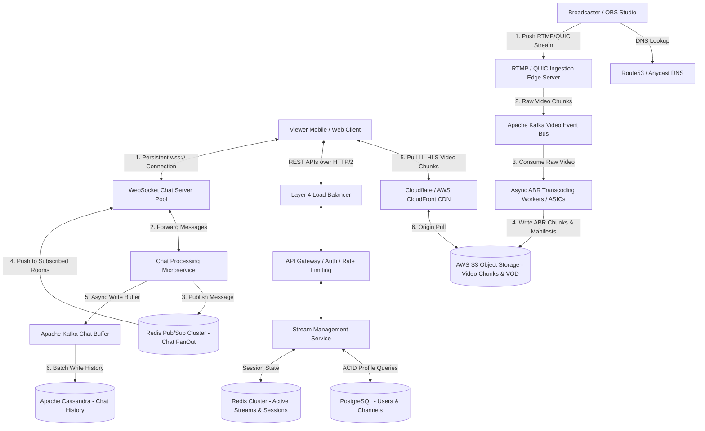

# Live-Streaming Platform System Design (YouTube Live / Twitch)
---

## 1. Scope & System Requirements

### Core Functional Requirements
* **Live Media Ingestion:** Broadcasters can transmit live video and audio from streaming software (like OBS) or mobile cameras to our ingestion servers with minimal dropped frames.
  > **Ingestion in plain English:** The process of receiving live video data from a creator's device and importing it into our backend servers.
* **Live Media Delivery:** Viewers can watch live broadcasts with minimal delay across varying internet speeds.
* **Real-Time Live Chat:** Viewers can send and receive chat messages alongside the video stream in real time.
* **VOD Archiving (Video on Demand):** Once a broadcast ends, the live stream is automatically converted into a permanent, standard video file that can be re-watched anytime.
* **Proactive Engineering Additions:**
  * **Adaptive Bitrate Streaming (ABR):** Real-time generation of multiple video quality profiles (1080p, 720p, 480p, 360p) on the fly.
    > **ABR in plain English:** Instead of forcing everyone to download the exact same heavy 1080p video, the server chops the incoming live feed into tiny 1-second chunks and creates 4 different quality sizes for each chunk in real time. If a viewer's Wi-Fi weakens, their video player automatically drops down to downloading smaller 480p chunks so the stream never pauses to buffer.
  * **DVR Rewind Window:** A sliding temporary memory buffer allowing viewers who join a broadcast late to pause, rewind, and scrub backward up to 30 minutes while the stream is still live.
    > **DVR in plain English:** Just like pausing live television on a cable box, our servers hold the last 30 minutes of live video chunks in a temporary cache so viewers can jump backward without breaking the live broadcast connection.
  * **Intelligent Chat Throttling & Sampling:** Algorithmically filtering chat messages during high-velocity traffic spikes to prevent viewer browser crashes.
    > **Chat Sampling in plain English:** If 100,000 people type a message at the exact same second, sending 100,000 messages to every single viewer's phone will freeze their screen. The server smartly picks a randomized 10% sample to show, making the chat feel super fast and active without crashing the user's device.

### Non-Functional Requirements (NFRs) & Architectural Justifications
* **Video Delivery Latency < 5 Seconds (Glass-to-Glass):**
  * *Justification:* Standard broadcast psychology dictates that delays exceeding 5 seconds destroy the illusion of participating in a live social event (e.g., hearing a neighbor cheer for a soccer goal 5 seconds before seeing it on your screen).
  * > **Glass-to-Glass in plain English:** The total time it takes for light hitting the camera lens (the first glass) to show up on the viewer's phone screen (the second glass).
* **Live Chat Latency < 500 Milliseconds:**
  * *Justification:* Human conversational flow feels sluggish and disconnected when delays exceed 500ms. Furthermore, if chat lags behind the video stream, spoilers ruin the viewer experience.
* **High Availability over Consistency (AP in CAP Theorem):**
  > **CAP Theorem in plain English:** In a distributed network of computers, if a communication wire breaks between data centers, you must choose between keeping the app running with slightly outdated information (**Availability**) or shutting the app down until all servers sync up again (**Consistency**).
  * *Justification:* If a database node fails during a live esports tournament, it is infinitely better for a viewer to keep watching the video with a slightly delayed "Live Viewer Count" (Eventual Consistency) than to see a blank screen or an error page.
* **High Outbound Throughput & Hot-Spot Tolerance:**
  * *Justification:* A single celebrity going live can trigger a **Thundering Herd**, where 1,000,000+ viewers join a single stream and chat room within a 60-second window. The architecture must absorb massive traffic spikes without degrading global platform performance.
  * > **Thundering Herd in plain English:** When millions of users suddenly surge into the exact same server or resource at the exact same second, potentially causing the system to crash from overload.

---

## 2. Scale Estimation & Hardware Boundaries

### Traffic & Volumetric Parameters
* **Daily Active Users (DAU):** 100,000,000
* **Concurrent Live Broadcasters at Peak:** 10,000 streams
* **Concurrent Live Viewers at Peak:** 5,000,000 (skewed heavily toward top celebrity creators)
* **Average Ingestion Video Bitrate:** 5 Mbps (1080p source stream)
  > **Bitrate vs Megabytes in plain English:** Static files (like photos) are measured in Megabytes (MB). Live streams are continuous data pipelines measured in Megabits per second (Mbps). Remember the golden rule: **8 Megabits = 1 Megabyte**. A 5 Mbps stream consumes 0.625 MB of data every second.
* **Average Delivery Video Bitrate:** 3 Mbps (average across all Adaptive Bitrate profiles: 1080p down to 360p)

### Bandwidth Calculations (The Network Boundary)
* **Inbound Bandwidth (Ingestion):** 10,000 streamers * 5 Mbps = 50,000 Mbps = **50 Gbps**
* **Outbound Bandwidth (Delivery Egress):** 5,000,000 viewers * 3 Mbps = 15,000,000 Mbps = **15 Tbps (Terabits per second)**
* **Infrastructure Boundary Conclusion:** Serving **15 Tbps** of video directly from application servers or databases would instantly melt internal cloud networks. All video delivery **must** be offloaded to global Content Delivery Networks (CDNs) serving static video chunks from edge nodes physically closer to viewers.
  > **CDN (Content Delivery Network) in plain English:** A global network of servers located in major cities worldwide that store copies of your videos locally. When a viewer in Tokyo watches a video, they download it from the Tokyo CDN server instead of your main server in America, making it much faster and reducing your server load.

### Storage Footprint & Replication Needs (VOD Archiving)
Assuming the average streamer broadcasts for 2 hours per day:
* **Raw Daily Video Stream Size:** (5 Mbps / 8) * 3,600 sec * 2 hours ≈ **4.5 GB per stream**
  * Total daily raw storage: 10,000 streamers * 4.5 GB = **45 TB/day of raw video**
* **Transcoding Multiplier (1.8x):** Storing the lower-resolution ABR profiles (720p, 480p, 360p) alongside the 1080p master file increases storage to: 45 TB * 1.8 = **81 TB/day**
* **Replication Multiplier (3x Across AZs):** To guarantee durability across physically isolated data centers: 81 TB * 3 = **243 TB/day** (~88.7 PB/year).
  > **AZ (Availability Zone) in plain English:** A physically separate data center building within a cloud region. Storing 3 copies across different AZs means if one data center loses power or catches fire, your video data still survives.

### Live Chat QPS Math
If 10% of our 5,000,000 concurrent viewers send 1 message per minute:
* **Average Chat Write QPS:** 500,000 messages / 60 seconds ≈ **8,333 QPS**
* **Peak Chat Write QPS (2x Multiplier):** 8,333 * 2 ≈ **16,666 QPS**
  > **QPS (Queries Per Second) in plain English:** The number of individual requests or actions our backend servers must successfully process every single second.

---

## 3. High-Level Design (HLD) & Architecture Flow

### Protocol Selection: Why REST vs. WebSockets vs. RTMP?
We strictly separate our communication protocols based on data velocity and caching requirements:
1. **For Live Ingestion (Broadcaster -> Server): RTMP over TCP or QUIC (HTTP/3 over UDP)**
   * *Why not HTTP REST?* Standard HTTP request-response adds heavy header bloat (~800 bytes per request) and requires repeated TCP handshakes. RTMP establishes a single, persistent, long-lived TCP connection and streams raw video frames continuously with minimal overhead.
   * > **RTMP (Real-Time Messaging Protocol) in plain English:** A continuous communication pipe designed specifically to send raw, uninterrupted video from streaming software like OBS to servers without waiting for "message received" replies.
   * > **QUIC (HTTP/3 over UDP) in plain English:** A modern network protocol that sends data without strict ordering rules. If a mobile streamer on weak Wi-Fi loses a single packet of data, QUIC lets the rest of the video keep playing without freezing the screen to wait for the lost packet.
2. **For Video Delivery (Server -> Viewer): LL-HLS (Low-Latency HTTP Live Streaming) over CDN**
   * *Why not WebSockets?* WebSockets create persistent, stateful connections directly to application servers. **Standard CDN edge networks cannot cache WebSocket data streams.** LL-HLS chops live video into tiny 1-second files served over standard HTTP GET requests, allowing CDNs to cache and serve them to millions of users without hitting our origin servers.
   * > **LL-HLS in plain English:** A method that slices a live video stream into tiny 1-second video files and updates an index playlist continuously. Video players download these tiny files one after another over regular web links, which allows CDN caching networks to distribute them cheaply.
3. **For Live Chat (Viewer <-> Server): WebSockets (`wss://`)**
   * *Why WebSockets?* Chat requires bi-directional, sub-500ms push communication. A standard HTTP request carries ~800 bytes of headers, while a WebSocket data frame carries only **~2 bytes of overhead**. This allows servers to push thousands of chat messages per second over open sockets without polling latency.
   * > **WebSockets in plain English:** An open, two-way communication tunnel between a user's phone and our server. Once opened, both sides can instantly push data back and forth without having to reconnect or send heavy web headers every time.

### API Contracts
* **`POST /v1/streams/start` (REST - Broadcaster)**
  * *Request:* `{ "title": "SDE Intern Prep Live", "category": "Education", "resolution": "1080p" }`
  * *Response:* `{ "stream_id": "strm_8892a", "rtmp_ingest_url": "rtmp://[ingest.platform.com/live](https://ingest.platform.com/live)", "stream_key": "sec_key_99102", "expires_in": 3600 }`
  * *Purpose:* Authenticates the creator and issues a secure routing URL and stream key for their streaming software (OBS).
* **`GET [https://cdn.platform.com/hls/strm_8892a/master.m3u8](https://cdn.platform.com/hls/strm_8892a/master.m3u8)` (HTTP GET - Viewer via CDN)**
  * *Response:* An HLS Playlist manifest file listing the URLs for available video resolutions (1080p down to 360p).
  * *Purpose:* Instructs the video player on where to download live video chunks, dynamically adjusting based on internet speed.
* **`wss://[chat.platform.com/v1/ws?stream_id=strm_8892a](https://chat.platform.com/v1/ws?stream_id=strm_8892a)` (WebSocket - Viewer)**
  * *Client Send Event:* `{ "event": "SEND_MSG", "payload": { "text": "Can you explain CAP Theorem?" } }`
  * *Server Push Event:* `{ "event": "NEW_MSG", "payload": { "user_id": "usr_102", "text": "Can you explain CAP Theorem?", "timestamp": 1721750000 } }`
  * *Purpose:* Maintains a bi-directional persistent socket for instant chat broadcasting.

### System Architecture Diagram

### What each box actually does, in one line:

| Term | Plain-English Meaning |
|---|---|
| **Anycast DNS** | A routing system where multiple servers worldwide share the same IP address, automatically connecting a streamer to the closest physical data center. |
| **RTMP Ingestion Server** | A specialized server that accepts continuous, live raw video streams over long-lived TCP connections from streaming software. |
| **Transcoding Workers** | A cloud farm of computers (or custom hardware chips) that instantly compresses raw incoming video into 1080p, 720p, 480p, and 360p chunks within 2 seconds. |
| **CDN (Content Delivery Network)** | A global network of servers that caches video chunks close to viewers so millions can watch without overloading our main servers. |
| **WebSocket Chat Server** | Holds open, persistent TCP connections with viewers' phones/browsers to instantly push chat messages without waiting for requests. |
| **Redis Pub/Sub** | An ultra-fast, in-memory message broadcaster. When one person types a message, Redis instantly routes it to all servers holding connections for that chat room. |
| **Kafka Chat Buffer** | A heavy-duty digital shock absorber (message queue) that holds massive bursts of chat messages so the database isn't overwhelmed during viral spikes. |
| **Layer 4 Load Balancer** | A traffic-controller that routes requests based only on IP addresses and port numbers without reading the actual content, making it ultra-fast. |
| **API Gateway** | The single front door for all general client requests, handling security authentication and rate-limiting before routing to backend services. |

---

## 4. The Polyglot Persistence Data Tier

We strictly match storage engines to exact data velocities and access patterns:

| Storage Technology | Selected Engine | Target Use Case | Access Pattern & Engineering Justification |
| :--- | :--- | :--- | :--- |
| **Object Storage** | AWS S3 / GCS | Video chunks (`.m4s`), HLS playlists (`.m3u8`), thumbnails, and archived VOD files. | **Why:** Databases choke on large binary files. Object storage provides infinite scaling, cheap cost-per-GB ($0.02/GB), and direct CDN caching integration. |
| **Relational SQL** | PostgreSQL | User accounts, channel profiles, authentication tokens, and stream configurations. | **Why:** Requires **strict ACID transactional integrity**. If a streamer updates their stream key or channel settings, the change must be atomic and consistent across all services immediately. |
| **In-Memory Broker** | Redis Pub/Sub & Redis Cache | Real-time chat message distribution, active live viewer counts, and stream session routing states. | **Why:** Bypasses disk I/O entirely to guarantee sub-500ms chat delivery. Handles massive fan-out routing in memory. Uses Redis Atomic Counters (`INCR`/`DECR`) for live viewer counts. |
| **Wide-Column NoSQL** | Apache Cassandra | Live chat message history and stream audit logs. | **Why:** Chat history is an **append-only, time-series access pattern** with massive write QPS (16,666+ Peak QPS). Using `stream_id` as the Partition Key and `timestamp` as the Clustering Key stores chat logs sequentially on disk for lightning-fast range queries (`LIMIT 50`). |

> **Redis Atomic Counters (`INCR`/`DECR`) in plain English:** When 10,000 people join a stream at the exact same millisecond, a normal database tries to read the number, add 1, and save it, causing errors where counts get overwritten or lost. Redis has a built-in hardware-level command that steps the number up or down instantly in RAM without losing a single count.
>
> **ACID in plain English:** A database guarantee that a transaction either fully completes or doesn't happen at all—no half-finished states. Critical for account credentials and streaming permissions.
>
> **Partition Key & Clustering Key in plain English:** In NoSQL databases like Cassandra, the **Partition Key** determines which physical computer stores a piece of data (e.g., grouping all messages for Stream #123 on Server A). The **Clustering Key** automatically sorts that data on the hard drive (e.g., ordering those messages strictly by timestamp so loading the newest 50 is instantaneous).

---

## 5. Architectural Deep-Dive: How YouTube Survives at Massive Scale

To handle millions of concurrent live viewers without melting standard server farms, platforms like YouTube Live deploy two proprietary, specialized engineering innovations:

### A. Custom Hardware Transcoding: Google Argos VCU (Video Coding Unit)
**The Problem:** Taking a raw 4K or 1080p live stream and simultaneously compressing it into modern video formats across 5 different resolutions in real time requires massive computational horsepower. Standard server processors consume immense electricity, generate extreme heat, and suffer from micro-stutters during heavy live concurrency.

**The Solution:** Google engineered custom hardware chips called **Argos VCUs**.
* Instead of running software on general-purpose CPUs, these physical hardware chips are built specifically at the silicon level to do only one mathematical task: video encoding and compression.
* **The Result:** Argos VCUs process live video transcoding with **20x to 33x greater computational efficiency** than traditional server CPUs, allowing YouTube to ingest and transcode tens of thousands of concurrent live streams with sub-2-second latency at a fraction of the power and hardware cost.
  > **ASIC / Custom Hardware in plain English:** While a standard computer processor (CPU) is like a Swiss Army knife designed to do a million different general tasks okay, a custom video chip (ASIC/VCU) is a custom-forged chef's knife designed to do exactly one specific task (video compression) at unimaginable speeds.

### B. Network Ingestion Resiliency: QUIC (HTTP/3 over UDP)
**The Problem:** Traditional RTMP ingestion relies on TCP (Transmission Control Protocol). TCP enforces strict, ordered data delivery. If a mobile streamer on a weak 5G connection loses a single data packet, TCP triggers **Head-of-Line Blocking**—the entire video stream freezes and waits while that one missing packet is re-transmitted, causing stuttering and dropped frames for viewers.

**The Solution:** YouTube Live increasingly utilizes **QUIC (HTTP/3)** over UDP for live ingestion and delivery.
* Unlike TCP, QUIC does not suffer from Head-of-Line Blocking across data streams. If one video packet is dropped over the network, QUIC allows subsequent video frames to continue flowing without freezing the connection.
* Furthermore, QUIC integrates security encryption directly into the initial connection setup, reducing network handshake delays from 3 round-trips to just **0 or 1 round-trip**, allowing mobile creators to connect and stream instantly even on spotty networks.
  > **Head-of-Line Blocking in plain English:** Imagine a single-lane highway where car #1 breaks down. Even if cars #2, #3, and #4 work perfectly, they are trapped behind the broken car and nobody can move. QUIC builds a multi-lane highway so if one data packet fails, the remaining packets bypass it and keep moving.

---

## 6. Production Bottlenecks & Architectural Solutions

### Bottleneck 1: The "Hot-Room" Chat Explosion (Thundering Herd & Fan-Out)
**The Problem:** When a celebrity streamer goes live, **1,000,000 viewers** join a single chat room. If 100 viewers send a message every second, a naive Redis Pub/Sub model must perform a **Central Fan-Out**: 100 messages/sec * 1,000,000 viewers = **100,000,000 network pushes per second**. A single Redis node is single-threaded; attempting to dispatch 100 million network pushes per second will freeze the CPU, exhaust network bandwidth, and crash the chat infrastructure.
  > **Fan-Out in plain English:** Taking one incoming piece of data (like one person typing "Hello") and duplicating it across the network wires to send to millions of individual devices simultaneously.

**The Solution: Hierarchical (Tiered) Pub/Sub + Client-Side Sampling**
We decouple message routing using a two-tier fan-out architecture combined with algorithmic throttling:
1. **Tiered Pub/Sub Routing:** Instead of 1 million client connections subscribing directly to one central Redis channel, we group our WebSocket servers into clusters (e.g., 500 WebSocket servers, each holding 2,000 client connections). Central Redis pushes the chat message **once per WebSocket Server** (500 pushes total). Each local WebSocket server then pushes the message over open sockets to its 2,000 local clients. We reduce central fan-out from 1,000,000 to just 500.
2. **Algorithmic Message Sampling:** A human eye cannot read 100 messages per second. When chat QPS exceeds a readable threshold (>10 msgs/sec), the backend enables **Intelligent Sampling**. It dynamically broadcasts only a randomized 10% of messages to general viewers, while guaranteeing 100% delivery for streamer messages, moderators, and paid subscribers.

---

### Bottleneck 2: NoSQL Hot-Partition Write Failures
**The Problem:** We chose wide-column NoSQL (Cassandra/DynamoDB) to store chat logs for fast writes. In NoSQL, all data sharing the exact same **Partition Key** (`stream_id`) is routed to a single physical database node. For a celebrity stream generating 16,000+ chat writes per second, that single database node experiences a **Hot Partition**. The node suffers severe disk I/O queuing and throws throughput errors, dropping chat history while all other database nodes sit completely idle.
  > **Hot Partition in plain English:** Imagine a supermarket with 100 checkout lanes, but every customer buying items from a celebrity brand is forced to use Lane 1. Lane 1 will collapse into massive lines and system failures while lanes 2 through 100 stand empty.

**The Solution: Key Sharding (Salting) + Kafka Asynchronous Batching**
We eliminate hot spots by breaking the partition key into smaller logical buckets:
1. **Partition Key Salting:** When writing chat logs to Cassandra, we do not use `stream_id` alone as the partition key. We append a randomized bucket number (from 0 to 99) or a 60-second time window:
   `Salted Partition Key = stream_id + "#" + bucket_id (0 to 99)`
   This forces the database to distribute the writes for a single celebrity stream evenly across **100 different physical database nodes**, completely eliminating the hot-spot!
   > **Key Salting / Sharding in plain English:** Adding a random extra number to a database label so that instead of piling 16,000 messages onto one machine, the system divides the messages into 100 small piles of 160 messages and spreads them evenly across 100 different computers.
2. **Kafka Asynchronous Buffer:** WebSocket servers never write directly to the database. Incoming chat messages are published to Apache Kafka. Background consumer workers read from Kafka in batches of 500 and execute asynchronous multi-row inserts into Cassandra, smoothing out massive traffic spikes.

---

### Bottleneck 3: RTMP Ingestion Server Severance Mid-Broadcast
**The Problem:** A broadcaster is live-streaming a gaming tournament via RTMP over a TCP connection to Edge Ingestion Server A. If Server A suffers a hardware fault or network glitch, the TCP connection drops. If our architecture forces the streamer's software to generate a brand-new stream key or session URL to reconnect, **5 million viewers instantly see a dead stream**, ruining the broadcast.

**The Solution: Anycast BGP Routing + Redis Session State Failover**
We make the ingestion tier completely stateless and resilient to hardware failures:
1. **Anycast Edge Routing:** Broadcasters connect to an Anycast IP address. The internet's Border Gateway Protocol (BGP) automatically routes their stream to the physically closest healthy server.
   > **Anycast BGP Routing in plain English:** Like having a single national emergency phone number (911) that automatically connects you to the nearest local police station. If one station loses power, the phone network automatically routes your call to the next closest working station without you having to dial a different number.
2. **500ms Auto-Reconnect via Standby Nodes:** If Ingestion Server A dies, the creator's streaming software (OBS) automatically attempts a TCP reconnect within 500ms. BGP routing immediately directs the connection to standby Ingestion Server B in the same data center.
3. **Stateless Session Recovery via Redis:** Active stream keys and session metadata are stored in an in-memory Redis cluster with a 60-second Time-To-Live (TTL). When Server B receives the reconnected stream, it queries Redis, verifies the `stream_key` is valid and active, and seamlessly stitches the new video chunks into the existing CDN delivery pipeline. Viewers experience at most a 1-second stutter instead of a broken broadcast!
   > **Stateless Session Failover in plain English:** Storing stream connection states in fast RAM (Redis) instead of inside the video server itself. This way, if Video Server A dies, Backup Server B can look at RAM, see who was streaming, and instantly take over the live feed without disconnecting the viewers.

---

## 7. Quick-Reference Glossary

| Term | One-Line Plain-English Meaning |
|---|---|
| **Adaptive Bitrate (ABR)** | Chunks live video into multiple quality sizes (1080p to 360p) on the fly so slow Wi-Fi doesn't cause buffering. |
| **RTMP Ingestion** | A continuous, low-overhead communication pipe used by creators to send raw live video from their PC to our servers. |
| **LL-HLS (Low-Latency HLS)** | Chops live video into tiny 1-second HTTP files so global CDN networks can cache and deliver them to millions. |
| **WebSockets (`wss://`)** | A persistent, bi-directional TCP connection with tiny header overhead (~2 bytes), mandatory for instant live chat. |
| **CAP Theorem (AP Choice)** | Choosing platform uptime and uninterrupted streaming over exact millisecond data consistency during network faults. |
| **Eventual Consistency** | Data (like viewer counts) syncs across all servers worldwide within a few seconds instead of instantly locking the database. |
| **Redis Pub/Sub** | An ultra-fast in-memory message router that broadcasts chat messages to thousands of servers instantly without touching hard drives. |
| **Thundering Herd** | When millions of users simultaneously join a single stream or hit a server at the exact same second, causing system overload. |
| **Tiered (Hierarchical) Pub/Sub** | Grouping servers into clusters so central message brokers only push once per server group rather than to millions of individual users. |
| **Chat Sampling** | Algorithmically showing only a randomized percentage of chat messages during massive traffic spikes to prevent browser crashes. |
| **NoSQL Hot-Partition** | When too much data sharing the exact same DB key overloads a single physical computer while other machines sit empty. |
| **Key Sharding / Salting** | Adding a random number or timestamp to a database key so writes are forced to spread evenly across many physical computers. |
| **Anycast BGP Routing** | Sharing a single global IP address across many servers worldwide so users are automatically connected to the closest healthy machine. |
| **Stateless Session Failover** | Storing stream connection states in fast RAM (Redis) so if a video server dies, a backup server can instantly take over the live feed. |
| **Argos VCU** | Custom hardware chips designed by Google specifically to encode live video 20-33x more efficiently than normal computer CPUs. |
| **QUIC (HTTP/3)** | A modern network protocol over UDP that prevents video stuttering when a user's Wi-Fi drops a data packet. |

---

## 8. Interviewer Evaluation Rubric (What Earns a "Strong Hire")

A candidate architecture is evaluated against three core engineering pillars:
1. **Protocol & Network Pragmatism:** The candidate explicitly distinguishes between live ingestion protocols (RTMP/QUIC), video delivery protocols (LL-HLS via CDN edge caching), and real-time bidirectional chat protocols (WebSockets). They understand why WebSockets cannot be used for mass video delivery due to CDN caching limitations.
2. **Access-Pattern Driven Storage Selection:** The candidate rejects one-size-fits-all databases. They explicitly match relational ACID needs for streamer profiles to SQL, high-velocity append-only chat logs to Wide-Column NoSQL, and sub-500ms chat broadcasting and viewer counts to In-Memory brokers (Redis Pub/Sub & Atomic Counters).
3. **Scale-Induced Bottleneck Resolution:** The candidate demonstrates that designs working for a 500-viewer stream will collapse during a 1,000,000-viewer celebrity stream. Proactively identifying and engineering robust solutions for **Chat Fan-Out Explosions** (via Tiered Pub/Sub and Sampling) and **NoSQL Hot-Partitions** (via Key Salting and Kafka buffering) separates junior candidates from principal architects.